<h3 align="center"> Universidad Peruana de Ciencias Aplicadas </h3>

<h3 align="center"> Ingeniería de Software </h3>
<h3 align="center"> Ciclo 2025 - 1</h3>

 

    </img> 

 

<h1 align="center"> TB1 Report </h1>

<h3 align="center"> Aplicaciones para Dispositivos Móviles - 346 </h3>

<h3 align="center"> Docente: Jorge Luis Mayta Guillermo </h3>

<h3> Startup: HealTeam</h3>

<h3> Product: NutriPlan</h3>

<h3> Team Members: </h3>

| Member                              |    Code    |
| :---------------------------------- | :--------: |
| Oshiro Yamashita, Daiki Oscar       | U20201F846 |
| Pardo Zapata, Gustavo Adolfo        | U202120347 |
| Alejandro Espino Flores             | U202122129 |
| Dueñas Canales Leonardo Manuel      | U202117475 |
| Comettant Rubiños Jessica Elizabeth | U20211C009 |

<h3 align="center">Abril, 2025</h3>

# Registro de Versiones del Informe

| Versión |   Fecha    |         Autor         |  Descripción de modificación   |
| :-----: | :--------: | :-------------------: | :----------------------------: |
|   TB1   | 24/04/2025 | Todos los integrantes | Se añadió los capítulos 1 al 4 |

# Project Report Collaboration Insights

**Primera Entrega**

Durante esta fase inicial, el equipo trabajó colaborativamente en la estructura general del informe y la redacción de las secciones introductorias, incluyendo el contexto del proyecto, definición del problema y objetivos.

Link: https://github.com/HealTeam1/Report.git

Participación de los miembros:

Jessica Comettant: Contribuyo en la redaccion de Lean UX canvas,Impact mapping y Product backlog

Leonardo Dueñas: Contribuyo en la redacción de las User Stories y el scenario mapping.

Alejandro Espino : Contribuyo con el diseño de base de datos y segunda parte del capitulo 4.

Gustavo Pardo: Coordinación general del documento, diseño de EventStorming,c4 modeling y primera parte del capitulo 4.

Daiki Oshiro: Contribuyó en la redacción de Problem Statements, segmentación y análisis preliminar de usuarios.

Herramientas utilizadas:

GitHub (repositorio principal del informe en formato Markdown)

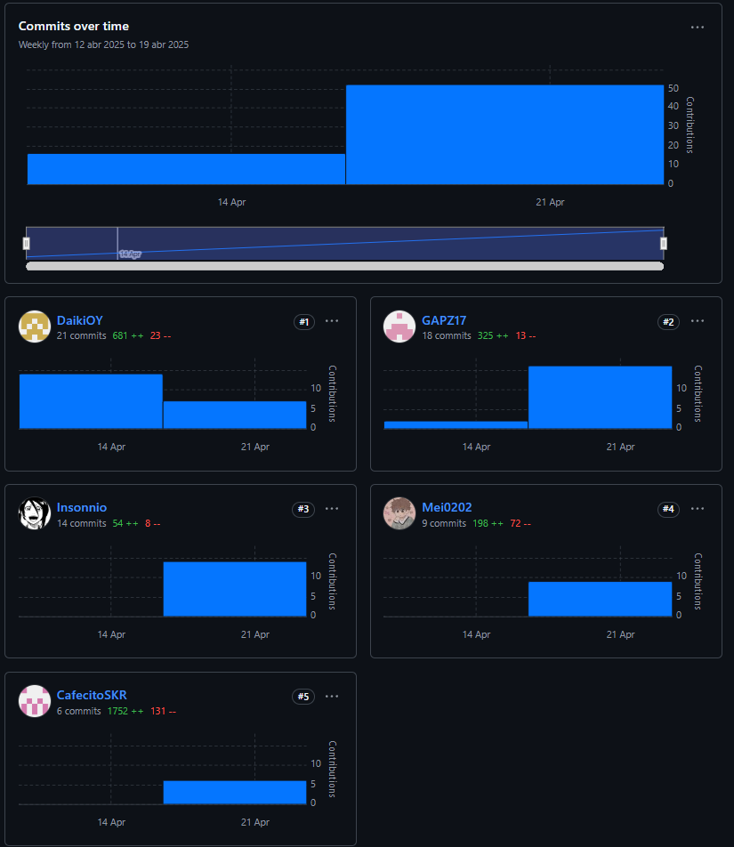

**Alejandro**

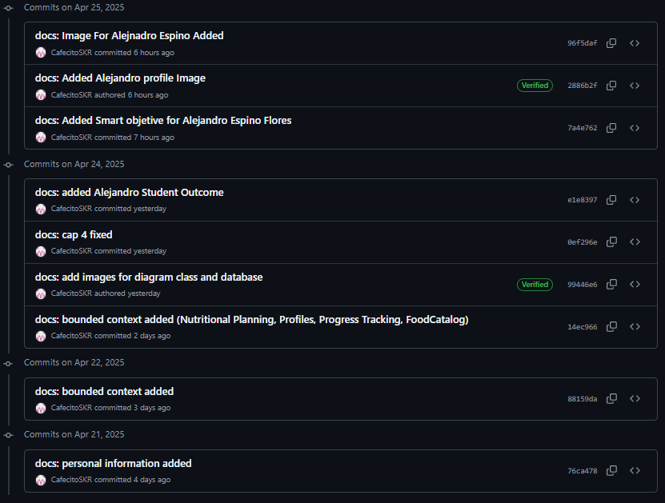

**Daiki**

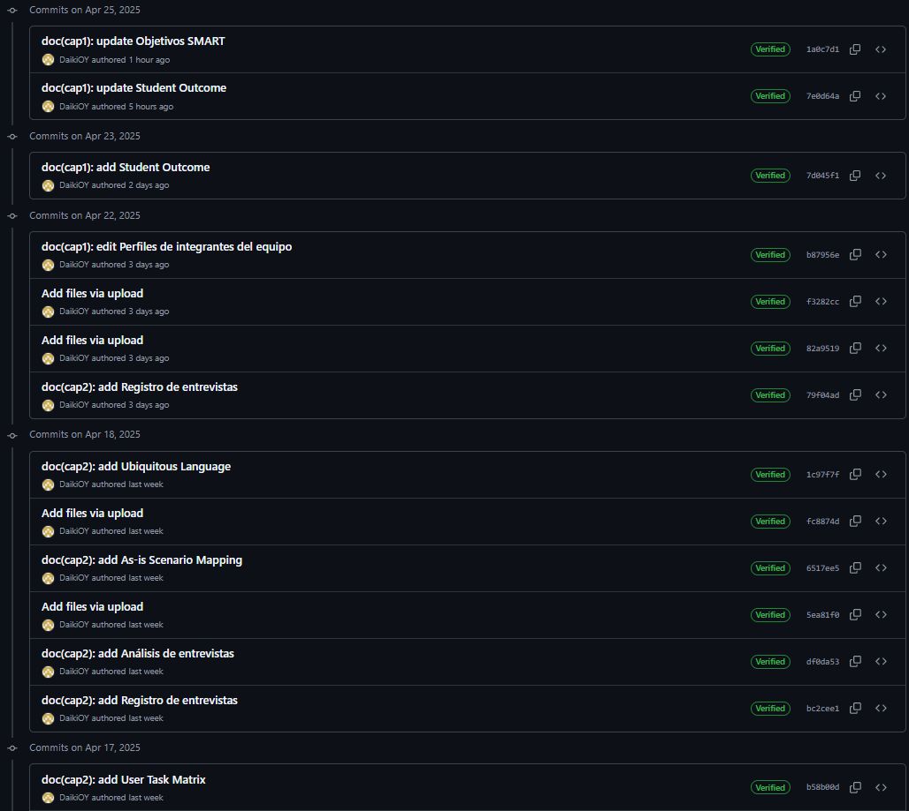

**Leonardo**

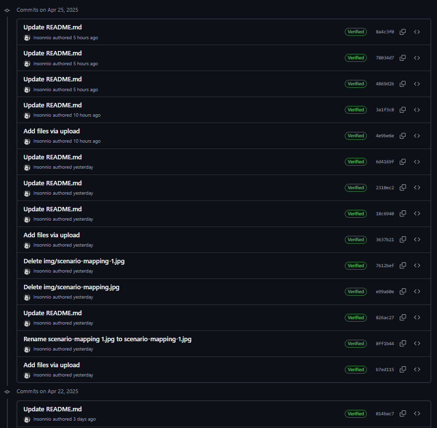

**Jessica**

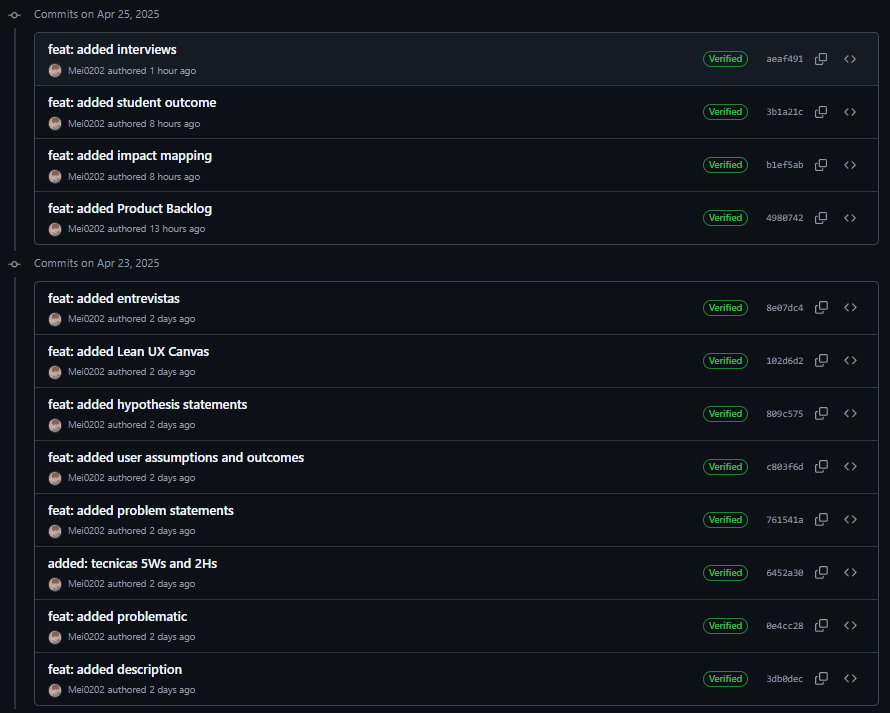

**Gustavo**

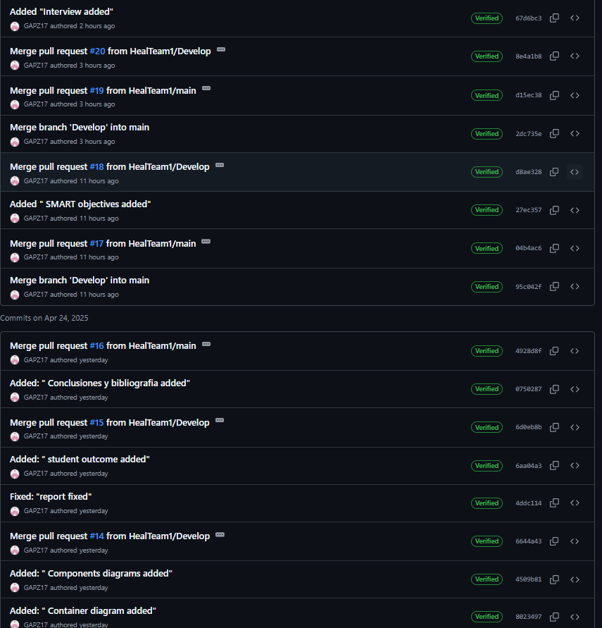

# Contenido

## Tabla de Contenidos

[Registro de versiones del informe](#registro-de-versiones-del-informe)

[Project Report Collaboration Insights](#project-report-collaboration-insights)

[Contenido](#contenido)

[Student Outcome](#student-outcome-1)

[Objetivos SMART](#objetivos-smart-1)

[Capítulo I: Introducción](#capitulo-i-introduccion)

- [1.1. Startup Profile](#11-startup-profile)

  - [1.1.1. Descripción de la Startup](#111-description-de-la-startup)

  - [1.1.2. Perfiles de integrantes del equipo](#112-perfiles-de-integrantes-del-equipo)

- [1.2. Solution Profile](#12-solution-profile)
  - [1.2.1 Antecedentes y problemática](#121-antecedentes-y-problemática)
  - [1.2.2 Lean UX Process](#122-lean-ux-process)
    - [1.2.2.1. Lean UX Problem Statements](#1221-lean-ux-problem-statements)
    - [1.2.2.2. Lean UX Assumptions](#1222-lean-ux-assumptions)
    - [1.2.2.3. Lean UX Hypothesis Statements](#1223-lean-ux-hypothesis-statements)
    - [1.2.2.4. Lean UX Canvas](#1224-lean-ux-canvas)
- [1.3. Segmentos objetivo](#13-segmentos-objetivo)

[Capítulo II: Requirements Elicitation & Analysis](#capítulo-ii-requirements-elicitation--analysis-1)

- [2.1. Competidores](#21-competidores)
  - [2.1.1. Análisis competitivo](#211-análisis-competitivo)
  - [2.1.2. Estrategias y tácticas frente a competidores](#212-estrategias-y-tácticas-frente-a-competidores)
- [2.2. Entrevistas](#22-entrevistas)
  - [2.2.1. Diseño de entrevistas](#221-diseño-de-entrevistas)
  - [2.2.2. Registro de entrevistas](#222-registro-de-entrevistas)
  - [2.2.3. Análisis de entrevistas](#223-análisis-de-entrevistas)
- [2.3. Needfinding](#23-needfinding)
  - [2.3.1. User Personas](#231-user-personas)
  - [2.3.2. User Task Matrix](#232-user-task-matrix)
  - [2.3.3. User Journey Mapping](#233-user-journey-mapping)
  - [2.3.4. Empathy Mapping](#234-empathy-mapping)
  - [2.3.5. As-is Scenario Mapping](#235-as-is-scenario-mapping)
- [2.4. Ubiquitous Language](#24-ubiquitous-language)

[Capítulo III: Requirements Specification](#capítulo-iii-requirements-specification-1)

- [3.1. To-Be Scenario Mapping](#31-to-be-scenario-mapping)
- [3.2. User Stories](#32-user-stories)
- [3.3. Impact Mapping](#33-impact-mapping)
- [3.4. Product Backlog](#34-product-backlog)

[Capítulo IV: Solution Software Design](#capítulo-iv-solution-software-design-1)

- [4.1. Strategic-Level Domain-Driven Design](#41-strategic-level-domain-driven-design)
  - [4.1.1. EventStorming](#411-eventstorming)
    - [4.1.1.1. Candidate Context Discovery](#4111-candidate-context-discovery)
    - [4.1.1.2. Domain Message Flows Modelings](#4112-domain-message-flows-modeling)
    - [4.1.1.3. Bounded Context Canvases](#4113-bounded-context-canvases)
  - [4.1.2. Context Mapping](#412-context-mapping)
  - [4.1.3. Software Architecture](#413-software-architecture)
    - [4.1.3.1. Software Architecture Context Level Diagrams](#4131-software-architecture-context-level-diagrams)
    - [4.1.3.2. Software Architecture Container Level Diagrams](#4132-software-architecture-container-level-diagrams)
    - [4.1.3.3. Software Architecture Deployment Diagrams](#4133-software-architecture-deployment-diagrams)
- [4.2. Tactical-Level Domain-Driven Design](#42-tactical-level-domain-driven-design)

  - [4.2.1. Bounded Context: <Bounded-Context-Name>](#421-bounded-context-bounded-context-name)
    - [4.2.1.1. Domain Layer](#4211-domain-layer)
    - [4.2.1.2. Interface Layer](#4212-interface-layer)
    - [4.2.1.3. Application Layer](#4213-aplication-layer)
    - [4.2.1.4. Infrastructure Layer](#4214-infrasructure-layer)
    - [4.2.1.5. Bounded Context Software Architecture Component Level Diagrams](#4215-bounded-context-software-architecture-component-level-diagrams)
    - [4.2.1.6. Bounded Context Software Architecture Code Level Diagrams](#4216-bounded-context-software-architecture-code-level-diagrams)
      - [4.2.1.6.1. Bounded Context Domain Layer Class Diagrams](#42161-bounded-context-domain-layer-class-diagrams)
      - [4.2.1.6.2. Bounded Context Database Design Diagram](#42162-bounded-context-database-design-diagram)
    
- [5.1 Product Design](#51-product-design)
  - [5.1.1 Style Guidelines](#511-style-guidelines)
  - [5.1.1.1 General Style Guidelines](#5111-general-style-guidelines)
  - [5.1.2 Information Architecture](#512-information-architecture)
  - [5.1.2.1 Organization Systems](#5121-organization-systems)
  - [5.1.2.2 Labeling Systems](#5122-labeling-systems)
  - [5.1.2.3 SEO Tags and Meta Tags](#5123-seo-tags-and-meta-tags)
  - [5.1.2.4 Searching Systems](#5124-searching-systems)
  - [5.1.2.5 Navigation Systems](#5125-navigation-systems)
  - [5.1.3 Landing Page UI Design](#513-landing-page-ui-design)
  - [5.1.3.1 Landing Page Wireframe](#5131-landing-page-wireframe)
  - [5.1.3.2 Landing Page Mock-up](#5132-landing-page-mock-up)
  - [5.1.4 Mobile Applications UX/UI Design](#514-mobile-applications-uxui-design)
  - [5.1.4.1 Mobile Applications Wireframes](#5141-mobile-applications-wireframes)
  - [5.1.4.2 Mobile Applications Wireflow Diagrams](#5142-mobile-applications-wireflow-diagrams)
  - [5.1.4.3 Mobile Applications Mock-ups](#5143-mobile-applications-mock-ups)
  - [5.1.4.4 Mobile Applications User Flow Diagrams](#5144-mobile-applications-user-flow-diagrams)
  - [5.1.4.5 Mobile Applications Prototyping](#5145-mobile-applications-prototyping)

- [6.1 Software Configuration Management](#61-software-configuration-management)
  - [6.1.1 Software Development Environment Configuration](#611-software-development-environment-configuration)
  - [6.1.2 Source Code Management](#612-source-code-management)
  - [6.1.3 Source Code Style Guide & Conventions](#613-source-code-style-guide--conventions)

- [6.2 Landing Page & Mobile Application Implementation](#62-landing-page--mobile-application-implementation)
  - [6.2.X Sprint 1](#62x-sprint-1)
    - [6.2.X.1 Sprint Planning 1](#62x1-sprint-planning-1)
    - [6.2.X.2 Sprint Backlog 1](#62x2-sprint-backlog-1)
    - [6.2.X.3 Execution Evidence for Sprint Review](#62x3-execution-evidence-for-sprint-review)
    - [6.2.X.4 Services Documentation Evidence for Sprint Review](#62x4-services-documentation-evidence-for-sprint-review)
    - [6.2.X.5 Software Deployment Evidence for Sprint Review](#62x5-software-deployment-evidence-for-sprint-review)
    - [6.2.X.8 Team Collaboration Insights during Sprint](#62x8-team-collaboration-insights-during-sprint)

  [Conclusiones](#conclusiones-1)

- [Conclusiones y recomendaciones](#conclusiones-y-recomendaciones)

[Bibliografía](#bibliografc3ada-1)

[Anexos](#anexos-1)

# Student Outcome

| Criterio específico                                                                                                                    | Acciones realizadas                                                                                                                                                                                                                                                                                                                                                                                                                                                                                                                                                                                                                                                                                                                                                                                                                                                                                 | Conclusiones  |
| :------------------------------------------------------------------------------------------------------------------------------------- | :-------------------------------------------------------------------------------------------------------------------------------------------------------------------------------------------------------------------------------------------------------------------------------------------------------------------------------------------------------------------------------------------------------------------------------------------------------------------------------------------------------------------------------------------------------------------------------------------------------------------------------------------------------------------------------------------------------------------------------------------------------------------------------------------------------------------------------------------------------------------------------------------------- | :------------ |
| Actualiza conceptos y conocimientos necesarios para su desarrollo profesional y en especial para su proyecto en soluciones de software | _Daiki Oscar Oshiro Yamashita_   _TB1_: Para esta primera entrega del trabajo, se utilizaron conceptos y conocimientos previamente adquiridos para este desarrollo del proyecto.   _Pardo Zapata Gustavo Adolfo_   _TB1_: Para esta primera entrega del trabajo,apliqué conocimientos adquiridos en diseño de softwware,modelado con DDD y arquitectura de sistemas para estructurar el proyecto Nutriplan. Participé activamente en la identificación de funcionalidades clave, eldiseño de diagramas y documentacion.    _Alejandro Espino Flores_  Para esta entrega optimicé tanto el modelado de la base de datos como el diagrama UML, aplicando principios de Domain-Driven Design para reflejar fielmente la lógica del dominio. Identifiqué y definí claramente los distintos bounded contexts, estableciendo sus agregados, entidades y relaciones de manera coherente.   _Jessica Comettant Rubiños_  _TB1_:  He actualizado y aplicado conceptos clave en el desarrollo de soluciones de software, especialmente mediante el uso de metodologías como Lean UX. Esto me ha permitido estructurar entregables como Lean UX assumptions, Business assumptions, User assumptions, Problem Statements, Hypothesis Statements, Lean UX canvas, Impact Mapping, y Product Backlog, mejorando mi capacidad técnica y estratégica en el proyecto. _Dueñas Canales Leonardo Manuel_  _TB1_: Para esta primera entrega se desarrollaron las user stories, to be scenario mapping y se estuvo activamente atento a posibles deficiencias en el proyecto. Esto nos permite mejorar las capacidades de identificación estrategica en el proyecto para futuras entregas.| Conclusiones:  Se pudo utilizar y adquirir conceptos y conocimientos relacionados con las soluciones de software para el desarrollo del proyecto.|
| Reconoce la necesidad del aprendizaje permanente para el desempeño profesional y el desarrollo de proyectos en soluciones de software. | _Daiki Oscar Oshiro Yamashita_   _TB1_: Para esta primera entrega del trabajo, desarrollé parte de los capítulos 1 y 2, teniendo en cuenta las soluciones de software.   _Pardo Zapata Gustavo Adolfo_   _TB1_: Contribuí a definir la visión estratégica de NutriPlan y colaboré en el desarrollo de secciones técnicas y estratégicas del documento del proyecto, lo cual exigió reforzar conceptos sobre modelos de dominio y arquitectura limpia.  _Alejandro Espino Flores_  En esta entrega combiné mi experiencia en modelado de bases de datos y diagramación UML con los principios de Domain-Driven Design para diseñar cada bounded context de forma clara y alineada con las reglas de negocio, al mismo tiempo reconociendo que el aprendizaje continuo es esencial para potenciar mi desempeño profesional y elevar la calidad de las soluciones de software.  _Jessica Comettant Rubiños_  _TB1_:  A través de este proceso, he comprendido la importancia del aprendizaje continuo para mantenerme al día con las mejores prácticas y herramientas del sector. Integrar metodologías como Lean UX y trabajar con herramientas prácticas ha sido esencial para mi desarrollo profesional y el éxito en proyectos de soluciones de software. _Dueñas Canales Leonardo Manuel_  _TB1_: En este primera entrega se comprendió lo importante que es mantener las buenas practicas y así estabilizar el proyecto a través de ellas para futuras entregas. | Conclusiones:  Se confirma la necesidad del aprendizaje permanente para el desarrollo del proyecto por medio de las soluciones de software.  |

# Objetivos SMART

<table>
  <tr>
    <td colspan="4"> </td>
    <th colspan="5"><b>METODOLOGÍA SMART</b></th>
  </tr>
  <tr>
    <td colspan="4">   </td>
    <td> S 
 Specific 
 Específico </td>
   <td> M 
 Meassurable 
 Medible</td>
   <td> A 
 Ambitious 
 Ambicioso</td>
   <td> R 
 Relevant 
 Relevante</td>
   <td> T 
 Time-bound 
 Tiempo Limite</td>
  </tr>
  <tr>
    <td>  Nombre del Estudiante </td>
    <td>  Descripción del Objetivo</td>
   <td> Fecha de inicio </td>
   <td> Fecha de cumplimiento esperada </td>
   <td> ¿Qué se va a lograr? 
 
  El objetivo indica con especificidad, cuál es el proceso, servicio o producto en cuestión, para qué área es relevante, u otro detalle clave que brinde contexto </td>
   <td> ¿Tiene KPI o métrica clara? 
 
  El enunciado tiene una meta con indicador (KPI) o métrica clara, que determinará si el objetivo se cumplió. Idealmente, describe el impacto (lo que vamos a lograr) más que el entregable (Lo que vamos a hacer) </td>
   <td> ¿Es retador y va más allá de sus funciones? 
 
  El objetivo inspira y reta a pensar acciones para dar el salto que se requiere para el logro, no se lograría sin una estrategia y un foco potentes. </td>
   <td> ¿Está alineado a la estratégia? 
 
  Existe una explicación clara respecto a cómo el objetivo impacta sobre los objetivos estratégicos de la Institución o Laureate Perú. Brinda una noción del alcance del objetivo. </td>
   <td> ¿Cuándo se cumplirar? 
 
  En caso que la expectativa de fecha de cumplimiento sea previa al cierre de año, el enunciado contiene de forma explícita la fecha límite para alcanzar el objetivo </td>
  </tr>
  <tr>
    <td> Oshiro Yamashita, Daiki Oscar </td>
    <td> Lanzar una aplicación digital que ofrezca planes de alimentación personalizados basados en objetivos nutricionales y estilo de vida, facilitando a los usuarios el acceso a recomendaciones confiables, herramientas de seguimiento y contenidos educativos nutricionales.</td>
    <td> 01/04/2025 </td>
    <td> 30/09/2025</td>
    <td> Crear una plataforma móvil que ofrezca planes de alimentación personalizados basados en el perfil y objetivos de cada usuario.</td>
    <td> Alcanzar 500 usuarios registrados en los primeros 3 meses de lanzamiento y obtener al menos un 60% de retención mensual. </td>
    <td> Posicionar NutriPlan como una alternativa confiable frente a otras apps de nutrición dentro del primer año. </td>
    <td> La nutrición personalizada es clave para prevenir enfermedades y mejorar la calidad de vida, lo cual responde a una necesidad social real. </td>
    <td> Publicar y poner en funcionamiento la plataforma NutriPlan de forma completa antes del 30 de septiembre de 2025, permitiendo que los usuarios accedan a sus funcionalidades y beneficios principales. </td>
  </tr>
  <tr>
    <td> Pardo Zapata, Gustavo Adolfo </td>
    <td> Mi objetivo es crear y lanzar una aplicación móvil llamada "NutriPlan", diseñada para ayudar a los usuarios a encontrar planes de alimentacion personalizados y hacer seguimiento de su progreso nutricional, contribuyendo así a mejorar su salud y hábitos alimenticios. </td>
    <td> 01/04/2025 </td>
    <td> 30/09/2025</td>
    <td> Se logrará el desarrollo y publicación de una aplicación funcional y atractiva para usuarios generales interesados en su nutrición, así como para nutricionistas que deseen escalar sus servicios. Será relevante para el área de bienestar, innovación y transformación digital. </td>
  <td> Sí. Se espera alcanzar al menos 1,000 descargas en los primeros 3 meses desde el lanzamiento, con una calificación mínima promedio de 4.0 en la tienda de aplicaciones y al menos un 40% de usuarios activos mensuales. </td>
  <td> Sí. El objetivo implica diseñar una solución innovadora, investigar el mercado, coordinar equipo técnico y validar hipótesis de usuario, lo cual va más allá del trabajo operativo y requiere visión estratégica. </td>
  <td> Sí. Está alineado con la estrategia institucional de fomentar el uso de tecnología en el bienestar y promover proyectos con impacto social y escalabilidad. Contribuye a los objetivos de innovación y sostenibilidad. </td>
  <td> El objetivo tiene un plazo claramente definido, con la meta de tener la aplicación completamente desarrollada el 30 de setiembre del 2025 </td>
  </tr>
 <tr>
    <td> Alejandro Espino Flores </td>
    <td>Mi objetivo es desarrollar los módulos principales de la aplicación NutriPlan, reforzando mis conocimientos en diseño de software, arquitectura por capas y uso de buenas prácticas como Domain-Driven Design (DDD), con el fin de mejorar mis habilidades como desarrollador. </td>
    <td> 01/04/2025 </td>
    <td> 30/09/2025 </td>
    <td> Construir una aplicación funcional que aplique buenas prácticas de desarrollo, organizando la lógica del sistema en capas bien definidas y documentadas.</td>
    <td> Completar al menos el 90% de las funcionalidades asignadas dentro de los plazos establecidos, y generar documentación técnica para cada módulo implementado.</td>
    <td> Esto implica aprendizaje continuo, aplicar patrones de arquitectura, colaborar con otros roles y mejorar mis capacidades técnicas en un entorno de proyecto real.</td>
    <td>Si, contribuye al objetivo institucional de formar profesionales que desarrollen soluciones tecnológicas innovadoras y sostenibles. </td>
    <td>El objetivo debe cumplirse con la entrega funcional de la app y su documentación técnica antes del 30 de septiembre de 2025. </td>
  </tr>
 <tr>
    <td> Dueñas Canales Leonardo Manuel</td>
    <td> 	Mi objetivo es obtener experiencia profesional en el área de desarrollo de productos digitales enfocados en salud y nutrición, mediante prácticas preprofesionales o proyectos colaborativos, para fortalecer mi portafolio y aumentar mi empleabilidad en el sector tecnológico. </td>
    <td> 	01/10/2025 </td>
    <td> 	30/03/2026 </td>
    <td>    Sí. El objetivo se enfoca en una acción concreta: adquirir experiencia real en desarrollo de productos digitales del rubro salud/nutrición, a través de prácticas o proyectos. </td>
    <td>    Se medirá por haber participado en al menos 1 proyecto o práctica con duración mínima de 3 meses en un entorno real de trabajo, y contar con al menos 2 proyectos nuevos documentados en mi portafolio profesional. </td>
    <td> 	Sí. Requiere buscar activamente oportunidades, aplicar a convocatorias, adaptar habilidades a entornos reales y demostrar resultados tangibles a potenciales empleadores o clientes. </td>
    <td> 	Sí. Este objetivo es clave para mi crecimiento profesional, ya que la experiencia práctica complementa mi formación académica y me posiciona mejor en el mercado laboral dentro del rubro tecnológico aplicado a salud y bienestar. </td>
    <td>  	El plazo está claramente definido: se busca concretar la experiencia entre octubre de 2025 y marzo de 2026, lo que permite organizar y monitorear avances dentro de ese período. </td>
  </tr>
 <tr>
    <td> Comettant Rubiños Jessica Elizabeth </td>
    <td>  Mi objetivo es asegurar que la plataforma cumpla con los requisitos del usuario final y los objetivos de negocio. De igual forma, busco que la aplicación sea lanzada dentro del plazo establecido, con una experiencia de usuario optimizada.</td>
    <td> 	01/04/2025 </td>
    <td> 	30/09/2025 </td>
    <td> Mi objetivo es asegurar que el producto final cumpla con los requerimientos de los usuarios y se alinee con los objetivos estratégicos del negocio. </td>
    <td> El éxito se medirá por la tasa de adopción de la aplicación, con el objetivo de que al menos el 50% de los usuarios activos la utilicen semanalmente dentro del primer mes del lanzamiento. </td>
    <td> Este objetivo es ambicioso, ya que implica la coordinación de varios equipos interdisciplinarios, incluyendo desarrollo, diseño, y marketing. Será necesario un enfoque iterativo y basado en feedback constante para asegurar que el producto final sea efectivo, eficiente y bien recibido por los usuarios. </td>
    <td> Este objetivo es clave para NutriPlan porque está alineado tanto con las necesidades de los usuarios como con los objetivos del negocio, que incluyen aumentar la retención de usuarios y generar ingresos a través de suscripciones premium. </td>
    <td> El objetivo tiene un plazo claro, el 30 de septiembre de 2025. Este es el plazo en el cual se debe completar el desarrollo, las pruebas y el lanzamiento oficial de la aplicación, asegurando que se cumplan los objetivos de rendimiento, usabilidad y comercialización. </td>
  </tr>
</table>

# Capitulo I: Introduccion

## 1.1. StartUp Profile

En un contexto donde la salud y el bienestar han cobrado una importancia central, y donde la tecnología redefine nuestros hábitos cotidianos, nace NutriPlan. Con una propuesta enfocada en la planificación nutricional inteligente, esta app busca empoderar a las personas y profesionales de la salud a través de una herramienta digital accesible, educativa y personalizada.

### 1.1.1. Description de la StartUp

NutriPlan es una app móvil que facilita la planificación de comidas saludables mediante recetas balanceadas, listas de compras inteligentes y seguimiento nutricional.
Está diseñada tanto para usuarios que desean mejorar su alimentación como para nutricionistas que buscan una herramienta práctica para personalizar y monitorear planes alimenticios.

- Misión: Promover una alimentación saludable y accesible, utilizando la tecnología para mejorar los hábitos nutricionales de las personas y apoyar el trabajo de los profesionales de la salud.

- Visión: Ser la plataforma líder en planificación nutricional personalizada en Latinoamérica, transformando la forma en que las personas se alimentan y cuidan su salud.

### 1.1.2. Perfiles de integrantes del equipo

| Integrantes                                                                                                                                                                                                               | Descripción                                                                                                                                                                                                                                                                                                                                                                                                                                                                                                                                                                                                             | Conocimientos                                                                                                                                           |
| :------------------------------------------------------------------------------------------------------------------------------------------------------------------------------------------------------------------------ | :---------------------------------------------------------------------------------------------------------------------------------------------------------------------------------------------------------------------------------------------------------------------------------------------------------------------------------------------------------------------------------------------------------------------------------------------------------------------------------------------------------------------------------------------------------------------------------------------------------------------- | :------------------------------------------------------------------------------------------------------------------------------------------------------ |
| Nombre                                                                                                                                                                                                                    | Descripción                                                                                                                                                                                                                                                                                                                                                                                                                                                                                                                                                                                                             | Conocimientos                                                                                                                                           |
|  Daiki Oscar Oshiro Yamashita u20201f846                                                                                                                         | Soy estudiante de la carrera de Ingeniería de Software. Tengo interés en obtener nuevos conocimientos relacionados con mi carrera que me sean de utilidad para el futuro.                                                                                                                                                                                                                                                                                                                                                                                                                                               | Cuento con el conocimiento de diversos lenguajes HTML, Python, C++, C# y MySQL.                                                                         |
| Pardo Zapata Gustavo Adolfo u2020120347                                                                                                                  | Estudiante de la carrera de Ingeniería de Software. Soy proactivo, colaborativo, organizado,responsable y con habilidades de resolución de problemas.Tengo una excelente capacidad para comunicarme de manera efectiva y clara con los demás miembros de mi equipo y deseo colaborar en todo lo posible con mis demás compañeros en este trabajo.                                                                                                                                                                                                                                                                       | Cuento con conocimiento en JavaScript, Java, Python, C# y SQL.                                                                                          |
| Espino Flores, Alejandro | Soy estudiante de la carrera de Ingeniería de Software. Me considero una persona proactiva, responsable y con gran capacidad para trabajar en equipo. Valoro el compañerismo y la colaboración, ya que creo que son fundamentales para alcanzar los objetivos comunes. Estoy comprometido con el aprendizaje continuo y me esfuerzo por aportar lo mejor de mí en cada proyecto.                                                                                                                                                                                                                                        | Cuento con conocimientos en Python, Java, SQL y desarrollo web.                                                                                         |
|  Dueñas Canales Leonardo Manuel                                                                                                                                                                      | Soy estudiante de la carrera Ingeniría de Software. Me considero una persona asertiva, logíca con gran capacidad de trabajar en equipo.                                                                                                                                                                                                                                                                                                                                                                                                                                                                                 | Cuento con el conocimiento de Java, javascript, Python, C#, HTML.                                                                                       |
|  **Jessica Elizabeth Comettant Rubiños**                                                                                         | Estudiante de la carrera de ingeniería de software de la UPC (Universidad Peruana de Ciencias Aplicadas). Estoy en el sexto ciclo de mi carrera. Gracias a las asignaturas correspondientes a la malla curricular de mi carrera, cuento con las habilidades intelectuales propicias para el desarrollo del proyecto. Asimismo, mi personalidad se encuentra basada en la autonomía. Por lo tanto, he sido capaz de extender mis conocimientos de programación con mayor material de estudio. Finalmente, destaco de mi personalidad la empatía, la responsabilidad, la amabilidad y la capacidad de trabajar en equipo. | Conocimientos en C#, python y java. Manejo de base de datos relacionales. Frameworks de desarrollo (Angular y Vue). Acreditación en Scrum Fundamentals. |

## 1.2. Solution Profile

### 1.2.1. Antecedentes y problemática

#### Antecedentes y problemática

En la actualidad, el 60% de los adultos en Lima padecen sobrepeso u obesidad, lo que aumenta significativamente el riesgo de enfermedades crónicas como diabetes tipo 2, hipertensión y problemas cardiovasculares. A pesar de la creciente preocupación por la salud, muchas personas se enfrentan a barreras para mejorar su alimentación, como la falta de conocimientos nutricionales, la escasez de tiempo para planificar comidas o la dificultad para mantener hábitos saludables en medio de las exigencias diarias. Según la Encuesta Nacional de Hogares (ENAHO) del INEI, el 45.6% de la población en Perú no sigue una dieta balanceada debido a estos desafíos.

Simultáneamente, los nutricionistas enfrentan dificultades para acceder a herramientas modernas que les permitan brindar un mejor seguimiento a sus pacientes, personalizar planes alimenticios de forma eficiente y manejar una carga creciente de pacientes. De acuerdo con la Sociedad Peruana de Nutrición, la falta de plataformas digitales accesibles y efectivas para estos profesionales también es un factor que limita el impacto de su trabajo.

En este contexto, surge la necesidad de una solución tecnológica que integre educación nutricional, planificación inteligente de alimentos y asesoría profesional, de manera accesible y personalizada. NutriPlan busca resolver estos problemas, proporcionando a los usuarios herramientas para mejorar su alimentación, mientras ofrece a los nutricionistas una plataforma eficiente para gestionar planes alimenticios y realizar seguimientos de manera remota.

#### What? (¿Qué es?)

NutriPlan es una aplicación móvil que permite planificar comidas saludables, visualizar el valor nutricional de cada plato, generar listas de compras y acceder a recetas con instrucciones paso a paso. Además, brinda a los nutricionistas herramientas para crear y gestionar planes personalizados para sus pacientes.

#### Why? (¿Por qué lo hacemos?)

En Perú, especialmente en Lima, existen desafíos importantes en cuanto a salud y nutrición. Según el Ministerio de Salud (Minsa), el sobrepeso y la obesidad han aumentado significativamente en la población urbana, afectando aproximadamente al 60% de los adultos en Lima. Esta situación ha contribuido a un incremento de enfermedades crónicas como la diabetes tipo 2, hipertensión y problemas cardiovasculares. Además, muchas personas carecen de la educación nutricional necesaria para tomar decisiones alimenticias informadas. NutriPlan surge con el objetivo de ofrecer soluciones accesibles, proporcionando herramientas personalizadas para que los usuarios puedan mejorar sus hábitos alimenticios de manera efectiva.

#### Where? (¿Dónde se utilizará?)

NutriPlan estará disponible principalmente en Lima, la capital de Perú, y en otras zonas urbanas del país. La aplicación está diseñada para personas que desean mejorar su alimentación y para nutricionistas que buscan una plataforma práctica y accesible para gestionar planes alimenticios. Con el tiempo, se espera expandir su alcance a otras ciudades de América Latina, donde los problemas nutricionales son similares.

#### When? (¿Cuándo se utilizará?)

NutriPlan se utilizará de manera continua. Los usuarios podrán acceder a la aplicación en cualquier momento, ya sea para planificar sus comidas, hacer compras o seguir su progreso nutricional. La aplicación también podrá adaptarse a situaciones particulares, como dietas postoperatorias o cambios de hábitos alimenticios a lo largo del tiempo.

#### Who? (¿A quién está dirigido?)

Usuarios generales: Jóvenes adultos de entre 18 y 28 años en Lima que buscan mejorar su alimentación diaria, cocinar de manera saludable y optimizar sus compras. Este grupo busca una solución práctica y accesible para integrar hábitos alimenticios más saludables en su rutina.

Nutricionistas: Profesionales de la salud en Lima que necesitan una herramienta digital para personalizar dietas, monitorear el progreso de sus pacientes y compartir recomendaciones profesionales de manera eficiente y remota.

#### How? (¿Cómo funciona?)

Los usuarios descargan la app, configuran sus objetivos y preferencias, y acceden a un plan nutricional adaptado. Pueden consultar recetas, ver el valor nutricional de cada plato, organizar sus compras y recibir recordatorios. Los nutricionistas, por su parte, pueden crear planes, hacer seguimiento y comunicarse con sus pacientes desde la plataforma.

#### How much? (¿Cuánto cuesta?)

NutriPlan utilizará un modelo de negocio freemium con las siguientes modalidades:

Versión gratuita: Acceso a funciones básicas como recetas saludables, planificación semanal simple y generación automática de listas de compras.

Suscripción Premium para usuarios: Incluye planes nutricionales personalizados, seguimiento de objetivos, historial nutricional y acceso a contenido exclusivo.

### 1.2.2. Lean UX Process

#### 1.2.2.1. Lean UX Problem Statements

##### **1. Problem Statement: Mejora de Alimentación para Jóvenes Adultos en Lima**

**Descripción de la situación:**  
La mayoría de los jóvenes adultos en Lima tienen poco tiempo y conocimiento para planificar comidas saludables. Según el Ministerio de Salud, más del 60% de los adultos en Perú sufren de sobrepeso u obesidad, lo que aumenta los riesgos de enfermedades crónicas. Sin embargo, solo el 30% de los jóvenes de entre 18 y 28 años en Lima tiene acceso a recursos adecuados para mejorar su alimentación.

**Descripción del problema:**  
La falta de una herramienta que facilite la planificación de comidas saludables y optimice las compras diarias lleva a que muchos jóvenes adultos continúen tomando decisiones alimenticias poco informadas, lo que contribuye a un aumento de enfermedades relacionadas con la mala alimentación.

**Propuesta de solución:**  
¿Cómo podemos ofrecer a los jóvenes adultos en Lima una plataforma accesible que les permita planificar comidas saludables, optimizar sus compras y llevar un seguimiento nutricional, para que puedan tomar decisiones informadas y mejorar sus hábitos alimenticios?

##### **2. Problem Statement: Falta de Herramientas Digitales para Nutricionistas**

**Descripción de la situación:**  
Los nutricionistas en Lima gestionan una gran cantidad de pacientes con necesidades dietéticas diversas, pero la mayoría no dispone de herramientas digitales adecuadas para personalizar dietas y hacer un seguimiento continuo de los pacientes. Según la Sociedad Peruana de Nutrición, solo el 15% de los nutricionistas utiliza tecnología avanzada para gestionar sus prácticas profesionales.

**Descripción del problema:**  
La ausencia de una plataforma digital eficiente limita la capacidad de los nutricionistas para personalizar las dietas, realizar un seguimiento adecuado y proporcionar recomendaciones a sus pacientes de manera remota y en tiempo real. Esto afecta la calidad de la atención y aumenta la carga de trabajo sin optimizar recursos.

**Propuesta de solución:**  
¿Cómo podemos proporcionar a los nutricionistas en Lima una herramienta digital que les permita crear dietas personalizadas, realizar un seguimiento continuo y ofrecer recomendaciones eficientes, mejorando la calidad de su servicio y optimizando el tiempo dedicado a cada paciente?

##### **3. Problem Statement: Acceso y Comprensión de la Nutrición para Jóvenes Adultos en Lima**

**Descripción de la situación:**  
En Lima, la falta de educación nutricional accesible afecta a un alto porcentaje de la población, especialmente entre los jóvenes adultos. Según la Encuesta Nacional de Hogares (ENAHO), el 58% de los jóvenes no conoce la cantidad adecuada de calorías que deben consumir diariamente, lo que contribuye a una mala toma de decisiones alimenticias. Esta falta de educación es más notable en los sectores de menores ingresos.

**Descripción del problema:**  
La carencia de acceso a información nutricional clara y accesible limita la capacidad de los jóvenes adultos para tomar decisiones informadas sobre su alimentación, lo que provoca un incremento en enfermedades como la obesidad y la diabetes tipo 2.

**Propuesta de solución:**  
¿Cómo podemos ofrecer a los jóvenes adultos en Lima una plataforma educativa que proporcione información nutricional accesible, personalizada y fácil de comprender, para que puedan mejorar sus hábitos alimenticios y prevenir enfermedades relacionadas con la mala nutrición?

#### 1.2.2.2. Lean UX Assumptions

#### Business Assumptions

1. **Creemos** que nuestros usuarios necesitan una plataforma que les permita mejorar sus hábitos alimenticios de manera fácil y accesible, mientras reciben recomendaciones personalizadas de nutrición.

2. **Estas necesidades se pueden satisfacer** mediante el desarrollo de una aplicación móvil que proporcione recetas saludables, listas de compras inteligentes y un seguimiento nutricional continuo adaptado a cada usuario.

3. **Nuestros clientes iniciales** serán los jóvenes adultos de 18-28 años en Lima que desean mejorar su alimentación diaria, así como nutricionistas que buscan una herramienta para gestionar dietas personalizadas y hacer seguimiento de sus pacientes.

4. **El valor más importante** que un cliente quiere de nuestros servicios es la capacidad de recibir recomendaciones nutricionales personalizadas y tener una planificación de comidas fácil de seguir para mejorar su salud y bienestar general.

5. **El cliente también** obtendrá beneficios adicionales como acceso a estadísticas sobre su progreso nutricional y la optimización de sus compras mediante listas inteligentes basadas en sus recetas.

6. **Vamos a obtener la mayoría de los clientes** mediante marketing en redes sociales, campañas de concientización sobre hábitos alimenticios saludables y colaboraciones con nutricionistas y profesionales de la salud.

7. **Vamos a obtener ingresos** mediante suscripciones premium para usuarios que deseen funcionalidades adicionales, como asesoramiento personalizado, y mediante alianzas con nutricionistas que usen la plataforma para gestionar sus pacientes.

8. **Nuestra competencia en el mercado** serán aplicaciones de planificación de comidas y seguimiento nutricional que ya ofrecen algunas funcionalidades similares, como MyFitnessPal y Yazio.

9. **Vamos a tener ventaja frente a nuestra competencia** debido a que NutriPlan estará específicamente diseñada para adaptarse a los hábitos alimenticios de los jóvenes adultos de Lima, ofreciendo una experiencia más local y personalizada. Además, la plataforma incluirá un sistema de gestión para nutricionistas que mejorará la experiencia tanto para los usuarios como para los profesionales.

10. **El mayor riesgo del servicio** es que el segmento objetivo no se muestre dispuesto a adoptar una nueva aplicación para mejorar sus hábitos alimenticios. Esto puede ser debido a la falta de motivación para cambiar hábitos arraigados o resistencia a la tecnología.

11. **Lo resolveremos** creando una interfaz atractiva, fácil de usar y gamificada para mantener el compromiso de los usuarios, además de ofrecer contenido educativo interactivo que incentive la adopción de hábitos saludables.

12. **Otras suposiciones incluyen** la aceptación de funcionalidades adicionales basadas en inteligencia artificial para personalizar aún más las recomendaciones, la disponibilidad de recursos tecnológicos para garantizar el buen funcionamiento de la plataforma y la seguridad de los datos personales y nutricionales de los usuarios. Finalmente, se asume que la aplicación cumplirá con altos estándares de privacidad y seguridad para garantizar la confianza de los usuarios en el manejo de su información personal.

#### User Assumptions

#### **¿Quién utiliza nuestra plataforma?**

- **Jóvenes de 18-28 años en Lima:** Personas que buscan mejorar sus hábitos alimenticios, aprender a cocinar de manera más saludable y optimizar sus compras, pero enfrentan barreras como la falta de tiempo y conocimiento nutricional.
- **Nutricionistas:** Profesionales de la salud que necesitan una herramienta digital eficiente para personalizar dietas, monitorear pacientes y gestionar su carga de trabajo de manera efectiva.

#### **¿Cómo se integra nuestro producto en la rutina laboral o cotidiana?**

- **Para los jóvenes de 18-28 años en Lima:** NutriPlan se integra ayudando a los jóvenes a planificar sus comidas de forma rápida y sencilla, generar listas de compras inteligentes basadas en sus preferencias alimentarias y seguir su progreso nutricional, todo a través de una plataforma accesible desde su móvil.
- **Para los nutricionistas:** La aplicación facilita la creación de dietas personalizadas, el seguimiento remoto de pacientes y la gestión eficiente de múltiples pacientes, lo que optimiza su tiempo y mejora la calidad del servicio.

#### **¿Cuáles son los desafíos que aborda nuestro producto?**

- **Para los jóvenes de 18-28 años en Lima:** La falta de tiempo y conocimientos sobre nutrición que dificulta la planificación de comidas saludables y la toma de decisiones informadas sobre su alimentación, lo que contribuye a hábitos poco saludables y un mayor riesgo de enfermedades crónicas.
- **Para los nutricionistas:** La falta de herramientas digitales eficientes para personalizar dietas, gestionar un número elevado de pacientes y realizar un seguimiento adecuado de manera remota, lo que limita la calidad y efectividad de su trabajo.

#### **¿Cuál es la imagen que deseamos proyectar con nuestro producto?**

NutriPlan busca proyectar una imagen de **salud, accesibilidad y conveniencia**. Queremos ser vistos como una herramienta confiable, moderna y fácil de usar que facilita la mejora de los hábitos alimenticios, tanto para los jóvenes como para los nutricionistas, mejorando la salud nutricional de manera efectiva.

#### **¿Cuál es el propósito fundamental de nuestra aplicación?**

El propósito de NutriPlan es **mejorar la salud nutricional** de los jóvenes de 18-28 años en Lima proporcionando una plataforma que facilite la planificación de comidas saludables, optimice las compras y ofrezca un seguimiento continuo del progreso. Para los nutricionistas, la aplicación permite personalizar dietas y gestionar pacientes de forma eficiente y remota.

#### **¿Qué funcionalidades destacan en nuestra aplicación?**

- **Planificación de comidas personalizadas:** Recetas adaptadas a las necesidades y preferencias de cada usuario.
- **Listas de compras inteligentes:** Generación automática de listas basadas en las recetas y preferencias del usuario.
- **Seguimiento nutricional:** Monitoreo del progreso nutricional y recomendaciones personalizadas para ajustes en la dieta.
- **Gestión de pacientes (para nutricionistas):** Herramienta para crear dietas personalizadas, realizar seguimiento y gestionar pacientes de manera eficiente.

#### **Business Outcomes**

1. **Aumentar** la satisfacción del usuario al proporcionar una plataforma accesible, útil y fácil de usar para mejorar los hábitos alimenticios, lo que favorece la retención de usuarios.
2. **Expandir** la base de usuarios en Lima y Perú, aumentando la cuota de mercado en el sector de aplicaciones de salud y nutrición.
3. **Incrementar** las suscripciones premium de usuarios al ofrecer funcionalidades avanzadas como asesoramiento personalizado y seguimiento nutricional detallado.
4. **Mejorar** la eficiencia de los nutricionistas en la gestión de pacientes, lo que resulta en una mayor adopción de la plataforma por parte de profesionales de la salud.
5. **Establecer** alianzas estratégicas con instituciones de salud, empresas de nutrición y marcas de productos alimenticios para ampliar la visibilidad y las oportunidades de monetización.

#### User Outcomes

#### **Segmento objetivo Jóvenes de 18-28 años en Lima**

1. **Mejorar** los hábitos alimenticios al planificar comidas saludables adaptadas a sus necesidades y objetivos nutricionales.
2. **Optimizar** las compras mediante listas inteligentes que permiten comprar solo lo necesario, reduciendo desperdicios y costos.
3. **Incrementar** el conocimiento sobre nutrición para tomar decisiones informadas que mejoren la salud a largo plazo.
4. **Hacer** un seguimiento del progreso nutricional, ajustando los hábitos según los resultados y objetivos personales.
5. **Sentirse** más motivados a mantener hábitos saludables gracias al apoyo continuo y las recomendaciones personalizadas de la app.

#### **Segmento objetivo: Nutricionistas en Perú**

1. **Crear** dietas personalizadas de manera más rápida y eficiente, adaptadas a las necesidades específicas de cada paciente.
2. **Mejorar** el seguimiento de los pacientes, monitoreando su progreso de manera remota y realizando ajustes según sea necesario.
3. **Ahorrar** tiempo al automatizar tareas y centralizar la gestión de pacientes, optimizando sus recursos.
4. **Ofrecer** atención más personalizada, gracias al acceso a datos en tiempo real y a la capacidad de ajustar las recomendaciones rápidamente.
5. **Experimentar** mayor satisfacción profesional al contar con una herramienta que facilita el trabajo y mejora la calidad de atención.

#### 1.2.2.3. Lean UX Hypothesis Statements

1. **Creemos** que si proporcionamos a los jóvenes de 18-28 años en Lima una plataforma accesible y fácil de usar para planificar comidas saludables,  
   **Entonces** estos jóvenes adoptarán hábitos alimenticios más saludables de manera más consistente,  
   **Sabemos** que hemos tenido éxito cuando veamos un aumento del 25% en la retención de usuarios durante los primeros tres meses, medido a través de la tasa de retención de usuarios.

2. **Creemos** que si ofrecemos a los nutricionistas una herramienta eficiente para crear dietas personalizadas y hacer seguimiento remoto de pacientes,  
   **Entonces** mejorarán la eficiencia en la gestión de sus pacientes, reduciendo el tiempo invertido en tareas repetitivas,  
   **Sabemos** que hemos tenido éxito cuando observemos una disminución del 30% en el tiempo promedio dedicado a la creación de dietas, medido a través del tiempo invertido por tarea.

3. **Creemos** que si implementamos funcionalidades de seguimiento nutricional personalizado,  
   **Entonces** los jóvenes adultos mejorarán su conocimiento sobre nutrición y tomarán decisiones más informadas sobre su alimentación,  
   **Sabemos** que hemos tenido éxito cuando observemos una mejora del 15% en los hábitos alimenticios reportados en encuestas de usuarios, medido a través de la puntuación de hábitos alimenticios.

#### 1.2.2.4. Lean UX Canvas

El Lean UX Canvas es una herramienta utilizada en el campo del diseño centrado en el usuario (UX) y la metodología Lean para crear y desarrollar productos de manera más eficiente y efectiva. Su objetivo es proporcionar un marco estructurado para la colaboración entre equipos multidisciplinarios. A continuación se presenta el Lean UX Canvas trabajado por el equipo a través de la herramienta digital Mural:

Enlace: [https://app.mural.co/t/integradis6182/m/integradis6182/1745440077390/891b85b88f2d8e99fb15c7cdf2f30e62792b17af?sender=ufdf66b413172c812625a4806](LeanUX-Canvas_NutriPlan)

## 1.3. Segmentos Objetivo

#### Segmento 1: Jóvenes Adultos de 18 a 28 Años en Lima

- **Población**: En 2022, la población joven peruana entre 18 y 29 años ascendía a 7,875,040 personas, representando aproximadamente el 23.6% de la población nacional. Lima Metropolitana concentra el 28.4% de esta población joven.
- **Características**:

  - Alta penetración de smartphones y uso de aplicaciones móviles.
  - Interés creciente por la salud y el bienestar.
  - Búsqueda de soluciones prácticas y accesibles para mejorar sus hábitos alimenticios.

- **Necesidades**:
  - Herramientas que faciliten la planificación de comidas saludables.
  - Acceso a información nutricional personalizada.
  - Motivación y seguimiento para mantener hábitos alimenticios saludables.

#### Segmento 2: Nutricionistas en Perú

- **Población**: El Colegio de Nutricionistas del Perú cuenta con aproximadamente 9,000 profesionales registrados.
- **Características**:

  - Profesionales comprometidos con la salud y el bienestar de la población.
  - Interés en herramientas digitales que optimicen su labor.
  - Necesidad de plataformas que faciliten la gestión de pacientes y el seguimiento nutricional.

- **Necesidades**:
  - Herramientas que permitan crear dietas personalizadas de manera eficiente.
  - Seguimiento remoto de pacientes.
  - Acceso a datos y estadísticas que faciliten la toma de decisiones.

# Capítulo II: Requirements Elicitation & Analysis

En este capítulo se realizará el proceso de Análisis competitivo y Needfinding necesario para la identificación de las necesidades de nuestro segmento objetivo.

## 2.1. Competidores

### 2.1.1. Análisis Competitivo

El análisis competitivo es una herramienta esencial debido a su relevancia en la toma de decisiones estratégicas, la identificación de oportunidades y amenazas, y la creación de ventajas competitivas sostenibles en el mercado. Por tales motivos, ayuda a las empresas a mantenerse ágiles y a tomar decisiones informadas en un entorno empresarial de constante cambio. A continuación, se exhibe la incorporación de esta herramienta dentro del desarrollo del proyecto y la examinación de los competidores:

<table>
  <tr>
    <th colspan="6"><b>Competitive Analysis Landscape</b></th>
  </tr>
  <tr>
    <td>¿Por qué llevar a cabo este análisis?</td>
    <td colspan="5">
      Este análisis fue realizado con el propósito de estudiar el valor ofrecido por las empresas que compiten con nuestra solución NutriPlan. La información obtenida nos proporcionará la perspectiva necesaria para la realización de un servicio innovador y diferenciador.
    </td>
  </tr>
  <tr>
    <td colspan="2"></td>
    <td><b>NutriPlan</b></td>
    <td><b>Yazio</b></td>
    <td><b>Noom</b></td>
    <td><b>Lifesum</b></td>
  </tr>
  <tr>
    <td rowspan="2"><b>Perfil</b></td>
    <td><b>Overview</b></td>
    <td>
      Plataforma de planificación de comidas y recetas saludables, con enfoque personalizado y educación nutricional accesible.
    </td>
    <td>
      App de planificación nutricional que ofrece seguimiento de comidas y macronutrientes con recetas saludables.
    </td>
    <td>
      App de salud que combina coaching nutricional y psicológico para mejorar hábitos alimenticios.
    </td>
    <td>
      Plataforma de nutrición personalizada basada en metas de salud y estilo de vida con interfaz atractiva.
    </td>
  </tr>
  <tr>
    <td><b>Ventaja competitiva ¿Qué valor ofrece a los clientes?</b></td>
    <td>
      Planificación de menús adaptada a gustos y objetivos, interfaz amigable, enfoque educativo y accesible para todos.
    </td>
    <td>
      Recetas visuales, fácil seguimiento de objetivos, buena interfaz y enfoque saludable europeo.
    </td>
    <td>
      Enfoque psicológico y conductual, coaching personalizado, más allá de contar calorías.
    </td>
    <td>
      Recomendaciones visuales y personalizadas según metas, buena experiencia de usuario.
    </td>
  </tr>
  <tr>
    <td rowspan="2"><b>Perfil de Marketing</b></td>
    <td><b>Mercado objetivo</b></td>
    <td>
      Familias, jóvenes y adultos que buscan comer mejor sin complicaciones, interesados en salud preventiva y recetas prácticas.
    </td>
    <td>
      Usuarios que desean una alimentación balanceada, basada en recetas y control de macronutrientes.
    </td>
    <td>
      Personas que buscan cambiar hábitos a largo plazo con apoyo conductual y motivacional.
    </td>
    <td>
      Usuarios modernos interesados en bienestar integral y nutrición con diseño atractivo.
    </td>
  </tr>
  <tr>
    <td><b>Estrategias de marketing</b></td>
    <td>
      Contenido educativo en redes sociales, colaboraciones con nutricionistas, modelo freemium con opción premium accesible.
    </td>
    <td>
      Promociones freemium, marketing de influencers, campañas en Instagram y TikTok.
    </td>
    <td>
      Publicidad en plataformas de salud, storytelling en redes, testimonios de usuarios.
    </td>
    <td>
      Estrategias visuales, campañas pagadas en redes, segmentación según metas de salud.
    </td>
  </tr>
  <tr>
    <td rowspan="3"><b>Perfil de Producto</b></td>
    <td><b>Productos y Servicios</b></td>
    <td>
      Recetas interactivas, planes semanales de comida, escáner de ingredientes, historial nutricional y consejos saludables.
    </td>
    <td>
      Seguimiento de comidas, planes de dieta, recetas saludables, estadísticas de macronutrientes.
    </td>
    <td>
      Coaching conductual, planes de alimentación y ejercicios, comunidad de apoyo.
    </td>
    <td>
      Dietas personalizadas, seguimiento visual del progreso, recomendaciones saludables.
    </td>
  </tr>
  <tr>
    <td><b>Precios y Costos</b></td>
    <td>
      Freemium con funciones básicas gratis y planes mensuales o anuales económicos.
    </td>
    <td>
      Modelo freemium con suscripción premium para acceso completo.
    </td>
    <td>
      Prueba gratuita, suscripción mensual con acceso a coach y planes personalizados.
    </td>
    <td>
      Modelo por suscripción, con precios según funciones y metas elegidas.
    </td>
  </tr>
  <tr>
    <td><b>Canales de distribución (Web y/o móvil)</b></td>
    <td>
      Web y app móvil (iOS/Android), versión web responsive y posibilidad de integración futura con dispositivos.
    </td>
    <td>
      App móvil con presencia fuerte en redes sociales y comunidad de usuarios.
    </td>
    <td>
      App móvil, acompañamiento vía notificaciones y correo electrónico.
    </td>
    <td>
      Web y app móvil con interfaz visual atractiva y recomendaciones personalizadas.
    </td>
  </tr>
  <tr>
    <td rowspan="5"><b>Análisis SWOT</b></td>
    <td colspan="5">
    </td>
  </tr>
  <tr>
    <td><b>Fortalezas</b></td>
    <td>
      Enfoque inclusivo, recetas regionales adaptadas, facilidad de uso, personalización inteligente.
    </td>
    <td>
      Diseño intuitivo, enfoque en recetas, análisis nutricional completo.
    </td>
    <td>
      Acompañamiento emocional, diferencial psicológico y enfoque en el hábito.
    </td>
    <td>
      Personalización visual, buena experiencia de usuario, adaptación a estilo de vida.
    </td>
  </tr>
  <tr>
    <td><b>Debilidades</b></td>
    <td>
      Escasa notoriedad de marca al inicio. Marca en etapa inicial con baja visibilidad
    </td>
    <td>
      Limitado para usuarios que buscan coaching más avanzado o control conductual.
    </td>
    <td>
      Costo elevado frente a apps más simples, requiere mayor compromiso del usuario.
    </td>
    <td>
      Menor base de datos comparado con gigantes del mercado.
    </td>
  </tr>
  <tr>
    <td><b>Oportunidades</b></td>
    <td>
      Alianzas con supermercados, integración con nutricionistas, entrada a programas educativos y corporativos.
    </td>
    <td>
      Expansión a planes familiares y mercado corporativo wellness.
    </td>
    <td>
      Aumento de interés por la salud mental y nutrición consciente.
    </td>
    <td>
      Creciente mercado joven que valora estética y bienestar integral.
    </td>
  </tr>
  <tr>
    <td><b>Amenazas</b></td>
    <td>
      Alta competencia de apps posicionadas, dependencia del marketing digital para crecer.
    </td>
    <td>
      Saturación del mercado de apps nutricionales, dificultad para destacar sin diferenciación clara.
    </td>
    <td>
      Pérdida de usuarios por falta de resultados rápidos o motivación.
    </td>
    <td>
      Alta competencia, especialmente en diseño visual y experiencia de usuario.
    </td>
  </tr>
</table>

### 2.1.2. Estrategias y tácticas frente a competidores

En primer lugar, frente a la amplia base de usuarios que poseen competidores como Fitia y Yazio, NutriPlan deberá enfocarse en la diferenciación a través de la cercanía cultural y la personalización local. Esto implica adaptar los planes nutricionales al contexto latinoamericano, incorporando ingredientes típicos de la región y recomendaciones acordes con los hábitos y preferencias culturales.

En cuanto a la integración con dispositivos y aplicaciones de salud, una de las fortalezas clave de apps como Fitia, Yazio y Lifesum, NutriPlan deberá desarrollar alianzas estratégicas con fabricantes de tecnología y plataformas como Google Fit y Apple Health, permitiendo a los usuarios sincronizar su información de manera fluida y mejorar la experiencia de seguimiento.

Respecto a la interfaz visual y la gamificación, donde destacan especialmente Yazio y Lifesum, NutriPlan puede apostar por un diseño centrado en el usuario que incluya incentivos saludables, como desafíos semanales, logros por metas alcanzadas y una navegación simple e intuitiva que motive al usuario a mantenerse constante en su progreso nutricional.

Por último, para contrarrestar el respaldo científico y profesional que exhiben otras plataformas, NutriPlan trabajará con nutricionistas certificados de habla hispana, ofreciendo contenido validado y accesible para usuarios que buscan confianza y claridad en sus planes alimenticios.

## 2.2. Entrevistas

### 2.2.1. Diseño de entrevistas

**Preguntas Generales**

- ¿Cuál es su nombre?
- ¿Cuántos años tiene usted?
- ¿En que ciudad y distrito reside?
- ¿A qué se dedica o cual es su ocupación?

**Preguntas Específicas**

### Segmento 1: Jóvenes de 18 - 28 años en Lima

¿Qué le motiva a querer mejorar su alimentación o estilo de vida?

¿Cuál es su mayor desafío cuando intenta seguir una dieta saludable?

¿Ha utilizado alguna vez aplicaciones o plataformas para gestionar su nutrición? ¿Cuáles?

¿Qué tipo de información espera recibir de una aplicación de nutrición (por ejemplo, menús personalizados, seguimiento de calorías, consejos de salud)?

¿Qué funcionalidades considera imprescindibles en una app que lo ayuden a mantenerse motivado y organizado en su plan nutricional?

### Segmento 2: Nutricionistas en el Perú

¿Cuáles son los principales retos que enfrenta al gestionar los planes nutricionales de sus pacientes?

¿Qué funcionalidades le gustaría que tuviera una aplicación para facilitar la creación de planes de dieta personalizados para sus pacientes?

¿Utiliza alguna herramienta digital en su práctica profesional para gestionar las dietas o el progreso de sus pacientes? Si es así, ¿qué le gustaría mejorar de esa herramienta?

¿Qué tan importante es para usted que una app de nutrición ofrezca un sistema de seguimiento del progreso de los pacientes en tiempo real?

¿Le gustaría poder acceder a recursos educativos dentro de la app para poder compartirlos con sus pacientes o actualizarlos según nuevos descubrimientos o tendencias?

### 2.2.2. Registro de entrevistas

### Segmento #1: Jóvenes de 18 - 28 años en Lima
___
Nombre: Ernesto Ruiz

Edad: 20

Distrito: Pueblo Libre

Link: https://upcedupe-my.sharepoint.com/:v:/g/personal/u20201f846_upc_edu_pe/Eb4F9pJ-5kpMlwpi79JvVosBH-a6t5k3QGpR3Q75rotHbg?e=iM6Prv

En la entrevista, el usuario expresó que su motivación principal para mejorar su alimentación es llevar una vida más saludable, tener más energía y prevenir enfermedades. El mayor desafío que enfrenta es la falta de tiempo para planificar y preparar comidas saludables. Ha probado aplicaciones como Yazio y FatSecret, pero las encuentra complicadas y poco personalizadas. Busca una aplicación que ofrezca recomendaciones personalizadas, menús adaptados, seguimiento de calorías y hábitos saludables, además de contar con funcionalidades como recordatorios y monitoreo de metas para mantenerse motivado.

### Segmento #2: Nutricionistas
___

### Entrevista N° 01:

Nombre: Mariano Torres

Edad: 24

Distrito: Miraflores

Link: https://upcedupe-my.sharepoint.com/:v:/g/personal/u202120347_upc_edu_pe/EbPJhwFo-zVKj5cyG07U7hIBPhSZsTitI3-7-CBGOyTuWQ?e=Ku257q&nav=eyJyZWZlcnJhbEluZm8iOnsicmVmZXJyYWxBcHAiOiJTdHJlYW1XZWJBcHAiLCJyZWZlcnJhbFZpZXciOiJTaGFyZURpYWxvZy1MaW5rIiwicmVmZXJyYWxBcHBQbGF0Zm9ybSI6IldlYiIsInJlZmVycmFsTW9kZSI6InZpZXcifX0%3D

El nutricionista entrevistado, Mariano Torres, de 24 años y residente en Miraflores, Lima, trabaja en una clínica privada y atiende consultas particulares especializándose en enfermedades metabólicas.
Identifica como principales retos en su práctica la adaptación de los planes alimenticios a las rutinas diarias de sus pacientes y el mantenimiento de su motivación a largo plazo.
En cuanto a herramientas digitales, actualmente usa soluciones básicas como Excel, pero considera necesario contar con una plataforma más completa que permita personalizar dietas, realizar seguimientos en tiempo real y facilitar la comunicación con los pacientes.
Para mejorar su práctica, Mariano destaca la necesidad de una app que incluya personalización automática de planes nutricionales, sugerencias de recetas, generación de listas de compras, y recordatorios. Además, considera muy valioso tener acceso a materiales educativos actualizados para compartir con sus pacientes.

### Entrevista N° 02:

Nombre: Renato Reyes Valenzuela

Edad: 23 

Distrito: La Molina

 

Link: https://upcedupe-my.sharepoint.com/:v:/g/personal/u20211c009_upc_edu_pe/EQRnqWRaqPZFuxYMVO56m8UBLNgoyg5mJE1sxFbLz9Iy0w?e=vwgiUg&nav=eyJyZWZlcnJhbEluZm8iOnsicmVmZXJyYWxBcHAiOiJTdHJlYW1XZWJBcHAiLCJyZWZlcnJhbFZpZXciOiJTaGFyZURpYWxvZy1MaW5rIiwicmVmZXJyYWxBcHBQbGF0Zm9ybSI6IldlYiIsInJlZmVycmFsTW9kZSI6InZpZXcifX0%3D 

El nutricionista entrevistado, Renato Reyes, de 23 años y residente en La Molina. Indica que existen aplicaciones móviles deficientes en temas de seguimiento de pacientes. Una de esas aplicaciones es Fitia. Otro punto clave indicado en la entrevista fue la falta de conocimiento relacionados a términos nutricionales en los pacientes y la necesidad de recursos educativos. Finalmente, indica que los planes nutricionales  presentan problemas como: costos, alimentos de preferencia por el paciente y tiempos de alimentación. Es necesaria una comunicación constante con el paciente y una aplicación que lo facilite sería de gran apoyo. 

### 2.2.3. Análisis de entrevistas

| Entrevistado | Análisis de la entrevista                                                                                                                                                                                                                                                                                                                                                                                                                                                                                                                                                                                                                                                                                                                                                                                             |
| ------------ | --------------------------------------------------------------------------------------------------------------------------------------------------------------------------------------------------------------------------------------------------------------------------------------------------------------------------------------------------------------------------------------------------------------------------------------------------------------------------------------------------------------------------------------------------------------------------------------------------------------------------------------------------------------------------------------------------------------------------------------------------------------------------------------------------------------------- |
| Ernesto Ruiz | Según el entrevistado del segmento de usuarios generales, la motivación principal para mejorar su alimentación está en alcanzar una vida más saludable, tener más energía y prevenir enfermedades a futuro, junto con un interés estético por controlar el peso. Su mayor desafío radica en la falta de tiempo para planificar comidas y la confusión ante tanta información sobre nutrición. Ha utilizado aplicaciones como Yazio y FatSecret, pero las considera poco personalizadas y difíciles de mantener a largo plazo. Espera que una app de nutrición ofrezca menús adaptados, recomendaciones claras y herramientas visuales para seguir su progreso. Destaca como funciones imprescindibles una interfaz sencilla, metas personalizables, recordatorios y recetas rápidas que se alineen con sus objetivos. |
| Mariano Torres |La entrevista revela que los principales retos para los nutricionistas son adaptar los planes alimenticios a las rutinas específicas de los pacientes y mantener su motivación a largo plazo. Existe una necesidad clara de herramientas digitales más especializadas, ya que actualmente utilizan soluciones básicas como Excel que no satisfacen completamente sus necesidades. Se identifica una oportunidad importante para una app que permita personalizar dietas de forma rápida, hacer seguimientos en tiempo real y ofrecer recursos educativos actualizados. Además, el seguimiento visual del progreso y la automatización de tareas como la generación de listas de compras serían funciones altamente valoradas para mejorar la eficiencia y la experiencia tanto del nutricionista como del paciente.|
| Renato Reyes |La entrevista revela que los principales retos para los nutricionistas son adaptar los planes alimenticios a las rutinas específicas de los pacientes y mantener su motivación a largo plazo. Existe una necesidad clara de herramientas digitales más especializadas, ya que actualmente utilizan soluciones básicas como Excel que no satisfacen completamente sus necesidades. Se identifica una oportunidad importante para una app que permita personalizar dietas de forma rápida, hacer seguimientos en tiempo real y ofrecer recursos educativos actualizados. Además, el seguimiento visual del progreso y la automatización de tareas como la generación de listas de compras serían funciones altamente valoradas para mejorar la eficiencia y la experiencia tanto del nutricionista como del paciente.|

## 2.3. Needfinding

En esta sección se muestra el proceso de análisis de la información recolectada en las entrevistas. Se incluyen los User Personas, User Task Matrix, User Journey Maps, Empathy Mapping y As-Is Scenario Mapping.

### 2.3.1. User Personas

A continuación brindamos las fichas de User Persona elaboradas a partir del análisis de las entrevistas realizadas.

**Segmento #1: Jóvenes de 18 - 28 años en Lima**

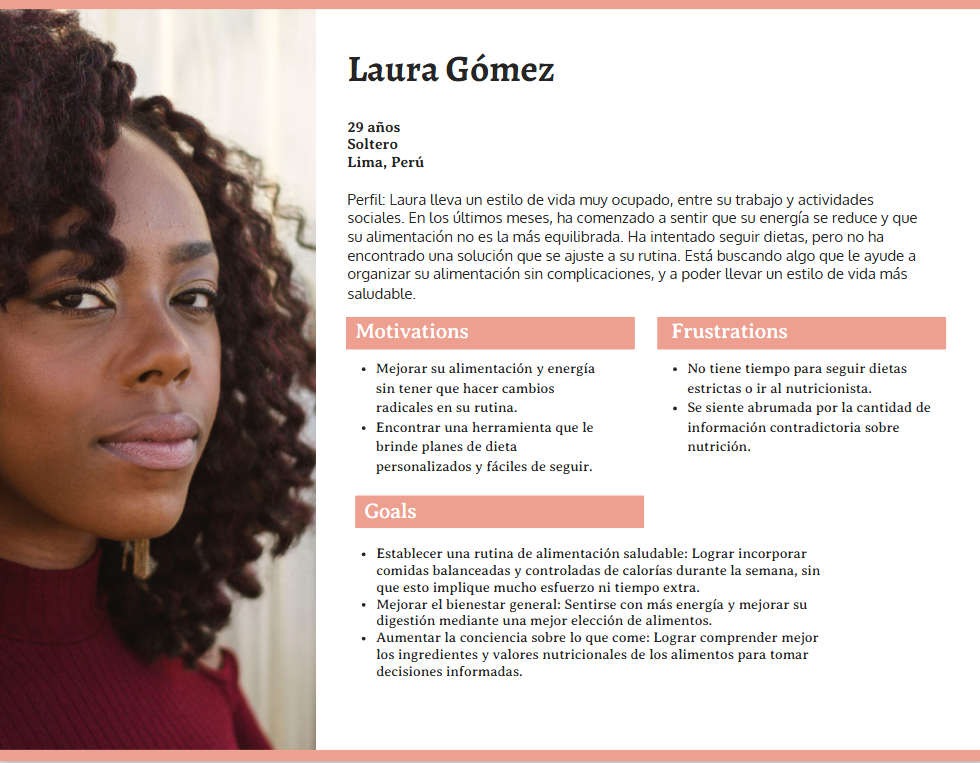

**Segmento #2: Nutricionistas en Perú**

### 2.3.2. User Task Matrix

A continuación se muestra el proceso para la realizacion del User Task Matrix para comprender las tareas que realizan los User Persona para cumplir sus objetivos.

**Segmento #1: Jóvenes de 18 - 28 años en Lima**

| **Tarea**                                                         | **Frecuencia** | **Importancia** |
| ----------------------------------------------------------------- | -------------- | --------------- |
| Ingresar alimentos y hacer seguimiento de calorías                | Diaria         | Alta            |
| Seguir plan nutricional personalizado                             | Diaria         | Alta            |
| Consultar recetas rápidas y fáciles                               | Semanal        | Media           |
| Realizar ajustes a la dieta (como cambiar recetas o ingredientes) | Semanal        | Media           |
| Consultar el progreso del peso o salud                            | Semanal        | Alta            |
| Recibir recordatorios de comidas o ejercicios                     | Diario         | Alta            |
| Acceder a recomendaciones sobre hábitos saludables                | Semanal        | Baja            |

---

**Segmento #2: Nutricionistas en el Perú**

| **Tarea**                                                        | **Frecuencia** | **Importancia** |
| ---------------------------------------------------------------- | -------------- | --------------- |
| Crear y personalizar planes nutricionales para pacientes         | Diario         | Alta            |
| Realizar seguimiento del progreso de los pacientes               | Semanal        | Alta            |
| Proveer consultas y asesoramiento a pacientes                    | Semanal        | Alta            |
| Ajustar planes nutricionales basados en el progreso del paciente | Semanal        | Alta            |
| Gestionar el historial de pacientes                              | Semanal        | Alta            |
| Acceder a recursos educativos sobre nutrición                    | Mensual        | Media           |
| Mantener comunicación con los pacientes                          | Semanal        | Alta            |

### 2.3.3. User Journey Mapping

A continuación se muestra el proceso para la realización del User Journey Mapping para los User Persona con el fin de entender las experiencias del usuario sin nuestra solución.

**Segmento #1: Jóvenes de 18 - 28 años en Lima**

**Segmento #2: Nutricionistas**

### 2.3.4. Empathy Mapping

A continuación se muestra el proceso para la realización del Empathy Mapping para los User Persona con el fin de entender lo que piensa, siente, oye, hace y observa.

**Segmento #1: Jóvenes de 18 - 28 años en Lima**

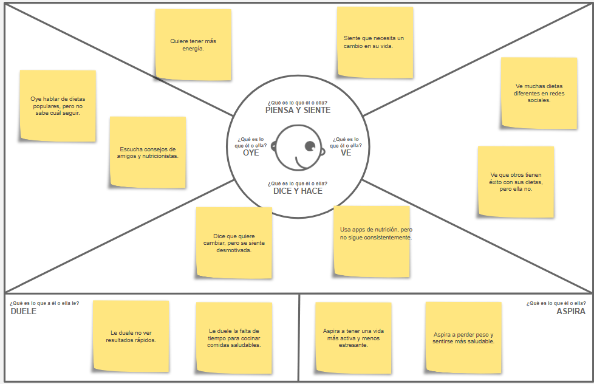

**Segmento #2: Nutricionistas en el Perú**

### 2.3.5. As-is Scenario Mapping

A continuación se muestra el proceso para la realización del As-Is Scenario Mapping para los User Persona.

**Segmento #1: Jóvenes de 18 - 28 años en Lima**

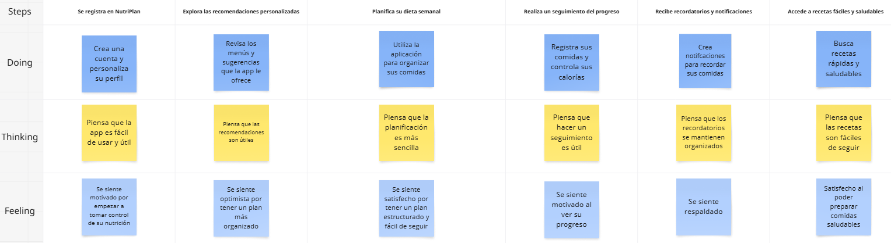

**Segmento #2: Nutricionistas en Perú**

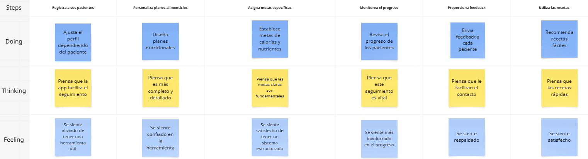

## 2.4. Ubiquitous Language

A continuación, se presentan los términos clave utilizados en el dominio de negocio de **NutriPlan**, con el objetivo de unificar el lenguaje entre el equipo de desarrollo, los usuarios y los profesionales involucrados.

- **User (joven usuario):** Persona que utiliza la aplicación con el objetivo de mejorar su alimentación mediante planes personalizados y seguimiento de hábitos.

- **Nutritionist (nutricionista):** Profesional de la salud que diseña, adapta y supervisa los planes alimenticios de los usuarios a través de la plataforma.

- **Meal plan (plan nutricional):** Conjunto de recomendaciones alimenticias diarias personalizadas según las metas, preferencias y estado de salud del usuario.

- **Progress tracking (seguimiento de progreso):** Funcionalidad que permite al usuario y al nutricionista visualizar avances relacionados al peso, hábitos y cumplimiento del plan.

- **Reminder (recordatorio):** Notificaciones automáticas que motivan al usuario a mantener la constancia en sus comidas, hidratación o consultas.

- **Healthy recipes (recetas saludables):** Preparaciones sugeridas por la app, sencillas y alineadas con el objetivo nutricional del usuario.

- **Food log (historial alimenticio):** Registro diario de alimentos consumidos por el usuario, utilizado para evaluación y ajustes del plan.

- **Professional dashboard (panel del profesional):** Interfaz exclusiva para nutricionistas, donde gestionan usuarios, visualizan métricas y dan seguimiento a planes.

- **Initial assessment (evaluación inicial):** Formulario al inicio del uso de la app donde el usuario detalla su estilo de vida, hábitos y metas.

- **Nutritional goal (objetivo nutricional):** Meta definida por el usuario, como perder peso, ganar masa muscular o mantener una dieta equilibrada.

- **Feedback (comentario):** Opiniones o sugerencias que el usuario deja en la plataforma sobre su experiencia, planes o funcionalidades.

- **Onboarding (proceso de incorporación):** Etapas iniciales para guiar al nuevo usuario en el uso de NutriPlan, como crear su perfil y recibir su primer plan.

- **Metrics (métricas):** Datos cuantificables como peso, IMC, calorías diarias y nivel de adherencia al plan, que se usan para evaluar el progreso del usuario.

- **Customization (personalización):** Adaptación del contenido de la app a las necesidades individuales de cada usuario.

# Capítulo III: Requirements Specification

## 3.1. To-Be Scenario Mapping

Para la realizar el To-be Scenario Mapping el equipo determinó como se vería el flujo de trabajo luego de que nuestra solución,
Nutriplan, haya sido implementada para ambos segmentos objetivos. El objetivo del presente artefacto es comparar y mejorar
los aspectos negativos identificados en el As-is Scenario.

**Segmento: Jóvenes de 18-28 años en Lima**

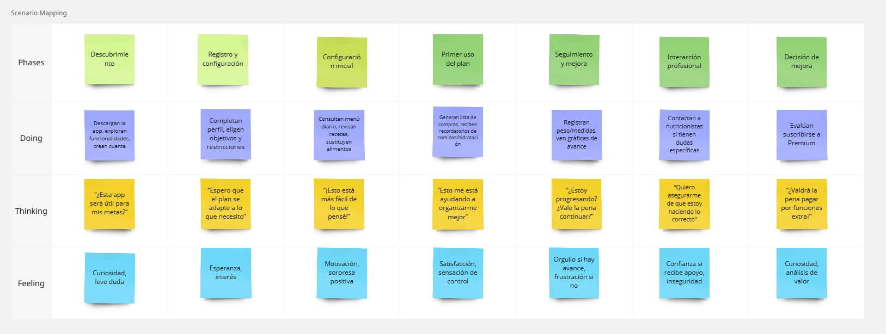

**Segmento: Nutricionistas en Perú**

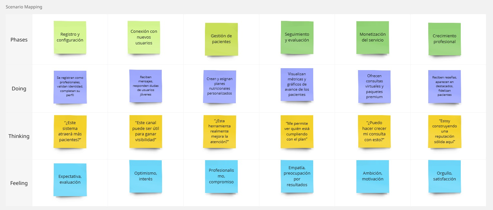

## 3.2. User Stories

| Epic/Story ID | Título                                       | Descripción                                                                                                                                       | Criterios de Aceptación                                                                                                                                                               | Relacionado con (Epic ID) |
|---------------|----------------------------------------------|---------------------------------------------------------------------------------------------------------------------------------------------------|----------------------------------------------------------------------------------------------------------------------------------------------------------------------------------------|----------------------------|
| E01           | Gestión de Cuentas                           | Como usuario, quiero crear, iniciar sesión, recuperar y eliminar mi cuenta para acceder a NutriPlan.                                               | Dado un visitante, cuando se registra con datos válidos, entonces se crea la cuenta y se envía una confirmación por correo.                                                       | -                          |
| US01          | Registro de Usuario                          | Como visitante, quiero registrarme con mi correo y contraseña para crear una cuenta en NutriPlan.                                                 | Dado un visitante, cuando proporciona datos válidos de registro, entonces el sistema crea una cuenta y envía un correo de confirmación.                                              | E01                        |
| US02          | Inicio y Cierre de Sesión                    | Como usuario, quiero iniciar y cerrar sesión de forma segura para gestionar mi cuenta.                                                            | Dado un usuario con cuenta activa, cuando ingresa sus credenciales válidas, entonces el sistema le permite acceder.                                                                | E01                        |
| US03          | Recuperación de Contraseña                   | Como usuario, quiero recuperar mi contraseña para volver a acceder a mi cuenta en caso de olvido.                                                 | Dado un usuario registrado, cuando solicita recuperar contraseña, entonces recibe un correo con un enlace para restablecerla.                                                       | E01                        |
| US04          | Eliminación de Cuenta                        | Como usuario, quiero eliminar mi cuenta y todos mis datos personales y nutricionales del sistema.                                                | Dado un usuario autenticado, cuando solicita eliminar su cuenta, entonces el sistema elimina todos sus datos asociados.                                                            | E01                        |
| E02           | Gestión de Perfiles                          | Como usuario, quiero configurar y editar mi perfil para personalizar mi experiencia en NutriPlan.                                                 | Dado un usuario autenticado, cuando completa sus datos y objetivos, entonces el sistema guarda correctamente la información.                                                         | -                          |
| US05          | Crear Perfil                                 | Como usuario, quiero registrar mis datos personales y objetivos nutricionales para recibir planes adecuados.                                      | Dado un usuario autenticado, cuando ingresa sus datos físicos y metas, entonces el sistema los almacena en su perfil.                                                              | E02                        |
| US06          | Editar Perfil                                | Como usuario, quiero modificar mis datos de perfil cuando haya cambios en mi estado físico o metas.                                               | Dado un usuario con perfil registrado, cuando actualiza sus datos, entonces el sistema los guarda y actualiza su configuración.                                                      | E02                        |
| E03           | Gestión de Suscripciones                     | Como usuario, quiero suscribirme a un plan para acceder a las funcionalidades premium de NutriPlan.                                               | Dado un usuario, cuando selecciona un plan y realiza el pago, entonces el sistema activa su suscripción.                                                                          | -                          |
| US07          | Seleccionar Plan de Suscripción              | Como usuario, quiero elegir un plan según mis necesidades nutricionales.                                                                          | Dado un usuario autenticado, cuando selecciona un plan válido, entonces el sistema le permite proceder al pago.                                                                    | E03                        |
| US08          | Ver Estado de Suscripción                    | Como usuario, quiero visualizar el estado de mi suscripción para saber si está activa o vencida.                                                 | Dado un usuario con suscripción, cuando accede a su cuenta, entonces el sistema muestra el estado y vencimiento de la suscripción.                                                | E03                        |
| E04           | Gestión de Pagos                             | Como usuario, quiero pagar mi suscripción de forma segura para acceder a funcionalidades premium.                                                 | Dado un usuario, cuando introduce datos de tarjeta válidos, entonces el pago se procesa correctamente.                                                                            | -                          |
| US09          | Procesar Pago                                | Como usuario, quiero ingresar los datos de mi tarjeta para pagar mi suscripción.                                                                  | Dado un usuario autenticado, cuando introduce datos válidos de pago, entonces el sistema procesa el cobro y genera un comprobante.                                                 | E04                        |
| US10          | Ver Historial de Pagos                       | Como usuario, quiero consultar mis pagos anteriores para llevar un control financiero.                                                            | Dado un usuario con historial de pagos, cuando accede a la sección correspondiente, entonces el sistema muestra la lista de pagos con fechas y montos.                             | E04                        |
| E05           | Planificación Nutricional                    | Como usuario o nutricionista, quiero crear y acceder a planes alimenticios personalizados para cumplir mis metas.                                | Dado un nutricionista autenticado, cuando crea un plan con objetivos, días y comidas, entonces el sistema lo guarda correctamente.                                                | -                          |
| US11          | Crear Plan Nutricional                       | Como nutricionista, quiero crear planes alimenticios personalizados para mis pacientes.                                                          | Dado un nutricionista autenticado, cuando define un plan con comidas, horarios y objetivos, entonces el sistema lo registra y asocia al usuario.                                    | E05                        |
| US12          | Ver Plan Nutricional Activo                   | Como usuario, quiero visualizar mi plan nutricional vigente para seguirlo diariamente.                                                            | Dado un usuario con plan activo, cuando accede a su perfil, entonces el sistema muestra las comidas organizadas por día.                                                           | E05                        |
| E06           | Seguimiento de Progreso                      | Como usuario, quiero registrar y ver mi progreso nutricional y físico para evaluar mis avances.                                                   | Dado un usuario, cuando registra datos como peso y medidas, entonces el sistema los almacena correctamente.                                                                      | -                          |
| US13          | Registrar Progreso                           | Como usuario, quiero ingresar mi peso y medidas periódicamente para llevar control.                                                               | Dado un usuario autenticado, cuando ingresa sus datos de progreso, entonces el sistema los guarda y vincula a su cuenta.                                                           | E06                        |
| US14          | Ver Gráficos de Progreso                     | Como usuario, quiero visualizar gráficos con la evolución de mi estado físico.                                                                    | Dado un usuario con datos de progreso, cuando accede a su historial, entonces ve representaciones gráficas de su evolución.                                                      | E06                        |
| E07           | Catálogo de Alimentos                        | Como nutricionista, quiero consultar un catálogo de alimentos con información nutricional para planificar dietas.                                | Dado un nutricionista, cuando busca alimentos por nombre o categoría, entonces el sistema muestra resultados relevantes.                                                           | -                          |
| US15          | Buscar Alimentos                             | Como nutricionista, quiero buscar alimentos por nombre o categoría.                                                                               | Dado un nutricionista autenticado, cuando realiza una búsqueda, entonces el sistema muestra los alimentos coincidentes.                                                           | E07                        |
| US16          | Ver Información Nutricional                  | Como nutricionista, quiero ver la información nutricional completa de cada alimento.                                                              | Dado un alimento, cuando se accede a su detalle, entonces el sistema muestra su perfil nutricional.                                                                                | E07                        |
| E08           | Página de Inicio (Landing Page)              | Como visitante, quiero acceder a la landing page para conocer la app antes de registrarme.                                                       | Dado un visitante, cuando accede al sitio, entonces puede ver información sobre beneficios, precios y testimonios.                                                                | -                          |
| US17          | Ver Información en Landing                   | Como visitante, quiero conocer las funciones y ventajas de NutriPlan antes de registrarme.                                                       | Dado un visitante, cuando entra al sitio, entonces puede leer las secciones de beneficios, testimonios y funcionalidades.                                                          | E08                        |
| US18          | Registro desde Landing                       | Como visitante, quiero iniciar mi registro desde la página informativa.                                                                           | Dado un visitante interesado, cuando hace clic en “Registrarse”, entonces el sistema lo redirige al formulario de creación de cuenta.                                              | E08                        |
| US19          | Exponer API IAM                              | Como desarrollador, quiero exponer endpoints de autenticación y gestión de cuentas para el backend de NutriPlan.                                  | Dado un request POST /auth/registro con datos válidos, entonces se crea el usuario y retorna 201.                                                                                   | -                          |
| US20          | API de Planes Nutricionales                   | Como desarrollador, quiero desarrollar endpoints para crear y obtener planes nutricionales.                                                     | Dado un request POST /planes con datos válidos, entonces se registra el plan nutricional y retorna 201.                                                                             | -                          |

## 3.3 Impact Mapping

**Segmento #1: Jóvenes de 18 - 28 años en Lima**

**Segmento #2: Nutricionistas en el Perú**

## 3.4 Product Backlog

El Product Backlog es una lista priorizada de todas las funcionalidades, mejoras, correcciones y tareas necesarias para desarrollar un producto. A continuación se presenta el Product Backlog de nuestro negocio:

| #   | User Story ID | Título                                 | Descripción                                                                                               | Story Points |
| --- | ------------- | -------------------------------------- | --------------------------------------------------------------------------------------------------------- | ------------ |
| 1   | US07          | Generar plan alimenticio personalizado | Como usuario, quiero recibir un plan de alimentación semanal basado en mis objetivos y perfil.            | 8            |
| 2   | US09          | Sustituir alimentos del plan           | Como usuario, quiero sustituir alimentos sugeridos por otros equivalentes para adaptarlo a mis gustos.    | 8            |
| 3   | US10          | Agregar restricciones alimentarias     | Como usuario, quiero especificar restricciones como alergias o preferencias (vegano, sin gluten).         | 8            |
| 4   | US04          | Crear perfil de usuario                | Como usuario nuevo, quiero crear mi perfil con información personal y metas nutricionales.                | 8            |
| 5   | US14          | Seguimiento de pacientes               | Como nutricionista, quiero ver el progreso de mis pacientes en la plataforma.                             | 8            |
| 6   | US13          | Nutricionista crea plan personalizado  | Como nutricionista, quiero poder crear y asignar planes nutricionales a mis pacientes.                    | 8            |
| 7   | US16          | Crear lista de compras                 | Como usuario, quiero generar una lista de compras basada en mi menú semanal.                              | 8            |
| 8   | US05          | Editar perfil                          | Como usuario, quiero actualizar mis datos personales y metas para mantenerlos al día.                     | 5            |
| 9   | US06          | Eliminar cuenta                        | Como usuario, quiero tener la opción de eliminar mi cuenta por privacidad o desuso.                       | 5            |
| 10  | US08          | Consultar plan diario                  | Como usuario, quiero ver el menú del día para seguir mi plan nutricional.                                 | 5            |
| 11  | US15          | Ver recetas saludables                 | Como usuario, quiero ver recetas saludables para preparar mis comidas.                                    | 5            |
| 12  | US17          | Editar lista de compras                | Como usuario, quiero modificar mi lista de compras para incluir otros productos.                          | 5            |
| 13  | US11          | Buscar nutricionista                   | Como usuario, quiero poder buscar un nutricionista dentro de la plataforma para consultas personalizadas. | 5            |
| 14  | US12          | Contactar a un nutricionista           | Como usuario, quiero enviar mensajes a nutricionistas para resolver dudas sobre mi plan.                  | 5            |
| 15  | US18          | Marcar productos comprados             | Como usuario, quiero marcar los productos que ya compré en mi lista.                                      | 3            |
| 16  | US20          | Ver gráfico de progreso                | Como usuario, quiero ver gráficos de evolución para motivarme y mantenerme en el camino.                  | 5            |
| 17  | US21          | Notificaciones de comidas              | Como usuario, quiero recibir recordatorios a la hora de mis comidas para mantener la constancia.          | 5            |
| 18  | US22          | Recordatorio de hidratación            | Como usuario, quiero recibir alertas para tomar agua durante el día.                                      | 5            |
| 19  | US23          | Recordatorio de actualización de peso  | Como usuario, quiero recibir recordatorios semanales para actualizar mi peso y mantener el seguimiento.   | 5            |
| 20  | US01          | Registro de Usuario                    | Como nuevo usuario, quiero registrarme en NutriPlan para poder acceder a las funcionalidades de la app.   | 5            |
| 21  | US02          | Inicio de sesión                       | Como usuario registrado, quiero iniciar sesión para acceder a mi perfil y funciones personalizadas.       | 5            |
| 22  | US03          | Recuperar contraseña                   | Como usuario, quiero recuperar mi contraseña si la olvido para poder acceder de nuevo a mi cuenta.        | 3            |
| 23  | US24          | Suscribirse a versión premium          | Como usuario, quiero poder suscribirme a NutriPlan Premium para acceder a funciones exclusivas.           | 8            |
| 24  | US25          | Ver beneficios premium                 | Como usuario, quiero comparar los beneficios de la versión gratuita y la versión premium.                 | 5            |

# Capítulo IV: Solution Software Design

## 4.1. Strategic-Level Domain-Driven Design

En esta sección se introduce y explica el proceso realizado para las decisiones de nivel estratégico aplicando Domain-Driven Design. El equipo explica y evidencia el proceso para descomponer el sistema en subconjuntos con límites naturales o Bounded Contexts. Para ello debe aplicar las herramientas de EvenStorming y Bounded Context Canvas.

### 4.1.1. EventStorming

Durante esta sesión de EventStorming, el equipo de NutriPlan se reunió conel objetivo de mapear de manera colaborativa yvisual el flujo principal de eventos de dominio que ocurren en la interacción entre usuarios y la apliación.La actividad tuvo una duración aprocimada de 2 horas, y fue facilitada utilizando herramientas digitales, siendo en este caso la herramienta Miro.

La técnica e aplico enfocándonos en la experienciadel usuario general y del nutricionista,identificando los eventos significativos del negocio, los comandos del sistema,los agregados y las vistas,conforme a la metodología propuesta por Alberto Brandolini.

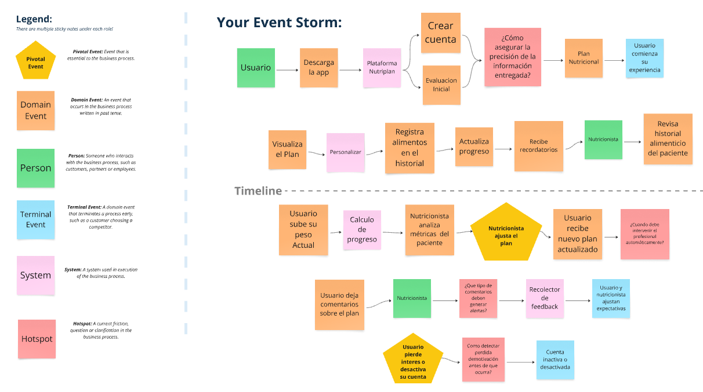

link: https://miro.com/app/board/uXjVI_LnCNw=/?share_link_id=288998827764

**Actividades realizadas**

- Se identificaron eventos clave de negocio.
- Se agregaron comando que desencadenan estos eventos.
- Se agruparon eventos por áreas funcionales, lo que permitió visualizar puntos de transición y dependencia.

#### 4.1.1.1. Candidate Context Discovery

A partir del EventStorming realizado,se llevó a cabo una sesión de Candidate Context Discovery con el objetivo de identificar los posibles bounded contexts del sistema, Para esta sesión, se utilizaron las siguientes técnicas:

- Start-with-value: Se priorizaron los componentes con mayor impacto en la propuesta de valor, como la personalización de planes y el monitoreo del progreso.
- Look-for-pivotal-events: Se analizaron los eventos que marcaban unatransición de responabilidad o un cambio de estado claro.

**Bounded Contexts identificados**

1. NutritionPlanning Context : Gestiona la creación, personalización y actualizazión de planes alimenticios
2. ProgressTracking Context : Encargado de registrar alimentos, métricas y generar reportes de progreso.
3. Onboarding Context : Maneja la incorporación de usuarios y su evaluacion incial.
4. FoodCatalog ontext : Relacionado con la sugerencia de recetas saludables y generación de listas.
5. UserProfile Context : Espacio para los usuarios para gestionar pacientes,metricas y recomendaciones.

#### 4.1.1.2. Domain Message Flows Modelings

En esta etapa se aplicó la tecnica de Domain Storytelling para representar como los distintos bounded contexts colaboran para satisfacer escenarios del negocio.Se seleccionaron flujos representativos como:

- Creacion de plan nutricional
- Monitoreo del progreso del usuario
- Gestion de plan del usuario

Cada historia se representa mediantes actores, acciones y los contextos responsable,permitiendo visualizar la orquestación y los contratos entre servicios

#### 4.1.1.3. Bounded Context Canvases

En esta sección se documenta cada uno de los bounded contexts identificados para el dominio de Nutriplan. utilizando el formato de Bounded Context Canvas. Cada canvas proporciona una visión detallada de los límites,responsabilidades,lenguaje ubicuo,capacidades y dependecias internas y externas del contexto.

Esta herramienta permitió al equipo delimitar ecplicitamente que comportamiento y datos pertenecen a cada parte del sistema,facilitando el diseño de soluciones modulares y alineadas con el dominio del negocio.

**Los Bounded Context definidos son:**

1. Nuriplanning
2. FoodCatalog
3. ProgressTracking
4. UserProfile
5. IAM
6. Payment
7. Subscription

### 4.1.2. Context Mapping

En esta sección se documenta el proceso y resultado del Context Mapping, una técnica estratégica que permite visualizar las relaciones entre los distintos Bounded Contexts de NutriPlan.

Se utilizó la técnica "look for pivotal events" a partir del EventStorming, lo que permitió descubrir interacciones relevantes entre contextos (por ejemplo, cómo el evento en ProgressTracking puede afectar la lógica de NutritionPlanning).

Se aplicaron patrones como:

- Customer/Supplier: Relaciones donde un contexto depende del output de otro.
- Conformist: donde un contexto consumidor se adapta al modelo del proveedor.
- Shared Kernel: donde dos conextos comparten un modelo común cuidadosament gestionado.

| **Context Origen** | **Context Destino** | **Relacion**      | **Descripción**                              |
| ------------------ | ------------------- | ----------------- | -------------------------------------------- |
| NutritionPlanning  | FoodCatalog         | Shared Kernel     | Comparten recetas y estructuras dealimentos. |
| NutritionPlanning  | ProgressTracking    | Customer/Supplier | Se adapta según el progreso del usuario.     |
| Subscription       | Payment             | Conformist        | Adopta el modelo y eventos de pago           |
| All                | IAM                 | Customer/supplier | Autenticación como servicio compartido.      |

### 4.1.3. Software Architecture

#### 4.1.3.1. Software Architecture Context Level Diagrams

El diagrama de contexto proporciona una vision de alto nivel del sistema. Muestra la interacción del sistema con sus actores externos, usuarios, otras aplicaciones, y externos, lo que ayuda a entender los limites del sistema.

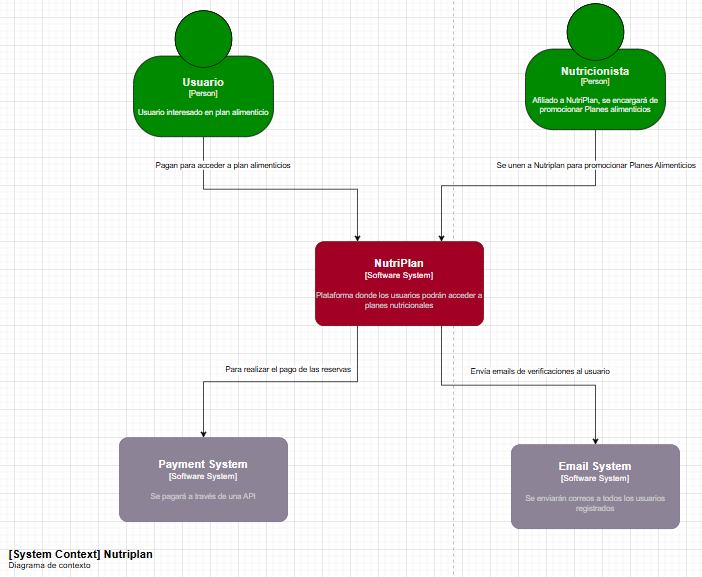

link: https://viewer.diagrams.net/?tags=%7B%7D&lightbox=1&highlight=0000ff&edit=_blank&layers=1&nav=1&title=C4%20Nutriplan&dark=auto#Uhttps%3A%2F%2Fdrive.google.com%2Fuc%3Fid%3D19SZcIG-Am5o2pFswX7s6hX-jFHn20M7v%26export%3Ddownload

#### 4.1.3.2. Software Architecture Container Level Diagrams

El diagram de contenedor detalla los diferentes componenetes del sistema. Muestra los principales contenedores como aplicaciones, servicios backend, bases de datos y la comunicación entre ellos.

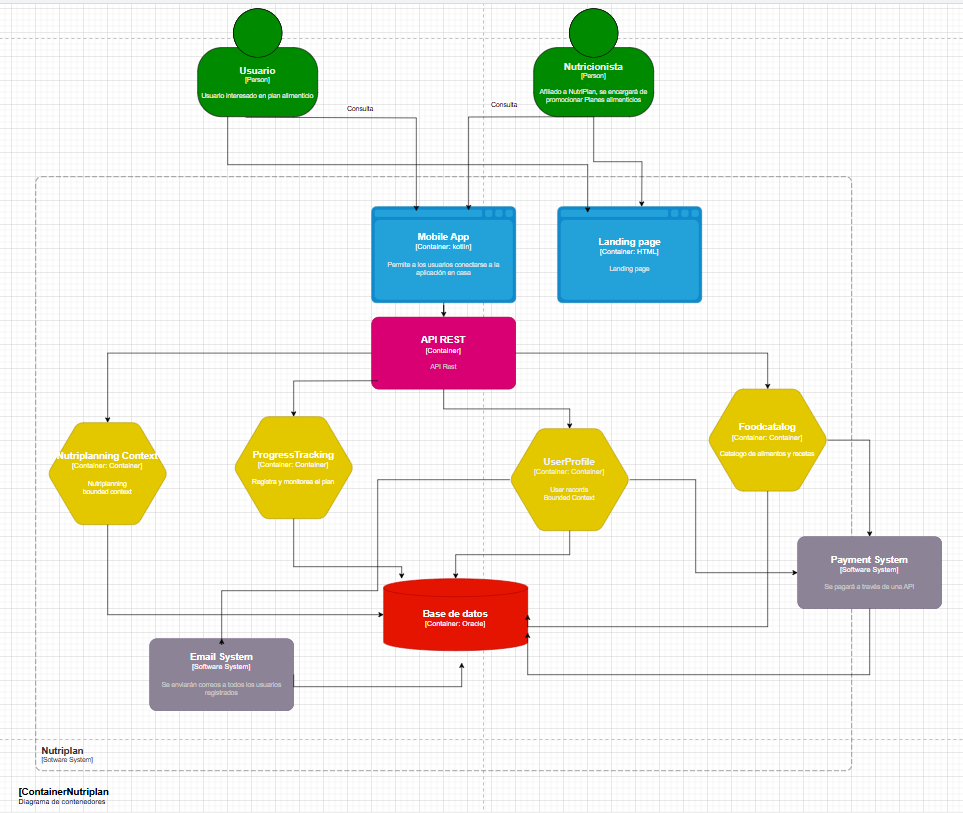

#### 4.1.3.3. Software Architecture Deployment Diagrams

El diagrama de componentes desglosa los contenedores en componentes internos. Cada componente muestra una funcionalidad específica dentro del sisetema, esto permite una comprensión más detallada de sus responsabilidadese interacción entre ellos.

**Nutriplanning**

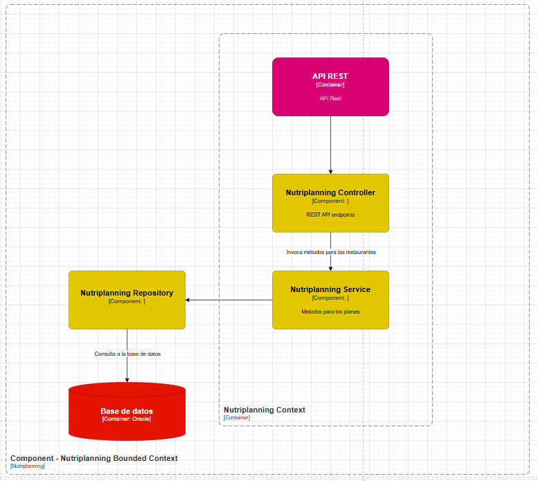

**FoodCatalog**

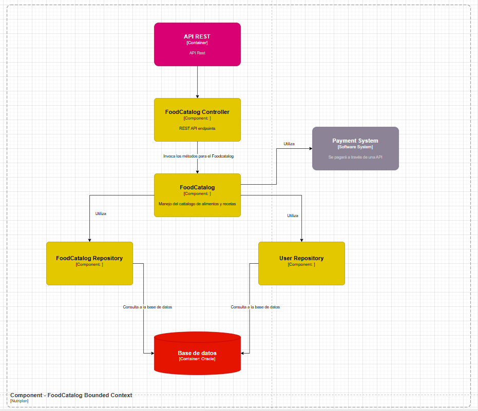

**ProgressTracking**

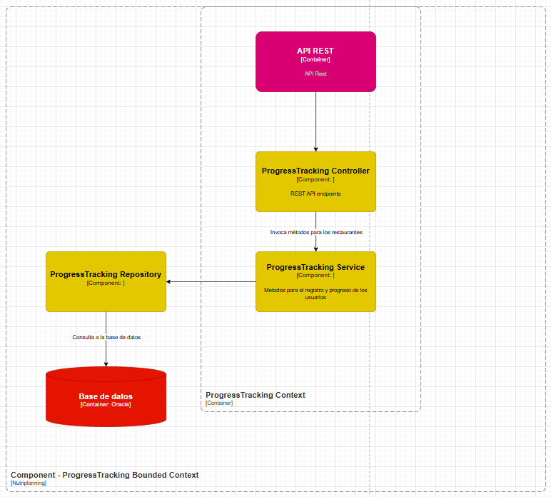

**UserProfile**

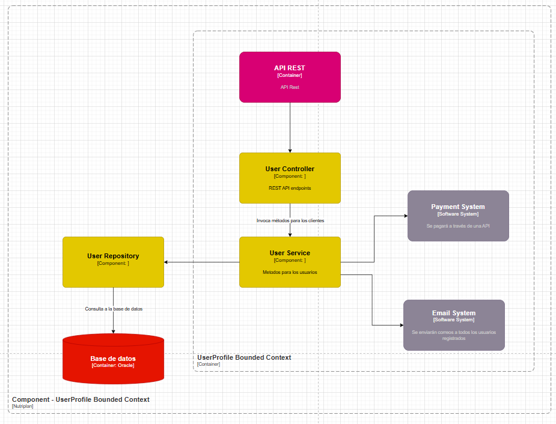

## 4.2. Tactical-Level Domain-Driven Design

### 4.2.1. Bounded Context: <Bounded-Context-Name>

#### Bounded Context: NutritionPlanning

En este contexto se gestiona toda la lógica relacionada con la **creación, asignación y seguimiento de planes nutricionales**, así como su desglose diario y por momento de comida. Este módulo es central en el sistema y depende de perfiles y recetas.

---

##### Clase: `NutritionalPlan`

###### Propósito:

Representa un plan nutricional creado por un nutricionista para un paciente. Contiene la información general del plan y los planes diarios asociados.

###### Atributos:

- `id: Long` – Identificador único del plan.
- `userId: Long` – ID del paciente al que está asignado el plan.
- `startDate: Date` – Fecha de inicio del plan.
- `name: String` – Nombre del plan (ej: "Plan Keto Semana 1").
- `description: String` – Descripción general del plan.
- `active: boolean` – Indicador de si el plan está activo.
- `dailyPlans: List<DailyPlan>` – Lista de planes diarios asociados al plan.

###### Métodos:

- `activatePlan(): void` – Activa el plan.
- `deactivatePlan(): void` – Desactiva el plan.
- `getDayPlan(weekDay:WeekDay):DailyPlan` – Devuelve el Plan del día de comida.
- `scheduleMeal(weekDay:WeekDay, meal:ScheduledMeal):void` – Agregar una comida programada a un día.
- `addFoodToMeal(weekDay:WeekDay,timeDay:TimeDay,food:PlannedFood)` – Agrega un alimento a la comida programada.
- `removeFoodFromMeal(weekDay:WeekDay,timeDay:TimeDay,foodId:Food)` – Elimina un alimento a la comida programada.
- `getPlanSummary(): PlanSummaryDTO` – Devuelve un resumen del plan.

---

#### Clase: `DailyPlan`

###### Propósito:

Representa un plan diario dentro de un plan nutricional. Define qué comidas están programadas para un día específico.

###### Atributos:

- `id: Long` – Identificador único del día.
- `nutritionalPlanId: Long` – Referencia al plan nutricional padre.
- `weekDay: WeekDay (enum)` – Día de la semana (ej: MONDAY).
- `scheduledMeals: List<ScheduledMeal>` – Comidas planificadas para ese día.

###### Métodos:

- `addScheduledMeal(meal: ScheduledMeal): void` – Agrega una comida al día.
- `removeScheduledMeal(moment: MomentOfDay): void` – Elimina una comida específica.
- `getMeals(): List<ScheduledMeal>` – Devuelve las comidas del día.
- `totalCalories(): Int` – Suma total de calorías del día.

---

#### Clase: `ScheduledMeal`

###### Propósito:

Representa una comida planificada en un momento específico del día (ej: desayuno).

###### Atributos:

- `momentOfDay: MomentOfDay (enum)` – Momento del día (ej: BREAKFAST, DINNER).
- `recipeId: Long` – Referencia a una receta (opcional).
- `plannedFoods: List<PlannedFood>` – Lista de alimentos específicos.

###### Métodos:

- `addFoodItem(foodItem: PlannedFood): void` – Agrega alimento a la comida.
- `removeFoodItem(foodId: Long): void` – Elimina un alimento.
- `getRecipe(): Recipe` – Devuelve la receta asociada (si la hay).
- `totalCalories(): Int` – Suma de calorías de esta comida.

---

#### Clase: `PlannedFood`

###### Propósito:

Alimento específico que se planifica consumir en una comida, con cantidad incluida.

###### Atributos:

- `foodId: Long` – Referencia al alimento.
- `quantity: Int` – Cantidad en gramos o unidad base.

###### Métodos:

- `calculateCalories(): Int` – Retorna las calorías de este alimento según su cantidad.

---

##### Relaciones

- `NutritionalPlan` → contiene muchos `DailyPlan`
- `DailyPlan` → contiene muchos `ScheduledMeal`
- `ScheduledMeal` → puede tener un `Recipe` o muchos `PlannedFood`
- `PlannedFood` → referencia a `Food` en el contexto de `FoodCatalog`

#### Bounded Context: FoodCatalog

Este contexto gestiona el catálogo de alimentos y recetas disponibles en el sistema. Permite a los nutricionistas y administradores registrar, consultar y estructurar alimentos y recetas, los cuales serán utilizados en la planificación de comidas.

---

##### Clase: `Food`

###### Propósito:

Representa un alimento individual que puede ser consumido por sí mismo o como parte de una receta. Contiene información nutricional relevante.

###### Atributos:

- `id: Long` – Identificador único del alimento.
- `name: String` – Nombre del alimento.
- `description: String` – Descripción general del alimento.
- `caloriesPerUnit: Int` – Calorías por unidad.
- `proteinPerUnit: Float` – Proteína por unidad.
- `fatPerUnit: Float` – Grasa por unidad.
- `carbsPerUnit: Float` – Carbohidratos por unidad.
- `unit: UnitOfMeasure (enum)` – Unidad de medida base.

###### Métodos:

- `calculateCalories(quantity: Float): Int` – Calcula las calorías según una cantidad dada.
- `isValid(): Boolean` – Valida si el alimento tiene datos completos.

---

##### Clase: `Recipe`

###### Propósito:

Representa una receta compuesta por varios ingredientes. Cada receta puede ser utilizada en la planificación de comidas.

###### Atributos:

- `id: Long` – Identificador único de la receta.
- `name: String` – Nombre de la receta.
- `description: String` – Descripción de preparación.
- `ingredients: List<Ingredient>` – Lista de ingredientes que componen la receta.
- `instructions: String` – Pasos para preparar la receta.

###### Métodos:

- `addIngredient(ingredient: Ingredient): void` – Agrega un ingrediente.
- `removeIngredient(foodId: Long): void` – Elimina un ingrediente de la receta.
- `getTotalCalories(): Int` – Calcula la suma total de calorías de la receta.

---

##### Clase: `Ingredient`

###### Propósito:

Representa un alimento y su cantidad utilizada dentro de una receta.

###### Atributos:

- `foodId: Long` – Referencia al alimento.
- `quantity: Float` – Cantidad utilizada.
- `unit: UnitOfMeasure (enum)` – Unidad de medida (gramos, unidades, etc.).

###### Métodos:

- `calculateCalories(): Int` – Calcula las calorías del ingrediente.
- `toFood(): Food` – Devuelve el objeto `Food` referenciado.

---

##### Enum: `UnitOfMeasure`

###### Propósito:

Enumera las unidades de medida disponibles para alimentos e ingredientes.

###### Valores:

- `GRAMS`
- `MILLILITERS`
- `UNITS`
- `CUPS`
- `TABLESPOONS`
- `TEASPOONS`

---

###### Relaciones

- `Recipe` → contiene muchos `Ingredient`
- `Ingredient` → referencia a `Food`
- `Food` → puede estar presente en múltiples `Recipe` a través de `Ingredient`

#### Bounded Context: UserProfiles

Este contexto gestiona la información de perfil tanto de los pacientes como de los nutricionistas. Incluye detalles personales, profesionales y el estado de verificación de los perfiles.

---

##### Clase: `UserProfile`

###### Propósito:

Representa el perfil básico de un usuario, ya sea paciente o nutricionista. Es la base para extender con roles específicos.

###### Atributos:

- `id: Long` – Identificador único del perfil.
- `userId: Long` – Referencia al usuario del sistema.
- `fullName: String` – Nombre completo del usuario.
- `birthDate: Date` – Fecha de nacimiento.
- `gender: Gender` – Género del usuario.
- `height: Float` – Altura en centímetros.
- `weight: Float` – Peso actual en kilogramos.
- `activityLevel: ActivityLevel` –Nivel de actividad del usuario.
- `profilePictureUrl: String` – URL de la imagen de perfil.

###### Métodos:

- `updateProfile(data: ProfileDTO): void` – Actualiza los datos del perfil.
- `getAge(): Int` – Calcula la edad actual.
- `isComplete(): Boolean` – Verifica si el perfil está completo.

---

##### Clase: `NutritionistProfile`

###### Propósito:

Extiende `UserProfile` con atributos y comportamientos específicos de los nutricionistas, permitiendo gestionar su perfil profesional, pacientes asignados y planes creados.

###### Atributos:

- `id:Long` – Referencia a la clase padre.
- `userId: Long` – Referencia al usuario.
- `patientId: List<PatientId>` – Referencia al paciente usuario.
- `licenseNumber: String` – Número de licencia profesional.
- `specialization: String` – Especialidad médica o nutricional.
- `yearsOfExperience: Int` – Años de experiencia.
- `description: String` – Descripción del perfil profesional.
- `isVerified: Boolean` – Estado de verificación por la plataforma.
- `createdAt: DateTime` – Fecha de creación del perfil.

###### Métodos:

- `updateProfile(specialization: String, description: String): void` – Actualiza la especialidad y descripción.
- `verifyLicense(): void` – Marca la licencia como verificada.
- `getAssignedPatients(): List<PatientProfile>` – Devuelve la lista de pacientes asignados.
- `getActivePlans(): List<NutritionalPlan>` – Devuelve los planes nutricionales activos que ha creado.
- `assignPatient(patientId: Long): void` – Asigna un paciente al nutricionista.
- `unassignPatient(patientId: Long): void` – Desasigna un paciente del nutricionista.
- `listPatients(): List<PatientProfile>` – Lista todos los pacientes asignados.
- `createNutritionalPlan(patientId: Long, planData: NutritionalPlanDTO): NutritionalPlan` – Crea un nuevo plan nutricional para un paciente.
- `reviewWeeklyReport(patientId: Long): WeeklyReport` – Permite revisar el reporte semanal de un paciente.

---

###### Relaciones

- `NutritionistProfile` extiende a `UserProfile`
- `UserProfile` está asociado a `User` (del contexto IAM)

#### Bounded Context: ProgressTracking

Este contexto se encarga de registrar y monitorear el progreso del paciente durante la duración de un plan nutricional. Incluye métricas como peso, calorías consumidas, adherencia al plan, y otros indicadores semanales.

---

##### Clase: `WeeklyReport`

###### Propósito:

Representa el reporte de progreso semanal de un paciente respecto a un plan nutricional asignado.

###### Atributos:

- `id: Long` – Identificador único del reporte.
- `userId: Long` – ID del paciente.
- `planId: Long` – Referencia al plan nutricional.
- `weekStart: Date` – Fecha de inicio de la semana.
- `weekEnd: Date` – Fecha de fin de la semana.
- `mealsPlanned: Int` – Cantidad total de comidas esperadas esa semana.
- `mealsLogged: Int` – Número de comidas registradas por el paciente.
- `adherence: Float` – Porcentaje de adherencia al plan (0.0 a 1.0).
- `caloriesPlanned: Int` – Calorías totales planificadas para la semana.
- `caloriesConsumed: Int` – Calorías realmente consumidas.
- `startingWeight: Float` – Peso al inicio de la semana.
- `endingWeight: Float` – Peso al final de la semana.
- `generatedAt: DateTime` – Fecha de generación del reporte.

###### Métodos:

- `calculateAdherence(): Float` – Calcula el nivel de adherencia del paciente.
- `calculateCaloricBalance(): Int` – Diferencia entre calorías planificadas y consumidas.
- `hasProgress(): Boolean` – Indica si hubo progreso en el peso.
- `generateSummary(): WeeklySummaryDTO` – Devuelve un resumen general del progreso.

---

###### Relaciones

- `WeeklyReport` → referencia a `NutritionalPlan` (en NutritionPlanning)
- `WeeklyReport` → se asocia a un `User` por `usuarioId`

#### Bounded Context: IAM

Este contexto gestiona la **identidad y acceso de los usuarios**, incluyendo la autenticación, autorización mediante roles y la asociación de estos con los usuarios. Es fundamental para garantizar el control de acceso dentro del sistema.

---

##### Clase: `User`

###### Propósito:

Representa a un usuario del sistema, ya sea paciente, nutricionista o administrador. Se encarga de manejar su identidad, credenciales y roles asignados.

###### Atributos:

- `id: Long` – Identificador único del usuario.
- `email: String` – Correo electrónico del usuario.
- `password: String` – Contraseña encriptada.
- `role: Set<Role>` – Conjunto de roles asignados.
- `createdAt: Date` – Fecha de creación del usuario.
- `updatedAt: Date` – Fecha de última actualización.

###### Métodos:

- `User()` – Constructor vacío.
- `User(email: String, password: String)` – Constructor con credenciales básicas.
- `User(email: String, password: String, roles: List<Role>)` – Constructor con roles iniciales.
- `addRole(role: Role): User` – Asigna un nuevo rol al usuario.
- `addRoles(roles: List<Role>): User` – Asigna múltiples roles al usuario.
- `getSerializedRoles(): List<String>` – Devuelve los roles como lista de strings.
- `getEmail(): String` – Devuelve el email del usuario.
- `getPassword(): String` – Devuelve la contraseña del usuario.
- `getRoles(): Set<Role>` – Devuelve el conjunto de roles asignados.

---

##### Clase: `Role`

###### Propósito:

Define un rol dentro del sistema, utilizado para controlar los permisos y acceso a funcionalidades específicas.

###### Atributos:

- `id: Long` – Identificador del rol.
- `name: Roles (enum)` – Nombre del rol, como `ROLE_ADMIN`, `ROLE_USER`, etc.

###### Métodos:

- `Role()` – Constructor vacío.
- `Role(name: Roles)` – Constructor con nombre de rol.
- `getStringName(): String` – Devuelve el nombre del rol como string.
- `getDefaultRole(): Role` – Devuelve el rol por defecto.
- `toRoleFromName(name: String): Role` – Convierte un string al rol correspondiente.
- `validateRoleSet(roles: List<Role>): List<Role>` – Valida y filtra un conjunto de roles.
- `getId(): Long` – Devuelve el ID del rol.
- `getName(): Roles` – Devuelve el nombre del rol.
- `setId(id: Long): void` – Asigna el ID del rol.
- `setName(name: Roles): void` – Asigna el nombre del rol.

---

##### Enumeración: `Roles`

###### Propósito:

Define los posibles valores de roles utilizados en el sistema.

###### Valores:

- `ROLE_ADMIN`
- `ROLE_NUTRITIONIST`
- `ROLE_USER`

---

## Relaciones

- `User` → puede tener muchos `Role`.
- `Role` → pertenece a uno o más `User`.
- `Roles` (enum) → define las constantes de los nombres de rol utilizados por `Role`.

#### Bounded Context: Subscription

Este contexto gestiona la **suscripción de usuarios al sistema**, incluyendo el tipo de plan contratado, su duración, estado y renovación. Se relaciona directamente con el contexto de `Payment` para validar los pagos asociados.

---

##### Clase: `Subscription`

###### Propósito:

Representa una suscripción activa o pasada de un usuario a un plan del sistema. Permite modificar el tipo de plan o renovarlo.

###### Atributos:

- `id: Long` – Identificador único de la suscripción.
- `planType: PlanTypes (enum)` – Tipo de plan contratado.
- `userId: UserId` – Identificador del usuario.
- `startDate: LocalDate` – Fecha de inicio de la suscripción.
- `renewDate: LocalDate` – Fecha de renovación automática.
- `status: String` – Estado de la suscripción (ej: ACTIVA, CANCELADA).
- `cost: double` – Costo del plan.
- `createdAt: Date` – Fecha de creación del registro.
- `updatedAt: Date` – Fecha de última modificación.

###### Métodos:

- `Subscription(command: CreateSubscriptionCommand)` – Constructor de suscripción.
- `updatePlanType(command: UpdatePlanTypeCommand): void` – Cambia el tipo de plan.
- `renewPlan(command: RenewSubscriptionCommand): void` – Renueva la suscripción.
- `getUserId(): Long` – Devuelve el ID del usuario.
- `getPlanType(): PlanTypes` – Devuelve el tipo de plan.
- `getStartDate(): LocalDate` – Devuelve la fecha de inicio.
- `getRenewDate(): LocalDate` – Devuelve la fecha de renovación.
- `getStatus(): String` – Devuelve el estado.
- `getCost(): double` – Devuelve el costo.

---

##### Enumeración: `PlanTypes`

###### Propósito:

Define los tipos de suscripciones disponibles en el sistema.

###### Valores:

- `BASIC`
- `PREMIUM`
- `STANDARD`

---

##### Relaciones

- `Subscription` → pertenece a un `User` (desde IAM).
- `Subscription` → tiene uno o más `Payment`.

---

#### Bounded Context: Payment

Este contexto gestiona la **información de pagos asociados a suscripciones**, incluyendo datos de tarjeta, fecha de vencimiento, CVV, estado de pago, y más.

---

##### Clase: `Payment`

###### Propósito:

Representa un pago realizado por un usuario para una suscripción, guardando detalles sensibles como método de pago, fecha y estado.

###### Atributos:

- `id: Long` – Identificador del pago.
- `subscriptionId: Long` – Referencia a la suscripción asociada.
- `date: LocalDate` – Fecha en la que se realizó el pago.
- `state: String` – Estado del pago (ej: APROBADO, RECHAZADO).
- `cardHolderName: String` – Nombre en la tarjeta.
- `cardNumber: String` – Número de la tarjeta (enmascarado).
- `expireDate: Date` – Fecha de expiración de la tarjeta.
- `cvv: String` – Código de seguridad.
- `createdAt: Date` – Fecha de creación del registro.
- `updatedAt: Date` – Fecha de última modificación.

###### Métodos:

- `Payment(command: CreatePaymentCommand)` – Constructor de pago.
- `getSubscriptionId(): Long` – Devuelve el ID de la suscripción.
- `getDate(): LocalDate` – Devuelve la fecha del pago.
- `getState(): String` – Devuelve el estado del pago.
- `getCardHolderName(): String` – Devuelve el nombre del titular.
- `getCardNumber(): String` – Devuelve el número de tarjeta.
- `getExpireDate(): String` – Devuelve la fecha de vencimiento.
- `getCvv(): String` – Devuelve el código de seguridad.

---

###### Relaciones

- `Payment` → pertenece a una `Subscription`.

#### 4.2.1.1. Domain Layer

#### Domain Layer - NutritionPlanning

La capa de dominio representa el núcleo de la lógica de negocio de la aplicación. Define los conceptos fundamentales del dominio, sus reglas y relaciones, utilizando elementos como Aggregates, Entities, Value Objects, Domain Services y comandos/consultas.

#### Aggregates

#### NutritionalPlan

Es la raíz del agregado que encapsula toda la lógica del plan nutricional de un usuario durante una semana. Garantiza la integridad y coherencia de los elementos que lo componen: los DailyPlans y sus ScheduledMeals.

**Métodos:**

- `activatePlan()`
- `deactivatePlan()`
- `getPlanSummary(): PlanSummaryDTO`
- `getDailyPlan(weekDay: WeekDay): DailyPlan`
- `scheduleMeal(weekDay: WeekDay, timeDay: TimeDay, meal: ScheduledMeal): void`
- `addFoodToMeal(weekDay: WeekDay, timeDay: TimeDay, food: PlannedFood): void`
- `removeFoodFromMeal(weekDay: WeekDay, timeDay: TimeDay, foodId: Long): void`

#### Entities

#### DailyPlan

Representa el conjunto de comidas planificadas para un día específico de la semana.

**Propiedades:**

- `weekDay: WeekDay`
- `scheduledMeals: List<ScheduledMeal>`

**Métodos:**

- `addScheduledMeal(meal: ScheduledMeal): void`
- `removeScheduledMeal(timeDay: TimeDay): void`
- `getMeals(): List<ScheduledMeal>`
- `totalCalories(): Int`

#### ScheduledMeal

Representa una comida específica (por ejemplo, desayuno o almuerzo) dentro de un día del plan.

**Propiedades:**

- `timeDay: TimeDay`
- `plannedFoods: List<PlannedFood>`
- `recipeId: Long?`

**Métodos:**

- `addFoodItem(foodItem: PlannedFood): void`
- `removeFoodItem(foodId: Long): void`
- `getRecipe(): Recipe`
- `totalCalories(): Int`

#### PlannedFood

Representa un alimento específico que será consumido dentro de una comida.

**Propiedades:**

- `foodId: Long`
- `amount: Int`
- `unit: Unit`

**Método:**

- `calculateCalories(): Int`

#### Value Objects

##### WeekDay (Enum)

Días de la semana:

- `MONDAY`, `TUESDAY`, `WEDNESDAY`, `THURSDAY`, `FRIDAY`, `SATURDAY`, `SUNDAY`

##### TimeDay (Enum)

Momentos del día para planificar comidas:

- `BREAKFAST`, `MIDMORNING`, `LUNCH`, `DINNER`

##### Unit (Enum)

Unidades válidas para los alimentos:

- `GRAM`, `KILOGRAM`, `MILLILITER`, `LITER`, `UNIT`, `SLICE`, `TABLESPOON`, `TEASPOON`, `CUP`, `PIECE`

### Commands

Acciones que modifican el estado del dominio:

- `CreateNutritionalPlanCommand(userId, startDate, name, description)`
- `DeleteNutritionalPlanCommand(planId)`
- `ActivatePlanCommand(planId)`
- `DeactivatePlanCommand(planId)`
- `ScheduleMealCommand(planId, weekDay, momentDay, recipeId?, List<PlannedFoodDTO>)`
- `AddFoodToMealCommand(planId, weekDay, momentDay, foodId, quantity)`
- `RemoveFoodFromMealCommand(planId, weekDay, momentDay, foodId)`
- `ReplaceMealRecipeCommand(planId, weekDay, momentDay, recipeId)`

### Queries

Consultas que permiten leer el estado del dominio:

- `GetNutritionalPlanQuery(planId)`
- `GetDailyPlanQuery(planId, weekDay)`
- `GetScheduledMealQuery(planId, weekDay, momentDay)`
- `GetWeeklySummaryQuery(planId)`
- `ListAllPlansForUserQuery(userId)`

### Domain Services

Servicios de dominio encargados de manejar lógica de negocio que no corresponde exclusivamente a una entidad:

- `NutritionalPlanCommandService`
- `DailyPlanCommandService`
- `ScheduledMealCommandService`
- `NutritionalPlanQueryService`
- `DailyPlanQueryService`
- `ScheduledMealQueryService`

---

#### Domain Layer - WeeklyReport

La capa de dominio representa el núcleo de la lógica del módulo de reportes semanales. Define los conceptos clave del dominio, sus atributos, comportamientos y relaciones, centrándose en representar el progreso del paciente con respecto a un plan nutricional.

#### Aggregates

#### WeeklyReport

Agregado raíz que representa el reporte semanal generado para un paciente. Centraliza la información sobre cumplimiento, consumo calórico y evolución del peso.

**Atributos:**

- `id: Long`
- `userId: Long`
- `planId: Long`
- `weekStart: Date`
- `weekEnd: Date`
- `mealsPlanned: Int`
- `mealsLogged: Int`
- `adherence: Float`
- `caloriesPlanned: Int`
- `caloriesConsumed: Int`
- `startingWeight: Float`
- `endingWeight: Float`
- `generatedAt: DateTime`

**Métodos:**

- `calculateAdherence(): Float`
- `calculateCaloricBalance(): Int`
- `hasProgress(): Boolean`
- `generateSummary(): WeeklySummaryDTO`

#### Value Objects

Actualmente no se definen Value Objects independientes, ya que los datos están encapsulados directamente en el agregado `WeeklyReport`.

---

### Commands

Acciones que modifican o generan nuevos elementos en el dominio:

- `GenerateWeeklyReportCommand(userId, planId, weekStart, weekEnd, mealsPlanned, mealsLogged, caloriesPlanned, caloriesConsumed, startingWeight, endingWeight)`

---

### Queries

Consultas para obtener información del dominio:

- `GetWeeklyReportQuery(reportId)`
- `ListWeeklyReportsForUserQuery(userId)`
- `GetReportByWeekQuery(userId, weekStart)`

---

### Domain Services

Servicios de dominio que encapsulan reglas de negocio complejas que no pertenecen a una sola entidad:

- `WeeklyReportCommandService`
- `WeeklyReportQueryService`

---

#### Domain Layer - RecipesAndFood

La capa de dominio representa el núcleo de la lógica relacionada con la gestión de alimentos y recetas. Define los conceptos fundamentales, sus atributos, comportamientos y relaciones dentro de este bounded context.

#### Aggregates

#### Recipe

Es la raíz del agregado que encapsula la lógica de una receta alimentaria. Gestiona su identidad, descripción, instrucciones y la lista de ingredientes que la componen.

**Propiedades:**

- `id: Long`
- `name: String`
- `description: String`
- `instructions: String`
- `createdBy: Long`
- `ingredients: List<MealIngredient>`

**Métodos:**

- `addIngredient(foodId: Long, quantity: Int): void`
- `removeIngredient(foodId: Long): void`
- `getTotalCalories(): Int`

#### Entities

#### Food

Representa un alimento individual con su información nutricional asociada.

**Propiedades:**

- `id: Long`
- `name: String`
- `unit: Unit`
- `caloriesPerUnit: Float`
- `proteinPerUnit: Float`
- `carbsPerUnit: Float`
- `fatPerUnit: Float`

**Método:**

- `getNutritionalInfo(): NutritionDTO`

#### Value Objects

##### Unit (Enum)

Unidades válidas para los alimentos:

- `GRAM`
- `KILOGRAM`
- `MILLILITER`
- `LITER`
- `UNIT`
- `SLICE`
- `TABLESPOON`
- `TEASPOON`
- `CUP`
- `PIECE`

#### Commands

Acciones que modifican el estado del dominio:

- `CreateRecipeCommand(name, description, instructions, createdBy)`
- `AddIngredientToRecipeCommand(recipeId, foodId, quantity)`
- `RemoveIngredientFromRecipeCommand(recipeId, foodId)`
- `DeleteRecipeCommand(recipeId)`
- `UpdateFoodNutritionalInfoCommand(foodId, updatedValues)`
- `CreateFoodCommand(name, unit, calories, proteins, carbs, fats)`

#### Queries

Consultas que permiten obtener información del dominio:

- `GetRecipeQuery(recipeId)`
- `ListAllRecipesByUserQuery(userId)`
- `GetFoodQuery(foodId)`
- `ListAllFoodsQuery()`

#### Domain Services

Servicios de dominio encargados de manejar lógica de negocio transversal:

- `RecipeCommandService`
- `FoodCommandService`
- `RecipeQueryService`
- `FoodQueryService`

---

#### Domain Layer - Profiles

La capa de dominio representa el núcleo de la lógica de negocio relacionada con los profesionales de la nutrición y los pacientes. Define las entidades principales, sus relaciones, comportamientos y validaciones, a través de Entities, Value Objects y Domain Services.

#### Entities

#### Nutritionist

Representa a un profesional de la salud encargado de gestionar planes nutricionales y hacer seguimiento del progreso de los pacientes.

**Propiedades:**

- `id: Long`
- `userId: Long`
- `patientIds: List<Long>`
- `licenseNumber: String`
- `specialization: String`
- `yearsOfExperience: Int`
- `description: String`
- `isVerified: Boolean`
- `createdAt: DateTime`

**Métodos:**

- `updateProfile(specialization: String, description: String): void`
- `verifyLicense(): void`
- `getAssignedPatients(): List<PatientProfile>`
- `getActivePlans(): List<NutritionalPlan>`
- `assignPatient(patientId: Long): void`
- `unassignPatient(patientId: Long): void`
- `listPatients(): List<PatientProfile>`
- `createNutritionalPlan(patientId: Long, planData: NutritionalPlanDTO): NutritionalPlan`
- `reviewWeeklyReport(patientId: Long): WeeklyReport`

#### PatientProfile (PerfilUsuario)

Contiene la información personal, biométrica y de estilo de vida del usuario paciente.

**Propiedades:**

- `id: Long`
- `userId: Long`
- `name: String`
- `birthdate: Date`
- `gender: Gender`
- `height: Float`
- `weight: Float`
- `activityLevel: ActivityLevel`

**Métodos:**

- `updateProfile(data: ProfileDTO): void`
- `getAge(): Int`
- `isComplete(): Boolean`

#### Value Objects

##### Gender (Enum)

Categoriza el género del paciente:

- `MALE`
- `FEMALE`
- `OTHER`

##### ActivityLevel (Enum)

Clasifica el nivel de actividad física del paciente:

- `SEDENTARY`
- `MODERATE`
- `ACTIVE`

#### Domain Services

Servicios de dominio que gestionan operaciones entre perfiles de usuario y nutricionistas, validaciones cruzadas o lógicas que no pertenecen exclusivamente a una entidad.

- `ProfileManagementService`
- `PatientAssignmentService`
- `NutritionistVerificationService`

---

### Domain Layer - Subscription

La capa de dominio encapsula la lógica central relacionada con la gestión de suscripciones de los usuarios. Define las reglas del negocio, el ciclo de vida de una suscripción y los distintos tipos de planes ofrecidos.

#### Entities

##### Subscription

Representa una suscripción activa o pasada de un usuario, incluyendo información sobre el tipo de plan, fechas de inicio y renovación, estado y costo.

**Propiedades:**

- `id: Long`
- `planType: PlanTypes`
- `userId: UserId`
- `startDate: LocalDate`
- `renewDate: LocalDate`
- `status: String`
- `cost: double`
- `createdAt: Date`
- `updatedAt: Date`

**Métodos:**

- `Subscription(command: CreateSubscriptionCommand)`
- `updatePlanType(command: UpdatePlanTypeCommand): void`
- `renewPlan(command: RenewSubscriptionCommand): void`
- `getUserId(): Long`
- `getPlanType(): PlanTypes`
- `getStartDate(): LocalDate`
- `getRenewDate(): LocalDate`
- `getStatus(): String`
- `getCost(): double`

#### Value Objects

##### PlanTypes (Enum)

Define los diferentes tipos de planes de suscripción disponibles:

- `BASIC`
- `STANDARD`
- `PREMIUM`

---

### Commands

Acciones que modifican el estado de las suscripciones:

- `CreateSubscriptionCommand(userId, planType, startDate, cost)`
- `UpdatePlanTypeCommand(subscriptionId, newPlanType)`
- `RenewSubscriptionCommand(subscriptionId, newRenewDate)`

---

### Queries

Consultas relacionadas con las suscripciones (se pueden expandir en la capa de aplicación):

- `GetSubscriptionByUserQuery(userId)`
- `ListAllSubscriptionsQuery()`
- `GetActiveSubscriptionsQuery()`

---

### Domain Services

Servicios de dominio para encapsular lógica compleja que no pertenece a una sola entidad:

- `SubscriptionCommandService`
- `SubscriptionQueryService`

---

#### 4.2.1.2. Interface Layer

#### Interface Layer - NutritionPlanning

Esta capa define los puntos de entrada de la aplicación desde el exterior, como controladores HTTP (REST API). Se encarga de recibir las solicitudes del cliente, transformarlas en comandos o queries, y delegarlas a la capa de aplicación. También transforma las respuestas del dominio en formatos comprensibles por el cliente.

#### Resources

Clases que representan las estructuras de datos que viajan entre el cliente y la aplicación.

- `NutritionalPlanResource.java`  
  Representa un plan nutricional completo con todos sus días y comidas asociadas.

- `DailyPlanResource.java`  
  Representa un día específico de un plan nutricional.

- `ScheduledMealResource.java`  
  Representa una comida planificada en un momento del día.

- `PlannedFoodResource.java`  
  Representa un alimento planificado con su cantidad y unidad.

#### Controllers

Clases encargadas de exponer endpoints REST para las funcionalidades del dominio.

- `NutritionalPlansController.java`

  - POST `/plans` → Crear un nuevo plan nutricional
  - DELETE `/plans/{id}` → Eliminar un plan
  - PUT `/plans/{id}/activate` → Activar un plan
  - PUT `/plans/{id}/deactivate` → Desactivar un plan
  - GET `/plans/{id}` → Obtener un plan específico
  - GET `/plans/user/{userId}` → Listar todos los planes de un usuario

- `DailyPlansController.java`

  - GET `/plans/{id}/days/{weekDay}` → Obtener plan diario
  - POST `/plans/{id}/days/{weekDay}/meals` → Agendar comida

- `ScheduledMealsController.java`
  - GET `/plans/{id}/days/{weekDay}/meals/{momentDay}` → Obtener comida específica
  - PUT `/plans/{id}/days/{weekDay}/meals/{momentDay}/foods` → Agregar alimento
  - DELETE `/plans/{id}/days/{weekDay}/meals/{momentDay}/foods/{foodId}` → Quitar alimento
  - PUT `/plans/{id}/days/{weekDay}/meals/{momentDay}/recipe` → Reemplazar receta

#### Transformers / Assemblers

Clases responsables de transformar entre recursos (DTOs) y comandos o entidades del dominio.

- `NutritionalPlanResourceFromEntityAssembler.java`
- `DailyPlanResourceFromEntityAssembler.java`
- `ScheduledMealResourceFromEntityAssembler.java`
- `PlannedFoodResourceFromEntityAssembler.java`

- `CreateNutritionalPlanCommandFromResourceAssembler.java`
- `ScheduleMealCommandFromResourceAssembler.java`
- `AddFoodToMealCommandFromResourceAssembler.java`
- `ReplaceMealRecipeCommandFromResourceAssembler.java`

---

#### Interface Layer - WeeklyReport

Esta capa expone los endpoints y recursos necesarios para interactuar con los reportes semanales a través de HTTP (REST API).

#### Controllers

##### WeeklyReportController

Responsable de manejar las solicitudes HTTP relacionadas con reportes semanales.

**Endpoints:**

- `GET /weekly-reports/{reportId}`  
  Obtiene un reporte semanal por su ID.

- `GET /users/{userId}/weekly-reports`  
  Lista todos los reportes semanales de un usuario.

- `GET /users/{userId}/weekly-reports/week?startDate=yyyy-MM-dd`  
  Obtiene el reporte semanal correspondiente a una semana específica.

- `POST /weekly-reports`  
  Genera un nuevo reporte semanal con los datos del progreso del paciente.

---

### Interface Layer - RecipesAndFood

La capa de interfaz o presentación expone los endpoints necesarios para la interacción de usuarios o sistemas externos con el bounded context de gestión de recetas y alimentos. Aquí se definen controladores REST y clases de ensamblaje (transformers).

#### Resources

Clases que representan los datos que se reciben y se envían desde/hacia la capa de presentación.

- `RecipeResource.java`  
  Representa la estructura de datos para mostrar una receta.

- `FoodResource.java`  
  Estructura que encapsula los datos nutricionales y de identificación de un alimento.

- `CreateRecipeResource.java`  
  Payload para la creación de una receta.

- `AddIngredientResource.java`  
  Payload para agregar un ingrediente a una receta.

- `CreateFoodResource.java`  
  Estructura de datos utilizada para registrar un nuevo alimento.

#### Controllers

Encargados de recibir las peticiones HTTP, validar datos, delegar en la capa de aplicación y devolver la respuesta.

- `RecipesController.java`  
  Expone endpoints como:

  - `POST /recipes`
  - `GET /recipes/{id}`
  - `POST /recipes/{id}/ingredients`
  - `DELETE /recipes/{id}/ingredients/{foodId}`

- `FoodsController.java`  
  Expone endpoints como:
  - `GET /foods`
  - `GET /foods/{id}`
  - `POST /foods`
  - `PUT /foods/{id}`

#### Transformers / Assemblers

Clases utilitarias para convertir entre recursos y entidades del dominio.

- `RecipeResourceFromEntityAssembler.java`  
  Convierte una entidad `Recipe` en un `RecipeResource`.

- `RecipeFromResourceCommandAssembler.java`  
  Ensambla un `CreateRecipeCommand` a partir de un `CreateRecipeResource`.

- `FoodResourceFromEntityAssembler.java`  
  Ensambla un `FoodResource` desde una entidad `Food`.

- `FoodFromResourceCommandAssembler.java`  
  Ensambla comandos de creación o actualización de alimento a partir de recursos.

---

### Interface Layer - Profiles

La capa de interfaz expone la funcionalidad del sistema al exterior (por ejemplo, a través de una API REST), delegando la lógica de negocio a los servicios de aplicación. Define los controladores, recursos y transformadores necesarios para la interacción con los perfiles de usuarios y nutricionistas.

#### Resources

- `/api/nutritionists`
- `/api/nutritionists/{id}`
- `/api/nutritionists/{id}/patients`
- `/api/nutritionists/{id}/plans`
- `/api/nutritionists/{id}/reports`
- `/api/patients/{id}`
- `/api/patients/{id}/profile`

#### Controllers

##### `NutritionistController`

Gestiona operaciones relacionadas con el perfil del nutricionista y la asignación de pacientes.

- `GET /nutritionists/{id}`  
  Retorna el perfil del nutricionista.

- `PUT /nutritionists/{id}`  
  Actualiza la especialización y descripción.

- `POST /nutritionists/{id}/verify-license`  
  Verifica la licencia profesional del nutricionista.

- `POST /nutritionists/{id}/patients`  
  Asigna un nuevo paciente.

- `DELETE /nutritionists/{id}/patients/{patientId}`  
  Desasigna un paciente del nutricionista.

- `GET /nutritionists/{id}/patients`  
  Lista los pacientes asignados.

- `GET /nutritionists/{id}/plans`  
  Lista los planes activos de los pacientes del nutricionista.

- `POST /nutritionists/{id}/patients/{patientId}/plans`  
  Crea un plan nutricional para un paciente.

- `GET /nutritionists/{id}/patients/{patientId}/weekly-report`  
  Revisa el reporte semanal del paciente.

##### `PatientProfileController`

Gestiona las operaciones relacionadas con el perfil del paciente.

- `GET /patients/{id}/profile`  
  Obtiene el perfil del paciente.

- `PUT /patients/{id}/profile`  
  Actualiza los datos del perfil.

- `GET /patients/{id}/profile/age`  
  Calcula la edad del paciente.

- `GET /patients/{id}/profile/completeness`  
  Verifica si el perfil está completo.

#### Transformers / Assemblers

Encargados de convertir entre DTOs y objetos de dominio o respuestas HTTP.

- `NutritionistAssembler`

  - `toDTO(Nutritionist): NutritionistDTO`
  - `fromDTO(NutritionistDTO): Nutritionist`

- `PatientProfileAssembler`

  - `toDTO(PatientProfile): ProfileDTO`
  - `fromDTO(ProfileDTO): PatientProfile`

- `WeeklyReportAssembler`
  - `toDTO(WeeklyReport): WeeklyReportDTO`

---

### Interface Layer - Subscription

Esta capa expone las funcionalidades del bounded context de suscripciones hacia el exterior (por ejemplo, controladores web o APIs), transformando los datos entre el dominio y las representaciones externas (DTOs, JSON, etc.).

#### Resources

##### /subscriptions

Representa el recurso principal para la gestión de suscripciones.

#### Controllers

##### SubscriptionController

Controlador responsable de manejar las solicitudes HTTP relacionadas con suscripciones.

**Endpoints:**

- `POST /subscriptions`

  - Crea una nueva suscripción.
  - **Request body:** `CreateSubscriptionDTO`
  - **Response:** `SubscriptionDTO`

- `PUT /subscriptions/{id}/plan-type`

  - Actualiza el tipo de plan de una suscripción existente.
  - **Request body:** `UpdatePlanTypeDTO`

- `PUT /subscriptions/{id}/renew`

  - Renueva la suscripción, extendiendo la fecha de renovación.
  - **Request body:** `RenewSubscriptionDTO`

- `GET /subscriptions/{userId}`

  - Obtiene la suscripción actual de un usuario.
  - **Response:** `SubscriptionDTO`

- `GET /subscriptions`
  - Lista todas las suscripciones (opcionalmente filtradas por estado, plan, etc.).
  - **Response:** `List<SubscriptionDTO>`

#### Transformers / Assemblers

##### SubscriptionAssembler

Responsable de transformar objetos de dominio a DTOs y viceversa.

**Métodos:**

- `toDTO(subscription: Subscription): SubscriptionDTO`
- `fromCreateDTO(dto: CreateSubscriptionDTO): CreateSubscriptionCommand`
- `fromUpdatePlanTypeDTO(dto: UpdatePlanTypeDTO): UpdatePlanTypeCommand`
- `fromRenewDTO(dto: RenewSubscriptionDTO): RenewSubscriptionCommand`

#### DTOs

- `CreateSubscriptionDTO`

  - `userId: Long`
  - `planType: String`
  - `startDate: LocalDate`
  - `cost: Double`

- `UpdatePlanTypeDTO`

  - `planType: String`

- `RenewSubscriptionDTO`

  - `renewDate: LocalDate`

- `SubscriptionDTO`
  - `id: Long`
  - `userId: Long`
  - `planType: String`
  - `startDate: LocalDate`
  - `renewDate: LocalDate`
  - `status: String`
  - `cost: Double`

---

#### 4.2.1.3. Application Layer

#### Application Layer - NutritionPlanning

La capa de aplicación coordina los flujos de procesos del negocio, orquestando la ejecución de comandos y consultas definidos en el dominio. Se encarga de manejar los casos de uso del sistema, delegando la lógica de negocio a la Domain Layer y gestionando la persistencia a través de interfaces como los repositorios. Esta capa expone las **capacidades** (capabilities) del sistema, y está compuesta por **Command Handlers**, **Query Handlers** y, eventualmente, **Event Handlers**.

#### Command Handlers

Encargados de ejecutar operaciones que modifican el estado del dominio. Cada handler implementa un caso de uso del negocio.

- `CreateNutritionalPlanCommandHandler.java`  
  Crea un nuevo plan nutricional para un usuario.

- `DeleteNutritionalPlanCommandHandler.java`  
  Elimina un plan nutricional existente.

- `ActivatePlanCommandHandler.java`  
  Activa un plan nutricional, asegurando que otros planes queden desactivados.

- `DeactivatePlanCommandHandler.java`  
  Desactiva un plan nutricional.

- `ScheduleMealCommandHandler.java`  
  Agrega una nueva comida a un día del plan.

- `AddFoodToMealCommandHandler.java`  
  Agrega un alimento específico a una comida planificada.

- `RemoveFoodFromMealCommandHandler.java`  
  Elimina un alimento específico de una comida.

- `ReplaceMealRecipeCommandHandler.java`  
  Reemplaza la receta asociada a una comida planificada.

#### Query Handlers

Se encargan de ejecutar consultas de solo lectura sobre el modelo de dominio.

- `GetNutritionalPlanQueryHandler.java`  
  Obtiene los datos completos de un plan nutricional.

- `GetDailyPlanQueryHandler.java`  
  Devuelve las comidas planificadas para un día específico.

- `GetScheduledMealQueryHandler.java`  
  Obtiene una comida específica del plan.

- `GetWeeklySummaryQueryHandler.java`  
  Calcula y devuelve un resumen semanal del plan (calorías por día, por ejemplo).

- `ListAllPlansForUserQueryHandler.java`  
  Devuelve todos los planes nutricionales asociados a un usuario.

#### Event Handlers

(Actualmente no definidos)

---

#### Application Layer - WeeklyReport

Esta capa coordina los flujos de negocio a través de command handlers y query handlers. Aquí se define cómo se ejecutan las operaciones que responden a los requerimientos de la aplicación.

#### Command Handlers

- `GenerateWeeklyReportCommandHandler`  
  Se encarga de crear y persistir un nuevo reporte semanal a partir de los datos del usuario y su progreso.

#### Query Handlers

- `GetWeeklyReportQueryHandler`
- `ListWeeklyReportsForUserQueryHandler`
- `GetReportByWeekQueryHandler`

---

### Application Layer - RecipesAndFood

La capa de aplicación orquesta los flujos de procesos del negocio mediante el uso de comandos, eventos y servicios. Define los _capabilities_ de la aplicación y conecta la capa de presentación con la lógica de dominio.

#### Command Handlers

Clases responsables de manejar los comandos enviados por los controladores y ejecutar las acciones sobre el dominio.

- `CreateRecipeCommandHandler`  
  Maneja la creación de una nueva receta a partir de los datos enviados por el usuario.

- `AddIngredientCommandHandler`  
  Agrega un nuevo ingrediente (referencia a un alimento) a una receta existente.

- `RemoveIngredientCommandHandler`  
  Elimina un ingrediente específico de una receta.

- `CreateFoodCommandHandler`  
  Registra un nuevo alimento con sus propiedades nutricionales.

- `UpdateFoodCommandHandler`  
  Actualiza los datos de un alimento existente.

#### Event Handlers

_No se han definido Event Handlers en este bounded context por el momento._

#### Services (Application Services)

Servicios que coordinan la ejecución de comandos complejos y componen lógica orquestada de aplicación.

- `RecipeApplicationService`  
  Servicio de aplicación para gestión de recetas. Coordina comandos como creación, adición o remoción de ingredientes.

- `FoodApplicationService`  
  Servicio de aplicación para registro, consulta y modificación de alimentos.

#### Comandos

- `CreateRecipeCommand(name, description, instructions, createdBy)`
- `AddIngredientCommand(recipeId, foodId, quantity)`
- `RemoveIngredientCommand(recipeId, foodId)`
- `CreateFoodCommand(name, unit, caloriesPerUnit, proteinPerUnit, carbsPerUnit, fatPerUnit)`
- `UpdateFoodCommand(foodId, updatedValues...)`

---

### Application Layer - Profiles

La capa de aplicación orquesta la lógica de negocio definida en la capa de dominio, coordinando la ejecución de comandos y consultas relacionados con los perfiles de usuario y nutricionistas. Sirve como puente entre la Interface Layer y el Domain Layer.

#### Commands

Acciones que modifican el estado del dominio:

- `UpdateNutritionistProfileCommand(nutritionistId, specialization, description)`
- `VerifyNutritionistLicenseCommand(nutritionistId)`
- `AssignPatientCommand(nutritionistId, patientId)`
- `UnassignPatientCommand(nutritionistId, patientId)`
- `CreateNutritionalPlanForPatientCommand(nutritionistId, patientId, planData)`
- `ReviewWeeklyReportCommand(nutritionistId, patientId)`
- `UpdatePatientProfileCommand(patientId, profileDTO)`

#### Queries

Consultas que permiten leer el estado del dominio:

- `GetNutritionistProfileQuery(nutritionistId)`
- `ListAssignedPatientsQuery(nutritionistId)`
- `ListActivePlansQuery(nutritionistId)`
- `GetPatientProfileQuery(patientId)`
- `GetPatientAgeQuery(patientId)`
- `CheckPatientProfileCompletenessQuery(patientId)`

#### Application Services

Servicios de aplicación que encapsulan la coordinación de casos de uso del negocio:

- `NutritionistCommandService`
- `NutritionistQueryService`
- `PatientProfileCommandService`
- `PatientProfileQueryService`

---

### Application Layer - Subscription

La capa de aplicación orquesta los flujos de procesos del negocio relacionados con la gestión de suscripciones. Aquí se definen los comandos, consultas y sus respectivos handlers, que coordinan la lógica de dominio mediante servicios y repositorios.

#### Commands

Acciones que modifican el estado del sistema:

- `CreateSubscriptionCommand(userId: Long, planType: PlanTypes, startDate: LocalDate, cost: Double)`
- `UpdatePlanTypeCommand(subscriptionId: Long, newPlanType: PlanTypes)`
- `RenewSubscriptionCommand(subscriptionId: Long, renewDate: LocalDate)`

#### Queries

Consultas que permiten recuperar datos sin modificar el estado del dominio:

- `GetSubscriptionByUserQuery(userId: Long)`
- `ListAllSubscriptionsQuery()`
- `GetActiveSubscriptionsQuery()`

#### Command Handlers

Encargados de ejecutar los comandos y delegar la lógica al dominio.

- `CreateSubscriptionCommandHandler`

  - Valida el comando y crea una nueva instancia de `Subscription`.

- `UpdatePlanTypeCommandHandler`

  - Cambia el tipo de plan de una suscripción existente.

- `RenewSubscriptionCommandHandler`
  - Renueva una suscripción actualizando su fecha de renovación.

#### Query Handlers

Resuelven las consultas del sistema de forma segura y sin efectos colaterales.

- `GetSubscriptionByUserQueryHandler`

  - Recupera la suscripción activa de un usuario.

- `ListAllSubscriptionsQueryHandler`

  - Retorna todas las suscripciones registradas.

- `GetActiveSubscriptionsQueryHandler`
  - Devuelve las suscripciones con estado activo.

#### Application Services

Servicios que coordinan casos de uso compuestos o reutilizables.

- `SubscriptionCommandService`
- `SubscriptionQueryService`

#### 4.2.1.4. Infrastructure Layer

#### Infrastructure Layer - NutritionPlanning

La capa de infraestructura contiene las implementaciones concretas que permiten a la aplicación interactuar con sistemas externos, como bases de datos, servicios de mensajería o APIs de terceros. En esta capa se implementan las interfaces definidas en la Domain Layer, especialmente los **Repositories** y potencialmente los **Message Brokers**.

#### Repositories

Implementaciones concretas de las interfaces de persistencia del dominio. Estas clases utilizan frameworks de persistencia como JPA, Hibernate o tecnologías similares para acceder a la base de datos.

- `JpaNutritionalPlanRepository.java`  
  Implementa el repositorio de planes nutricionales, permitiendo almacenar, recuperar y eliminar planes.

- `JpaDailyPlanRepository.java`  
  Proporciona acceso a los planes diarios asociados a un plan nutricional.

- `JpaScheduledMealRepository.java`  
  Permite la persistencia de comidas planificadas (ScheduledMeal) dentro de los planes diarios.

- `JpaPlannedFoodRepository.java`  
  Administra el acceso a los alimentos planificados que componen una comida.

---

#### Infrastructure Layer - WeeklyReport

Esta capa contiene las implementaciones técnicas que interactúan con servicios externos como bases de datos o mensajería.

#### Repositories

##### WeeklyReportRepository (Interface)

Define las operaciones de acceso a datos para los reportes semanales.

##### JpaWeeklyReportRepository (Implementación)

Implementación de la interfaz `WeeklyReportRepository` utilizando JPA/Hibernate para persistencia en base de datos relacional.

**Métodos comunes:**

- `findById(reportId): WeeklyReport`
- `findByUserId(userId): List<WeeklyReport>`
- `findByUserIdAndWeekStart(userId, weekStart): WeeklyReport`
- `save(report: WeeklyReport): void`

### Infrastructure Layer - RecipesAndFood

La capa de infraestructura se encarga de interactuar con servicios externos, como bases de datos o sistemas de mensajería. Contiene implementaciones concretas de interfaces definidas en el dominio, como los repositorios y adaptadores para otros servicios.

#### Repositories

Implementaciones que permiten el acceso y persistencia de entidades del dominio.

- `JpaRecipeRepository implements RecipeRepository`  
  Implementación del repositorio de recetas utilizando JPA/Hibernate. Permite crear, buscar y actualizar recetas.

- `JpaFoodRepository implements FoodRepository`  
  Implementación del repositorio de alimentos. Se encarga de almacenar y consultar objetos `Food`.

  ***

  ### Infrastructure Layer - Profiles

La capa de infraestructura proporciona implementaciones técnicas necesarias para interactuar con recursos externos, como bases de datos, servicios externos o sistemas de mensajería. Su propósito es soportar las operaciones definidas en la capa de aplicación.

#### Repositories

##### `NutritionistRepository`

Interfaz que define las operaciones de persistencia para nutricionistas.

**Métodos:**

- `findById(id: Long): Nutritionist`
- `save(nutritionist: Nutritionist): void`
- `deleteById(id: Long): void`
- `findPatientsByNutritionistId(nutritionistId: Long): List<PatientProfile>`
- `findActivePlans(nutritionistId: Long): List<NutritionalPlan>`

##### `PatientProfileRepository`

Interfaz para acceder a los perfiles de los pacientes.

**Métodos:**

- `findById(id: Long): PatientProfile`
- `save(profile: PatientProfile): void`
- `deleteById(id: Long): void`

---

### Infrastructure Layer - Subscription

La capa de infraestructura se encarga de proporcionar implementaciones técnicas específicas para los puertos definidos en las capas superiores, tales como la persistencia de datos, servicios externos y mapeo de objetos.

#### Repositories

##### SubscriptionRepository (Interface)

Define las operaciones necesarias para acceder a las suscripciones desde el almacenamiento.

**Métodos:**

- `save(subscription: Subscription): void`
- `findById(id: Long): Subscription?`
- `findByUserId(userId: Long): Subscription?`
- `findAll(): List<Subscription>`
- `findActiveSubscriptions(): List<Subscription>`

##### JpaSubscriptionRepository (Implementación)

Implementación del repositorio utilizando JPA/Hibernate o el ORM de preferencia.

#### Mappers / Assemblers

##### SubscriptionMapper

Responsable de transformar entidades del dominio a DTOs y viceversa.

**Métodos:**

- `toDTO(subscription: Subscription): SubscriptionDTO`
- `toDomain(dto: SubscriptionDTO): Subscription`
- `toListDTO(subscriptions: List<Subscription>): List<SubscriptionDTO>`

#### Persistence Models

##### SubscriptionEntity

Representación persistente de la entidad `Subscription`.

**Atributos:**

- `id: Long`
- `planType: String`
- `userId: Long`
- `startDate: LocalDate`
- `renewDate: LocalDate`
- `status: String`
- `cost: Double`
- `createdAt: Date`
- `updatedAt: Date`

#### Configuration

##### SubscriptionConfiguration

Clase de configuración para inyectar dependencias (repositorios, servicios, mappers).

- Define beans para:
  - `SubscriptionCommandService`
  - `SubscriptionQueryService`
  - `SubscriptionRepository`
  - `SubscriptionMapper`

#### 4.2.1.5. Bounded Context Software Architecture Component Level Diagrams

#### 4.2.1.6. Bounded Context Software Architecture Code Level Diagrams

##### 4.2.1.6.1. Bounded Context Domain Layer Class Diagrams}

Ruta del diagrama: [Diagrama](https://lucid.app/lucidchart/7937fb20-a1b0-4a73-a8ef-d8c7cd401433/edit?viewport_loc=3102%2C-394%2C2037%2C951%2C0_0&invitationId=inv_14323b19-0f20-4888-87d2-bc6514205237)

https://lucid.app/lucidchart/7937fb20-a1b0-4a73-a8ef-d8c7cd401433/edit?viewport_loc=3102%2C-394%2C2037%2C951%2C0_0&invitationId=inv_14323b19-0f20-4888-87d2-bc6514205237

##### 4.2.1.6.2. Bounded Context Database Design Diagram

# Capítulo V: Solution UI/UX Design

## 5.1 Product Design

### 5.1.1 Style Guidelines

#### 5.1.1.1 General Style Guidelines

**Branding:** El logo de NutriPlan representa una estilizada letra "N" formada por dos figuras entrelazadas que evocan un apretón de manos, símbolo de unión y compromiso. Esta imagen transmite la conexión cercana que nuestros usuarios establecen al integrarse a una comunidad enfocada en el bienestar. El brote en el centro simboliza el crecimiento y la transformación positiva que ofrece una buena nutrición, mientras que los tonos verdes y azules reflejan frescura, salud y confianza.

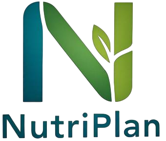

**Typography:** La tipografía del logotipo de NutriPlan adopta el estilo elegante de Roboto, reconocido por su modernidad y atractivo visual. Esta elección refleja el enfoque innovador y accesible de nuestra aplicación, destacando nuestro compromiso con la salud y el bienestar nutricional. Roboto proyecta una imagen contemporánea y confiable, alineándose con los valores de frescura, tecnología y comunidad que definen a NutriPlan.

**Colors:** La paleta de colores de NutriPlan transmite frescura, salud y claridad. El verde primario (#02C79D) representa bienestar y naturaleza, mientras que el blanco (#FFFFFF) aporta simplicidad y limpieza. Los tonos amarillos y verde secundario evocan energía y armonía. Los grises y negros aseguran legibilidad y una estética moderna. Esta combinación refuerza la identidad de NutriPlan como una app confiable y saludable.

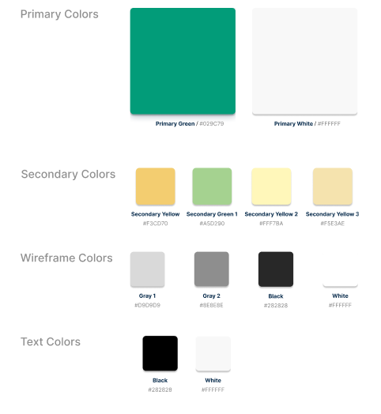

**Spacing:** En NutriPlan, el espaciado juega un papel clave en ofrecer una experiencia visual clara y equilibrada para los usuarios. Se emplean márgenes y rellenos basados en una unidad base de 1rem, lo que garantiza coherencia en la distribución de los elementos. Esta unidad relativa, en lugar de píxeles fijos, permite que la interfaz se adapte de manera fluida a distintos tamaños de pantalla. Gracias a este enfoque, NutriPlan mantiene un diseño ordenado, legible y accesible tanto en dispositivos móviles como en escritorio, reforzando su compromiso con la usabilidad y la salud digital.

### 5.1.2 Information Architecture

#### 5.1.2.1 Organization Systems

Al ingresar a NutriPlan, el usuario encontrará cuatro secciones principales: Planes de alimentación, Pago de suscripciones, Recetas saludables y Perfil personal. En cada una de estas secciones, el usuario podrá realizar diversas acciones interactivas, como explorar planes personalizados, gestionar sus pagos, descubrir recetas nutritivas y actualizar su información personal, todo diseñado para fomentar una nutrición equilibrada y accesible.

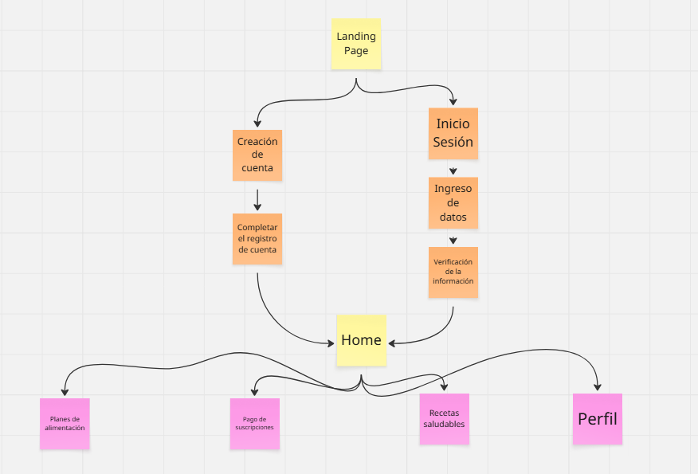

#### 5.1.2.2 Labeling Systems

En esta sección, tendrás la posibilidad de gestionar y personalizar los sistemas de etiquetado nutricional para cada uno de los productos o planes alimenticios. Podrás ajustar la información de los nutrientes, calorías, ingredientes, porciones recomendadas y cualquier otro dato relevante, asegurando que la información proporcionada a los usuarios sea precisa y clara. Esta herramienta está diseñada para facilitar la creación de etiquetas nutricionales que cumplan con los estándares regulatorios y que también se adapten a las necesidades específicas de cada cliente.

- HomePage (Página de inicio)

- Login (Inicio de sesión)

- Register (Registro)

- Profile (Perfil)

- DietPlan (Plan de dieta)

- Meal (Comida)

- Nutritionist (Nutricionista)

- ConsultationRequest (Solicitud de consulta)

- ConsultationRequestList (Lista de solicitudes de consulta)

- ConsultationRequestDetail (Detalle de solicitud de consulta)

- DietPlanCreate (Creación de plan de dieta)

- MealCreate (Creación de comida)

- NutritionistCreate (Creación de nutricionista)

#### 5.1.2.3 SEO Tags and Meta Tags

**SEO Tags**

a. Title Tag:

<title>NutriPlan - Tu plataforma de nutrición personalizada y saludable</title>

b. Meta Description Tag:

<meta name="description" content="Descubre, personaliza y mejora tu salud con NutriPlan, la plataforma que ofrece planes de dieta personalizados, asesoría nutricional y herramientas para un estilo de vida saludable.">

**Meta Tags**

a. Meta Robots Tag: Este tag indica a los motores de búsqueda que indexen el sitio y sigan los enlaces para mejorar la visibilidad de NutriPlan.

<meta name="robots" content="index, follow">

b. Meta Author Tag: Este meta tag se refiere al autor del contenido. 

<meta name="author" content="NutriPlan Inc.">

c. Meta Author Tag: Este meta tag también se incluye para reforzar la identidad de NutriPlan como el creador del contenido.

<meta name="author" content="NutriPlan Inc.">

#### 5.1.2.4 Searching Systems

Implementaremos sistemas de búsqueda por exploración, que permitirán a nuestros usuarios encontrar planes de alimentación de manera rápida y precisa. Las personas que deseen buscar planes alimenticios adecuados a sus necesidades podrán filtrarlos por objetivos nutricionales, tipo de dieta o nivel de actividad física. Además, contaremos con un sistema de búsqueda por nombre de plan o nutricionista desde la página principal de nuestra plataforma.

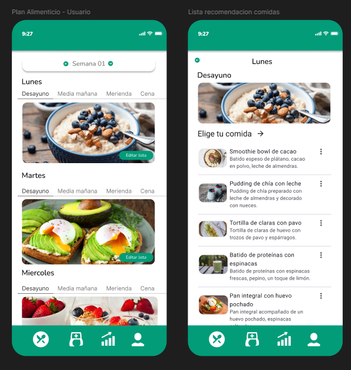

#### 5.1.2.5 Navigation Systems

1. Navegación principal o global:

En la landing page, se utilizará una barra de navegación superior que permitirá acceder fácilmente a secciones como inicio, beneficios, cómo funciona, contacto y registro. En la aplicación móvil, se implementará una barra de navegación inferior que dará acceso rápido a las funciones principales como planes de alimentación, consultas, nutricionistas, perfil y ajustes.

2. Navegación local:

Se ubicará jerárquicamente por debajo de la navegación principal y permitirá explorar contenidos dentro de una misma categoría. Por ejemplo, al ingresar a un plan de dieta, el usuario podrá navegar entre las comidas del día, sugerencias nutricionales o versiones alternativas del plan.

3. Navegación contextual:

Estará compuesta por enlaces relevantes que redirigen a otras secciones de NutriPlan o fuentes externas validadas. Se implementará en dos formatos. Navegación embebida, mediante enlaces en palabras clave dentro del contenido textual. Links relacionados, que aparecerán al final o lateral del contenido, sugiriendo otros planes, artículos o recursos educativos relacionados con el interés del usuario.

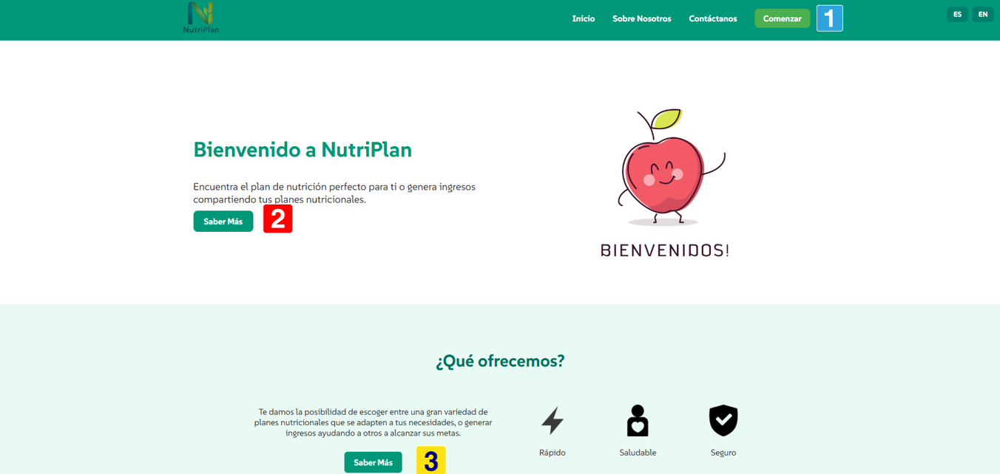

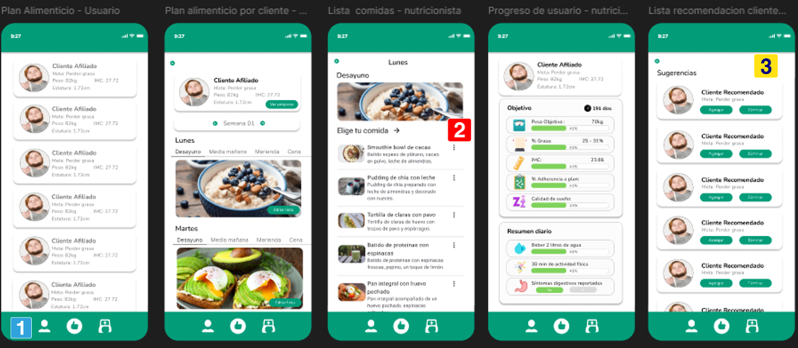

# Capitulo VI: Product Implementation, Validation & Deployment

## 6.1. Software Configuration Management

### 6.1.1. Software Development Environment Configuration

En esta seccion se proporcionara los enlaces a las aplicaciones que se usaran para mantener la coherencia del desarollo del proyecto, siendo estas clasificadas en software basado en modelos Saas y productos que se ejecuten en las computadoras .Tendremos las siguientes secciones.

* Project Management
* Requirements Management
* Product UX/UI Design
* Software Development
* Software Testing
* Software Documentation

## Project Management

Para la gestion del proyecto se usara software que se ejecuten en computadoras, seran las siguientes mostradas en el cuadro especificando su uso.

<table>
  <tr>
    <th>Programa</th>
    <th>Nombre</th>
    <th>Usado</th>
    <th>Link</th>
  </tr>

  <tr>
    <td></td>
    <td>Visual Studio Code</td>
    <td>El programa fue usado en la realización del informe y desarrollo del landingPage</td>
    <td>https://code.visualstudio.com/download </td>

  </tr>

  <tr>
    <td></td>
    <td>AndoridStudio</td>
    <td>El programa fue usado en la realización de la frontend con Kotlin</td>
    <td>https://plugins.jetbrains.com/androidstudio </td>
  </tr>

  <tr>
    <td></td>
    <td>Discord</td>
    <td>El programa fue usado para la comunicacion del equipo de trabajo</td>
    <td>https://meet.google.com/landing </td> 
    </td>
  </tr>

  <tr>
    <td></td>
    <td>Jetbrains</td>
    <td>El programa fue usado para el desarrollo de la backend este maneja el lenguaje java </td>
    <td>https://www.jetbrains.com/es-es/products/ </td>
  </tr>

  <tr>
    <td></td>
    <td>MySQL Workbench</td>
    <td>El programa fue usado para acceder a la base de datos </td>
    <td>https://dev.mysql.com/downloads/mysql/ </td>
  </tr>

  <tr>
    <td></td>
    <td>MySQL 8.0 </td>
    <td>Motor de Base de Datos Relacional Usado para el desarrollo de nuestra aplicacion MObil </td>
    <td>https://dev.mysql.com/downloads/mysql/ </td>
  </tr>
</table>

### Requirements Management

La gestion de requerimientos sera una herramienta de tipo Saas, aplicacion web, que permitira la organizacion de los rquerimientos planteados para nuestra aplicacion web.

* **Pivotal Tracker:** Ea una herramienta que facilita la gestión de las historias de usuario, organizándolas en epopeyas y evaluando su importancia en el programa según su puntuación. Se utilizo para gestionar el avanze del desarrollo de la aplicacion entre todos los mienbros del equipo.

## Product UX/UI Design

Parael Ux/Ui Design usamos los siguientes softwares:

<table>
  <tr>
    <th>Programa</th>
    <th>Nombre</th>
    <th>Usado</th>
    <th>Link</th>
  </tr>

  <tr>
    <td></td>
    <td>Mirro</td>
    <td>Software usado para la realizacion de impact maps y realizacion,Scenario mapping</td>
    <td>https://miro.com/es/</td>
  </tr>

  <tr>
    <td></td>
    <td>Figma</td>
    <td>Software usado para la realizacion de los wireframes, mockups y user diagrams flow</td>
    <td>https://www.figma.com/</td>
  </tr>

  <tr>
    <td></td>
    <td>LuciChart</td>
    <td>Software usado para la realizacion del diagrama de clases</td>
    <td>https://lucid.app/</td>
  </tr>

   <tr>
    <td></td>
    <td>Vertabelo</td>
    <td>Usado para el desarrollo del diagrama de Base de Datos</td>
    <td>http://vertabelo.com/</td>
  </tr>

</table>

### Conclusiones

**Conclusiones y recomendaciones**

Conclusiones

- A partir del trabajo desarrollado en el marco del modelo de negocio digital para NutriPlan, se han identificado y validado hallazgos clave en relación con los Problem Statements y supuestos iniciales:

- Problem Statements: Confirmamos que muchas personas interesadas en mejorar su alimentación enfrentan dificultades para encontrar planes nutricionales confiables, personalizados y sostenibles en el tiempo. Del mismo modo, los nutricionistas carecen de herramientas digitales que les permitan escalar su servicio sin comprometer la calidad de la atención.

- Assumptions validadas: Se validó que existe una alta disposición de los usuarios a utilizar una app móvil que les brinde orientación nutricional basada en objetivos personales (como bajar de peso, ganar masa muscular o mejorar hábitos). También se comprobó que los profesionales de nutrición están abiertos a digitalizar sus servicios si cuentan con herramientas que les permitan mantener contacto continuo y hacer seguimiento de sus pacientes.

Recomendaciones

Con base en los aprendizajes obtenidos, se recomienda lo siguiente como próximos pasos estratégicos dentro del Roadmap de NutriPlan:

- Desarrollo del MVP: Priorizar las funcionalidades validadas en la etapa de prototipo, enfocándose en la personalización de planes, seguimiento de métricas y conexión con nutricionistas.

- Integración con profesionales de nutrición: Diseñar un panel especializado para nutricionistas, lo que permitirá escalar el modelo hacia un marketplace de servicios nutricionales digitales.

- Estrategia de onboarding y retención: Incluir elementos de gamificación y recordatorios personalizados para fomentar el uso recurrente y el cumplimiento de objetivos por parte de los usuarios.

- Monetización progresiva: Evaluar modelos de suscripción premium una vez alcanzado un volumen crítico de usuarios activos, ofreciendo beneficios diferenciados como acceso a contenido exclusivo o consultas en línea.

- Pruebas con nuevos segmentos: Realizar pruebas específicas con subgrupos como personas con enfermedades crónicas o deportistas, para extender la propuesta de valor.

- Iteración continua: Mantener una cultura de mejora constante basada en el feedback de usuarios, estableciendo ciclos cortos de experimentación (Lean) en las siguientes fases del desarrollo.

# Bibliografía

1. Ledo-Varela, M., de Luis Román, D. A., González-Sagrado, M., Izaola Jauregui, O., Conde Vicente, R., & Aller De la Fuente, R. (2011). Características nutricionales y estilo de vida en universitarios. Nutrición Hospitalaria, 26(4), 814-818. https://scielo.isciii.es/scielo.php?pid=s0212-16112011000400022&script=sci_arttext
2. García-Izquierdo, I., Rodríguez-Yera, E., & Martín-Salinas, C. (2016). Plan de cuidado a personas de edad avanzada en riesgo nutricional. Gerokomos, 27(4), 157-160. https://scielo.isciii.es/pdf/geroko/v27n4/06_notas.pdf
3. Palacios, C. (2020, December). Uso de aplicaciones móviles para intervenciones nutricionales. In Anales Venezolanos de Nutrición (Vol. 33, No. 2, pp. 177-182). Fundación Bengoa. https://ve.scielo.org/pdf/avn/v33n2/0798-0752-avn-33-02-177.pdf
4. Troncoso-Pantoja, C., Alarcón-Riveros, M., Amaya-Placencia, J., Sotomayor-Castro, M., & Maury-Sintjago, E. (2020). Guía práctica de aplicación del método dietético para el diagnóstico nutricional integrado. Revista chilena de nutrición, 47(3), 493-502. https://www.scielo.cl/pdf/rchnut/v47n3/0717-7518-rchnut-47-03-0493.pdf
5. Yanguas Cariñena, A. (2024). Creación de una aplicación móvil y los servicios REST asociados para la recogida de datos nutricionales.
6. Quispe Vadillo, V. (2024). APLICACIÓN MÓVIL ORIENTADA A LA EDUCACIÓN NUTRICIONAL DE ALIMENTOS NATURALES PARA MOTIVAR EL APRENDIZAJE EN ESTUDIANTES DE PRIMERO DE SECUNDARIA. https://repositorio.upea.bo/jspui/bitstream/123456789/1065/1/ALIMENTOS-VQV.pdf
7. Nandi, K., & Dey, K. Designing Scalable Multi-Agent AI Systems: Leveraging Domain-Driven Design and Event Storming. https://www.academia.edu/download/122145825/IJCSE_V12I3P102.pdf
8. Brandolini, A. (2013). Introducing event storming. blog, Ziobrando’s Lair, 18. https://www.academia.edu/download/59311660/Event_Storming_Case_Studies20190519-70833-1rtyiru.pdf
9. Khononov, V. (2021). Learning Domain-Driven Design. " O'Reilly Media, Inc.".
10. Evans, E. (2014). Domain-driven design reference: Definitions and pattern summaries. Dog Ear Publishing. https://pssp.app.br/analise_de_sistemas/ddd_reference_2015-03.pdf
11. Ferrand, S., Onfray, M. P., & Medina, M. G. (2021). Actualización del rol del nutricionista clínico: Estándares de práctica. Revista chilena de nutrición, 48(3), 437-446. https://www.scielo.cl/scielo.php?pid=S0717-75182021000300437&script=sci_arttext
12. Homar, P. S., Blanco, M. P., Hernández, M. Á. C., Cortés, F. F., & Sotelo, J. M. (2015). Desarrollo de una aplicación informática de ayuda al soporte nutricional especializado integrado en la historia clínica electrónica. Farmacia Hospitalaria, 39(5), 240-268. https://www.sciencedirect.com/science/article/pii/S1130634323005184
13. Bealmonte, I. M. S. (2016). Diseño y aplicación de un plan nutricional para aumentar el rendimiento físico en futbolistas de la segunda división profesional de la federación mexicana de futbol AC, en el Municipio de Zitácuaro Michoacán. Área de Ciencias de la Salud.
14. Boatella, J. (2017). Relaciones nutricionales: del equivalente nutritivo a las listas de intercambio. Revista Española de Nutrición Humana y Dietética, 21(3), 300-309. https://scielo.isciii.es/scielo.php?pid=S2174-51452017000300012&script=sci_arttext&tlng=pt
15. Kapferer, S., & Zimmermann, O. (2020, February). Domain-specific Language and Tools for Strategic Domain-driven Design, Context Mapping and Bounded Context Modeling. In MODELSWARD (pp. 299-306). https://www.scitepress.org/PublishedPapers/2020/89105/89105.pdf

# Anexos

Lean Ux Canvas

https://app.mural.co/t/integradis6182/m/integradis6182/1745440077390/891b85b88f2d8e99fb15c7cdf2f30e62792b17af?sender=ufdf66b413172c812625a4806

Event Storming

https://miro.com/app/board/uXjVI_LnCNw=/?share_link_id=288998827764

C4 modeling

https://viewer.diagrams.net/?tags=%7B%7D&lightbox=1&highlight=0000ff&edit=_blank&layers=1&nav=1&title=C4%20Nutriplan&dark=auto#Uhttps%3A%2F%2Fdrive.google.com%2Fuc%3Fid%3D19SZcIG-Am5o2pFswX7s6hX-jFHn20M7v%26export%3Ddownload

UML-Data Base design:

Organization-Systems:
https://miro.com/app/board/uXjVI271poo=/?share_link_id=940428667876

https://lucid.app/lucidchart/7937fb20-a1b0-4a73-a8ef-d8c7cd401433/edit?viewport_loc=3102%2C-394%2C2037%2C951%2C0_0&invitationId=inv_14323b19-0f20-4888-87d2-bc6514205237

