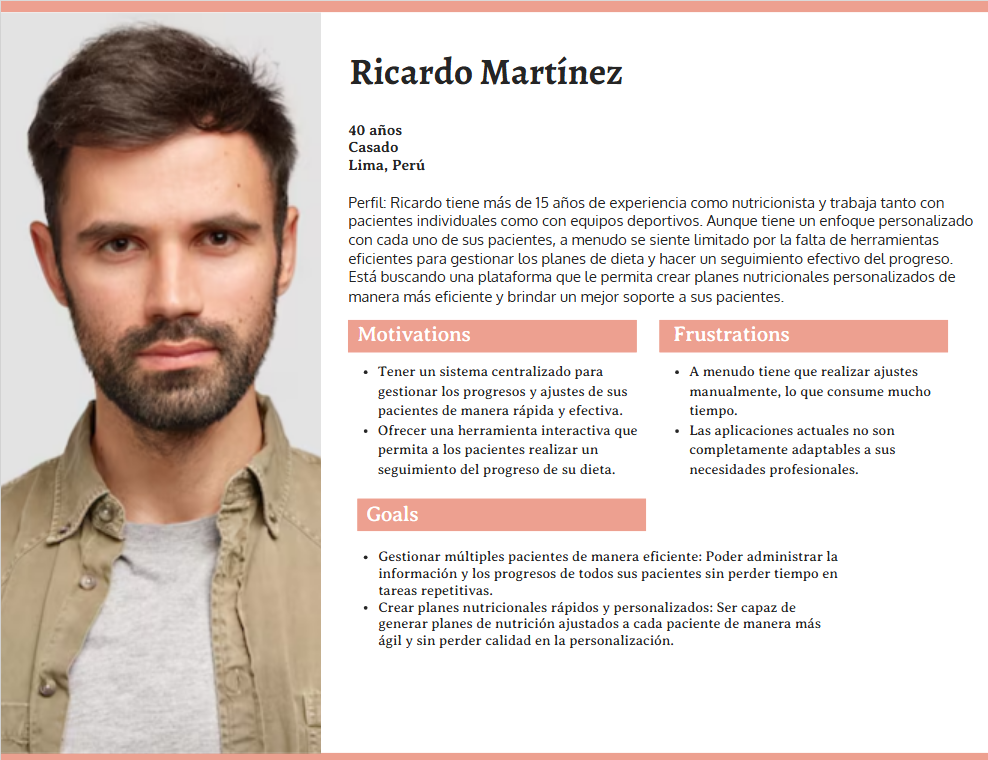
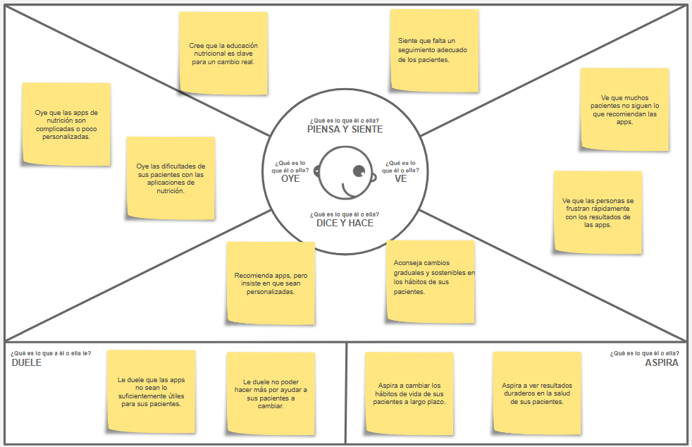

<h3 align="center"> Universidad Peruana de Ciencias Aplicadas </h3>

<h3 align="center"> Ingeniería de Software </h3>
<h3 align="center"> Ciclo 2025 - 1</h3>

 

    </img> 

 

<h1 align="center"> TP1 Report </h1>

<h3 align="center"> Aplicaciones para Dispositivos Móviles - 346 </h3>

<h3 align="center"> Docente: Jorge Luis Mayta Guillermo </h3>

<h3> Startup: HealTeam</h3>

<h3> Product: NutriPlan</h3>

<h3> Team Members: </h3>

| Member                        |    Code    |
| :---------------------------- | :--------: |
|                               |            |
|                               |            |
| Oshiro Yamashita, Daiki Oscar | U20201F846 |
| Pardo Zapata, Gustavo Adolfo  | U202120347 |
| Alejandro Espino Flores       | U202122129 |
|                               |            |

<h3 align="center">Abril, 2025</h3>

# Registro de Versiones del Informe

| Versión | Fecha | Autor |  Descripción de modificación   |
| :-----: | :---: | :---: | :----------------------------: |
|   TB1   |       |   -   | Se añadió los capítulos 1 al 4 |

# Project Report Collaboration Insights

# Contenido

## Tabla de Contenidos

[Registro de versiones del informe](#registro-de-versiones-del-informe)

[Project Report Collaboration Insights](#project-report-collaboration-insights)

[Contenido](#contenido)

[Student Outcome](#student-outcome-1)

[Capítulo I: Introducción](#capitulo-i-introduccion)

- [1.1. Startup Profile](#11-startup-profile)

  - [1.1.1. Descripción de la Startup](#111-description-de-la-startup)

  - [1.1.2. Perfiles de integrantes del equipo](#112-perfiles-de-integrantes-del-equipo)

- [1.2. Solution Profile](#12-solution-profile)
  - [1.2.1 Antecedentes y problemática](#121-antecedentes-y-problemática)
  - [1.2.2 Lean UX Process](#122-lean-ux-process)
    - [1.2.2.1. Lean UX Problem Statements](#1221-lean-ux-problem-statements)
    - [1.2.2.2. Lean UX Assumptions](#1222-lean-ux-assumptions)
    - [1.2.2.3. Lean UX Hypothesis Statements](#1223-lean-ux-hypothesis-statements)
    - [1.2.2.4. Lean UX Canvas](#1224-lean-ux-canvas)
- [1.3. Segmentos objetivo](#13-segmentos-objetivo)

[Capítulo II: Requirements Elicitation & Analysis](#capítulo-ii-requirements-elicitation--analysis-1)

- [2.1. Competidores](#21-competidores)
  - [2.1.1. Análisis competitivo](#211-análisis-competitivo)
  - [2.1.2. Estrategias y tácticas frente a competidores](#212-estrategias-y-tácticas-frente-a-competidores)
- [2.2. Entrevistas](#22-entrevistas)
  - [2.2.1. Diseño de entrevistas](#221-diseño-de-entrevistas)
  - [2.2.2. Registro de entrevistas](#222-registro-de-entrevistas)
  - [2.2.3. Análisis de entrevistas](#223-análisis-de-entrevistas)
- [2.3. Needfinding](#23-needfinding)
  - [2.3.1. User Personas](#231-user-personas)
  - [2.3.2. User Task Matrix](#232-user-task-matrix)
  - [2.3.3. User Journey Mapping](#233-user-journey-mapping)
  - [2.3.4. Empathy Mapping](#234-empathy-mapping)
  - [2.3.5. As-is Scenario Mapping](#235-as-is-scenario-mapping)
- [2.4. Ubiquitous Language](#24-ubiquitous-language)

[Capítulo III: Requirements Specification](#capítulo-iii-requirements-specification-1)

- [3.1. To-Be Scenario Mapping](#31-to-be-scenario-mapping)
- [3.2. User Stories](#32-user-stories)
- [3.3. Impact Mapping](#33-impact-mapping)
- [3.4. Product Backlog](#34-product-backlog)

[Capítulo IV: Solution Software Design](#capítulo-iv-solution-software-design-1)

- [4.1. Strategic-Level Domain-Driven Design](#41-strategic-level-domain-driven-design)

  [Conclusiones](#conclusiones-1)

- [Conclusiones y recomendaciones](#conclusiones-y-recomendaciones)

[Bibliografía](#bibliografc3ada-1)

[Anexos](#anexos-1)

# Student Outcome

| Criterio específico | Acciones realizadas | Conclusiones |
| :------------------ | :------------------ | :----------- |
| 1                   | 2                   | 3            |

# Capitulo I: Introduccion

## 1.1. StartUp Profile

En un contexto donde la salud y el bienestar han cobrado una importancia central, y donde la tecnología redefine nuestros hábitos cotidianos, nace NutriPlan. Con una propuesta enfocada en la planificación nutricional inteligente, esta app busca empoderar a las personas y profesionales de la salud a través de una herramienta digital accesible, educativa y personalizada.

### 1.1.1. Description de la StartUp

NutriPlan es una app móvil que facilita la planificación de comidas saludables mediante recetas balanceadas, listas de compras inteligentes y seguimiento nutricional.
Está diseñada tanto para usuarios que desean mejorar su alimentación como para nutricionistas que buscan una herramienta práctica para personalizar y monitorear planes alimenticios.

- Misión: Promover una alimentación saludable y accesible, utilizando la tecnología para mejorar los hábitos nutricionales de las personas y apoyar el trabajo de los profesionales de la salud.

- Visión: Ser la plataforma líder en planificación nutricional personalizada en Latinoamérica, transformando la forma en que las personas se alimentan y cuidan su salud.

### 1.1.2. Perfiles de integrantes del equipo

| Integrantes                                                                                              | Descripción                                                                                                                                                                                                                                                                                                                                                                      | Conocimientos                                                                   |
| :------------------------------------------------------------------------------------------------------- | :------------------------------------------------------------------------------------------------------------------------------------------------------------------------------------------------------------------------------------------------------------------------------------------------------------------------------------------------------------------------------- | :------------------------------------------------------------------------------ |
| Nombre                                                                                                   | Descripción                                                                                                                                                                                                                                                                                                                                                                      | Conocimientos                                                                   |
| Daiki Oscar Oshiro Yamashita u20201f846                                                                  | Soy estudiante de la carrera de Ingeniería de Software. Tengo interés en obtener nuevos conocimientos relacionados con mi carrera que me sean de utilidad para el futuro.                                                                                                                                                                                                        | Cuento con el conocimiento de diversos lenguajes HTML, Python, C++, C# y MySQL. |
| Pardo Zapata Gustavo Adolfo u2020120347 | Estudiante de la carrera de Ingeniería de Software. Soy proactivo, colaborativo, organizado,responsable y con habilidades de resolución de problemas.Tengo una excelente capacidad para comunicarme de manera efectiva y clara con los demás miembros de mi equipo y deseo colaborar en todo lo posible con mis demás compañeros en este trabajo.                                | Cuento con conocimiento en JavaScript, Java, Python, C# y SQL.                  |
| Espino Flores, Alejandro                                     | Soy estudiante de la carrera de Ingeniería de Software. Me considero una persona proactiva, responsable y con gran capacidad para trabajar en equipo. Valoro el compañerismo y la colaboración, ya que creo que son fundamentales para alcanzar los objetivos comunes. Estoy comprometido con el aprendizaje continuo y me esfuerzo por aportar lo mejor de mí en cada proyecto. | Cuento con conocimientos en Python, Java, SQL y desarrollo web.                 |

## 1.2. Solution Profile

### 1.2.1. Antecedentes y problemática

#### Antecedentes y problemática

En la actualidad, muchas personas desean mejorar su alimentación, pero se enfrentan a barreras como la falta de conocimientos nutricionales, el poco tiempo para planificar comidas o la dificultad para mantener hábitos saludables. Paralelamente, nutricionistas buscan herramientas modernas que les permitan brindar un mejor seguimiento a sus pacientes y generar planes personalizados de forma eficiente.

En este contexto, surge la necesidad de una solución tecnológica que integre educación nutricional, planificación inteligente y asesoría profesional, de manera accesible y personalizada.

#### What? (¿Qué es?)

NutriPlan es una aplicación móvil que permite planificar comidas saludables, visualizar el valor nutricional de cada plato, generar listas de compras y acceder a recetas con instrucciones paso a paso. Además, brinda a los nutricionistas herramientas para crear y gestionar planes personalizados para sus pacientes.

#### Why? (¿Por qué lo hacemos?)

Porque muchas personas quieren alimentarse mejor, pero no saben cómo empezar o cómo mantener una rutina saludable. Al mismo tiempo, los nutricionistas necesitan soluciones digitales que faciliten su trabajo. NutriPlan responde a ambas necesidades, promoviendo una mejor salud a través de la tecnología.

#### Where? (¿Dónde se utilizará?)

En cualquier lugar, gracias a su formato de app móvil. Ya sea en casa, en el supermercado o en la consulta con el nutricionista, NutriPlan está disponible para acompañar al usuario en todo momento.

#### When? (¿Cuándo se utilizará?)

NutriPlan está pensada para su uso diario, especialmente durante la planificación de comidas, compras semanales o al momento de preparar alimentos. También es útil durante las consultas nutricionales o el seguimiento de planes alimenticios.

#### Who? (¿A quién está dirigido?)

Usuarios generales que buscan mejorar su alimentación diaria, cocinar de manera saludable y optimizar sus compras.

Nutricionistas que requieren una herramienta digital para personalizar dietas, monitorear pacientes y compartir recomendaciones profesionales.

#### How? (¿Cómo funciona?)

Los usuarios descargan la app, configuran sus objetivos y preferencias, y acceden a un plan nutricional adaptado. Pueden consultar recetas, ver el valor nutricional de cada plato, organizar sus compras y recibir recordatorios. Los nutricionistas, por su parte, pueden crear planes, hacer seguimiento y comunicarse con sus pacientes desde la plataforma.

#### How much? (¿Cuánto cuesta?)

NutriPlan utilizará un modelo de negocio freemium con las siguientes modalidades:

Versión gratuita: Acceso a funciones básicas como recetas saludables, planificación semanal simple y generación automática de listas de compras.

Suscripción Premium para usuarios: Incluye planes nutricionales personalizados, seguimiento de objetivos, historial nutricional y acceso a contenido exclusivo.

### 1.2.2. Lean UX Process

#### 1.2.2.1. Lean UX Problem Statements

La idea central de NutriPlan surge a partir de la creciente necesidad de las personas de adoptar hábitos alimenticios saludables, pero sin contar con el conocimiento, el tiempo o las herramientas necesarias para lograrlo. Además, los profesionales de la nutrición enfrentan dificultades para hacer seguimiento personalizado y digital a sus pacientes de forma práctica y eficiente.

Pese a que existen aplicaciones centradas en dietas o recetas, muchas de ellas no ofrecen una visión integral que combine educación, seguimiento personalizado y planificación automatizada de comidas.

NutriPlan supera estas limitaciones al ofrecer una solución digital que permite a los usuarios planificar sus comidas, conocer su valor nutricional, mejorar sus hábitos y recibir orientación profesional. Al mismo tiempo, brinda a los nutricionistas una herramienta moderna para gestionar a sus pacientes y crear planes alimenticios basados en evidencia.

Sentiremos que estamos logrando nuestro propósito cuando veamos un número creciente de personas usando NutriPlan como parte de su rutina alimentaria diaria, y a nutricionistas recomendándola como una extensión de sus consultas.

#### 1.2.2.2. Lean UX Assumptions

¿Quién es el usuario?

Personas que desean mejorar su alimentación y aprender a comer de manera más saludable.

Nutricionistas que buscan herramientas digitales para gestionar mejor sus planes y pacientes.

¿Dónde encaja nuestro servicio? ¿En su trabajo o vida?
NutriPlan se integra en el día a día de quienes quieren mejorar su salud a través de la comida, facilitando la planificación y la educación alimentaria. En el caso de los nutricionistas, es un apoyo digital para su trabajo profesional.

¿Cuándo y cómo es usado nuestro servicio?

Los usuarios utilizarán NutriPlan al organizar sus menús semanales, al momento de cocinar, hacer compras o seguir un plan nutricional.

Los nutricionistas lo usarán para crear planes, revisar el progreso de sus pacientes y brindar recomendaciones a través de la app.

¿Qué problemas puede enfrentar nuestro servicio?

Dificultad para lograr la adherencia al uso continuo por parte del usuario.

Garantizar que los planes y recetas sean realmente personalizados y basados en datos confiables.

Conseguir que los nutricionistas adopten la plataforma como parte de su rutina profesional.

##### Business Outcomes

Creemos que los usuarios valorarán una plataforma que les ayude a mejorar su alimentación de forma práctica, educativa y personalizable.

Creemos que los nutricionistas adoptarán una herramienta que les permita ampliar su alcance, profesionalizar su seguimiento y mejorar la atención a sus pacientes.

Sabemos que existen apps similares, pero creemos que podemos diferenciarnos al integrar funcionalidades como planificación inteligente, análisis nutricional por receta y conexión con profesionales de la salud.

Reconocemos que existen otras aplicaciones relacionadas con nutrición, pero creemos que NutriPlan se diferenciará al integrar funciones de planificación automática, educación alimentaria, conexión con profesionales y análisis nutricional en una sola plataforma, ofreciendo una experiencia más completa y personalizada.

#### 1.2.2.3. Lean UX Hypothesis Statements

Creemos que los usuarios interesados en mejorar su alimentación usarán NutriPlan como una herramienta práctica y confiable para planificar sus comidas y adquirir mejores hábitos.

Creemos que los nutricionistas utilizarán nuestra plataforma para crear planes personalizados y monitorear el progreso de sus pacientes, fortaleciendo así su práctica profesional.

Creemos que ofrecer una experiencia integral (planificación, recetas, valor nutricional y seguimiento profesional) nos permitirá destacar frente a la competencia y generar un crecimiento sostenido en ambas audiencias.

Creemos que si incluimos funciones adaptables y contenido educativo accesible, lograremos una alta retención de usuarios y recomendaciones boca a boca.

#### 1.2.2.4. Lean UX Canvas

## 1.3. Segmentos Objetivo

#### 1. Usuarios generales

Jóvenes y adultos que desean mejorar sus hábitos alimenticios de forma sencilla y sostenible.

Personas con objetivos específicos como pérdida de peso, ganancia muscular o control de enfermedades crónicas (como diabetes o hipertensión).

Usuarios con poco tiempo para planificar sus comidas que buscan recetas saludables y fáciles de preparar.

Familias que quieren organizar mejor sus compras y comidas semanales, reduciendo desperdicio y mejorando su nutrición.

#### 2. Nutricionistas

Nutricionistas que desean ofrecer planes personalizados a sus pacientes de forma digital, optimizando su tiempo y aumentando su alcance.

Profesionales de la salud que buscan una plataforma que les permita monitorear progresos, enviar recomendaciones y mantener una comunicación constante con sus pacientes.

Especialistas que ya ofrecen asesoría nutricional presencial y desean digitalizar y escalar sus servicios.

Expertos en nutrición interesados en generar ingresos extra compartiendo su conocimiento a través de contenidos, recetas y asesorías online.

# Capítulo II: Requirements Elicitation & Analysis

En este capítulo se realizará el proceso de Análisis competitivo y Needfinding necesario para la identificación de las necesidades de nuestro segmento objetivo.

## 2.1. Competidores

### 2.1.1. Análisis Competitivo

A continuación se presenta un análisis competitivo de las empresas que ofrecen servicios similares a NutriPlan.

<table>
  <tr>
    <th colspan="6"><b>Competitive Analysis Landscape</b></th>
  </tr>
  <tr>
    <td>¿Por qué llevar a cabo este análisis?</td>
    <td colspan="5">
      Este análisis fue realizado con el propósito de estudiar el valor ofrecido por las empresas que compiten con nuestra solución NutriPlan. La información obtenida nos proporcionará la perspectiva necesaria para la realización de un servicio innovador y diferenciador.
    </td>
  </tr>
  <tr>
    <td colspan="2"></td>
    <td><b>NutriPlan</b></td>
    <td><b>Yazio</b></td>
    <td><b>Noom</b></td>
    <td><b>Lifesum</b></td>
  </tr>
  <tr>
    <td rowspan="2"><b>Perfil</b></td>
    <td><b>Overview</b></td>
    <td>
      Plataforma de planificación de comidas y recetas saludables, con enfoque personalizado y educación nutricional accesible.
    </td>
    <td>
      App de planificación nutricional que ofrece seguimiento de comidas y macronutrientes con recetas saludables.
    </td>
    <td>
      App de salud que combina coaching nutricional y psicológico para mejorar hábitos alimenticios.
    </td>
    <td>
      Plataforma de nutrición personalizada basada en metas de salud y estilo de vida con interfaz atractiva.
    </td>
  </tr>
  <tr>
    <td><b>Ventaja competitiva ¿Qué valor ofrece a los clientes?</b></td>
    <td>
      Planificación de menús adaptada a gustos y objetivos, interfaz amigable, enfoque educativo y accesible para todos.
    </td>
    <td>
      Recetas visuales, fácil seguimiento de objetivos, buena interfaz y enfoque saludable europeo.
    </td>
    <td>
      Enfoque psicológico y conductual, coaching personalizado, más allá de contar calorías.
    </td>
    <td>
      Recomendaciones visuales y personalizadas según metas, buena experiencia de usuario.
    </td>
  </tr>
  <tr>
    <td rowspan="2"><b>Perfil de Marketing</b></td>
    <td><b>Mercado objetivo</b></td>
    <td>
      Familias, jóvenes y adultos que buscan comer mejor sin complicaciones, interesados en salud preventiva y recetas prácticas.
    </td>
    <td>
      Usuarios que desean una alimentación balanceada, basada en recetas y control de macronutrientes.
    </td>
    <td>
      Personas que buscan cambiar hábitos a largo plazo con apoyo conductual y motivacional.
    </td>
    <td>
      Usuarios modernos interesados en bienestar integral y nutrición con diseño atractivo.
    </td>
  </tr>
  <tr>
    <td><b>Estrategias de marketing</b></td>
    <td>
      Contenido educativo en redes sociales, colaboraciones con nutricionistas, modelo freemium con opción premium accesible.
    </td>
    <td>
      Promociones freemium, marketing de influencers, campañas en Instagram y TikTok.
    </td>
    <td>
      Publicidad en plataformas de salud, storytelling en redes, testimonios de usuarios.
    </td>
    <td>
      Estrategias visuales, campañas pagadas en redes, segmentación según metas de salud.
    </td>
  </tr>
  <tr>
    <td rowspan="3"><b>Perfil de Producto</b></td>
    <td><b>Productos y Servicios</b></td>
    <td>
      Recetas interactivas, planes semanales de comida, escáner de ingredientes, historial nutricional y consejos saludables.
    </td>
    <td>
      Seguimiento de comidas, planes de dieta, recetas saludables, estadísticas de macronutrientes.
    </td>
    <td>
      Coaching conductual, planes de alimentación y ejercicios, comunidad de apoyo.
    </td>
    <td>
      Dietas personalizadas, seguimiento visual del progreso, recomendaciones saludables.
    </td>
  </tr>
  <tr>
    <td><b>Precios y Costos</b></td>
    <td>
      Freemium con funciones básicas gratis y planes mensuales o anuales económicos.
    </td>
    <td>
      Modelo freemium con suscripción premium para acceso completo.
    </td>
    <td>
      Prueba gratuita, suscripción mensual con acceso a coach y planes personalizados.
    </td>
    <td>
      Modelo por suscripción, con precios según funciones y metas elegidas.
    </td>
  </tr>
  <tr>
    <td><b>Canales de distribución (Web y/o móvil)</b></td>
    <td>
      Web y app móvil (iOS/Android), versión web responsive y posibilidad de integración futura con dispositivos.
    </td>
    <td>
      App móvil con presencia fuerte en redes sociales y comunidad de usuarios.
    </td>
    <td>
      App móvil, acompañamiento vía notificaciones y correo electrónico.
    </td>
    <td>
      Web y app móvil con interfaz visual atractiva y recomendaciones personalizadas.
    </td>
  </tr>
  <tr>
    <td rowspan="5"><b>Análisis SWOT</b></td>
    <td colspan="5">
    </td>
  </tr>
  <tr>
    <td><b>Fortalezas</b></td>
    <td>
      Enfoque inclusivo, recetas regionales adaptadas, facilidad de uso, personalización inteligente.
    </td>
    <td>
      Diseño intuitivo, enfoque en recetas, análisis nutricional completo.
    </td>
    <td>
      Acompañamiento emocional, diferencial psicológico y enfoque en el hábito.
    </td>
    <td>
      Personalización visual, buena experiencia de usuario, adaptación a estilo de vida.
    </td>
  </tr>
  <tr>
    <td><b>Debilidades</b></td>
    <td>
      Escasa notoriedad de marca al inicio. Marca en etapa inicial con baja visibilidad
    </td>
    <td>
      Limitado para usuarios que buscan coaching más avanzado o control conductual.
    </td>
    <td>
      Costo elevado frente a apps más simples, requiere mayor compromiso del usuario.
    </td>
    <td>
      Menor base de datos comparado con gigantes del mercado.
    </td>
  </tr>
  <tr>
    <td><b>Oportunidades</b></td>
    <td>
      Alianzas con supermercados, integración con nutricionistas, entrada a programas educativos y corporativos.
    </td>
    <td>
      Expansión a planes familiares y mercado corporativo wellness.
    </td>
    <td>
      Aumento de interés por la salud mental y nutrición consciente.
    </td>
    <td>
      Creciente mercado joven que valora estética y bienestar integral.
    </td>
  </tr>
  <tr>
    <td><b>Amenazas</b></td>
    <td>
      Alta competencia de apps posicionadas, dependencia del marketing digital para crecer.
    </td>
    <td>
      Saturación del mercado de apps nutricionales, dificultad para destacar sin diferenciación clara.
    </td>
    <td>
      Pérdida de usuarios por falta de resultados rápidos o motivación.
    </td>
    <td>
      Alta competencia, especialmente en diseño visual y experiencia de usuario.
    </td>
  </tr>
</table>

### 2.1.2. Estrategias y tácticas frente a competidores

En primer lugar, frente a la amplia base de usuarios que poseen competidores como Fitia y Yazio, NutriPlan deberá enfocarse en la diferenciación a través de la cercanía cultural y la personalización local. Esto implica adaptar los planes nutricionales al contexto latinoamericano, incorporando ingredientes típicos de la región y recomendaciones acordes con los hábitos y preferencias culturales.

En cuanto a la integración con dispositivos y aplicaciones de salud, una de las fortalezas clave de apps como Fitia, Yazio y Lifesum, NutriPlan deberá desarrollar alianzas estratégicas con fabricantes de tecnología y plataformas como Google Fit y Apple Health, permitiendo a los usuarios sincronizar su información de manera fluida y mejorar la experiencia de seguimiento.

Respecto a la interfaz visual y la gamificación, donde destacan especialmente Yazio y Lifesum, NutriPlan puede apostar por un diseño centrado en el usuario que incluya incentivos saludables, como desafíos semanales, logros por metas alcanzadas y una navegación simple e intuitiva que motive al usuario a mantenerse constante en su progreso nutricional.

Por último, para contrarrestar el respaldo científico y profesional que exhiben otras plataformas, NutriPlan trabajará con nutricionistas certificados de habla hispana, ofreciendo contenido validado y accesible para usuarios que buscan confianza y claridad en sus planes alimenticios.

## 2.2. Entrevistas

### 2.2.1. Diseño de entrevistas

**Preguntas Generales**

- ¿Cuál es su nombre?
- ¿Cuántos años tiene usted?
- ¿En que ciudad y distrito reside?
- ¿A qué se dedica o cual es su ocupación?

**Preguntas Específicas**

#### Segmento 1: Usuarios generales

¿Qué le motiva a querer mejorar su alimentación o estilo de vida?

¿Cuál es su mayor desafío cuando intenta seguir una dieta saludable?

¿Ha utilizado alguna vez aplicaciones o plataformas para gestionar su nutrición? ¿Cuáles?

¿Qué tipo de información espera recibir de una aplicación de nutrición (por ejemplo, menús personalizados, seguimiento de calorías, consejos de salud)?

¿Qué funcionalidades considera imprescindibles en una app que lo ayuden a mantenerse motivado y organizado en su plan nutricional?

#### Segmento 2: Nutricionistas

¿Cuáles son los principales retos que enfrenta al gestionar los planes nutricionales de sus pacientes?

¿Qué funcionalidades le gustaría que tuviera una aplicación para facilitar la creación de planes de dieta personalizados para sus pacientes?

¿Utiliza alguna herramienta digital en su práctica profesional para gestionar las dietas o el progreso de sus pacientes? Si es así, ¿qué le gustaría mejorar de esa herramienta?

¿Qué tan importante es para usted que una app de nutrición ofrezca un sistema de seguimiento del progreso de los pacientes en tiempo real?

¿Le gustaría poder acceder a recursos educativos dentro de la app para poder compartirlos con sus pacientes o actualizarlos según nuevos descubrimientos o tendencias?

### 2.2.2. Registro de entrevistas

#### Segmento #1: Usuarios generales

**Entrevista #1:**

Nombre: Ernesto Ruiz

Edad: 20

Distrito: Pueblo Libre

Link:

En la entrevista, el usuario expresó que su motivación principal para mejorar su alimentación es llevar una vida más saludable, tener más energía y prevenir enfermedades. El mayor desafío que enfrenta es la falta de tiempo para planificar y preparar comidas saludables. Ha probado aplicaciones como Yazio y FatSecret, pero las encuentra complicadas y poco personalizadas. Busca una aplicación que ofrezca recomendaciones personalizadas, menús adaptados, seguimiento de calorías y hábitos saludables, además de contar con funcionalidades como recordatorios y monitoreo de metas para mantenerse motivado.

#### Segmento #2: Nutricionistas

### 2.2.3. Análisis de entrevistas

| Entrevistado | Análisis de la entrevista                                                                                                                                                                                                                                                                                                                                                                                                                                                                                                                                                                                                                                                                                                                                                                                             |
| ------------ | --------------------------------------------------------------------------------------------------------------------------------------------------------------------------------------------------------------------------------------------------------------------------------------------------------------------------------------------------------------------------------------------------------------------------------------------------------------------------------------------------------------------------------------------------------------------------------------------------------------------------------------------------------------------------------------------------------------------------------------------------------------------------------------------------------------------- |
| Ernesto Ruiz | Según el entrevistado del segmento de usuarios generales, la motivación principal para mejorar su alimentación está en alcanzar una vida más saludable, tener más energía y prevenir enfermedades a futuro, junto con un interés estético por controlar el peso. Su mayor desafío radica en la falta de tiempo para planificar comidas y la confusión ante tanta información sobre nutrición. Ha utilizado aplicaciones como Yazio y FatSecret, pero las considera poco personalizadas y difíciles de mantener a largo plazo. Espera que una app de nutrición ofrezca menús adaptados, recomendaciones claras y herramientas visuales para seguir su progreso. Destaca como funciones imprescindibles una interfaz sencilla, metas personalizables, recordatorios y recetas rápidas que se alineen con sus objetivos. |

## 2.3. Needfinding

En esta sección se muestra el proceso de análisis de la información recolectada en las entrevistas. Se incluyen los User Personas, User Task Matrix, User Journey Maps, Empathy Mapping y As-Is Scenario Mapping.

### 2.3.1. User Personas

A continuación brindamos las fichas de User Persona elaboradas a partir del análisis de las entrevistas realizadas.

**Segmento #1: Usuarios generales**

**Segmento #2: Nutricionistas**

### 2.3.2. User Task Matrix

A continuación se muestra el proceso para la realizacion del User Task Matrix para comprender las tareas que realizan los User Persona para cumplir sus objetivos.

**Segmento #1: Usuarios generales**

| **Tarea**                                                         | **Frecuencia** | **Importancia** |
| ----------------------------------------------------------------- | -------------- | --------------- |
| Ingresar alimentos y hacer seguimiento de calorías                | Diaria         | Alta            |
| Seguir plan nutricional personalizado                             | Diaria         | Alta            |
| Consultar recetas rápidas y fáciles                               | Semanal        | Media           |
| Realizar ajustes a la dieta (como cambiar recetas o ingredientes) | Semanal        | Media           |
| Consultar el progreso del peso o salud                            | Semanal        | Alta            |
| Recibir recordatorios de comidas o ejercicios                     | Diario         | Alta            |
| Acceder a recomendaciones sobre hábitos saludables                | Semanal        | Baja            |

---

**Segmento #2: Nutricionistas**

| **Tarea**                                                        | **Frecuencia** | **Importancia** |
| ---------------------------------------------------------------- | -------------- | --------------- |
| Crear y personalizar planes nutricionales para pacientes         | Diario         | Alta            |
| Realizar seguimiento del progreso de los pacientes               | Semanal        | Alta            |
| Proveer consultas y asesoramiento a pacientes                    | Semanal        | Alta            |
| Ajustar planes nutricionales basados en el progreso del paciente | Semanal        | Alta            |
| Gestionar el historial de pacientes                              | Semanal        | Alta            |
| Acceder a recursos educativos sobre nutrición                    | Mensual        | Media           |
| Mantener comunicación con los pacientes                          | Semanal        | Alta            |

### 2.3.3. User Journey Mapping

A continuación se muestra el proceso para la realización del User Journey Mapping para los User Persona con el fin de entender las experiencias del usuario sin nuestra solución.

**Segmento #1: Usuarios generales**

**Segmento #2: Nutricionistas**

### 2.3.4. Empathy Mapping

A continuación se muestra el proceso para la realización del Empathy Mapping para los User Persona con el fin de entender lo que piensa, siente, oye, hace y observa.

**Segmento #1: Usuarios generales**

**Segmento #2: Nutricionistas**

### 2.3.5. As-is Scenario Mapping

A continuación se muestra el proceso para la realización del As-Is Scenario Mapping para los User Persona.

**Segmento #1: Usuarios generales**

**Segmento #2: Nutricionistas**

## 2.4. Ubiquitous Language

A continuación, se presentan los términos clave utilizados en el dominio de negocio de **NutriPlan**, con el objetivo de unificar el lenguaje entre el equipo de desarrollo, los usuarios y los profesionales involucrados.

- **User (usuario general):** Persona que utiliza la aplicación con el objetivo de mejorar su alimentación mediante planes personalizados y seguimiento de hábitos.

- **Nutritionist (nutricionista):** Profesional de la salud que diseña, adapta y supervisa los planes alimenticios de los usuarios a través de la plataforma.

- **Meal plan (plan nutricional):** Conjunto de recomendaciones alimenticias diarias personalizadas según las metas, preferencias y estado de salud del usuario.

- **Progress tracking (seguimiento de progreso):** Funcionalidad que permite al usuario y al nutricionista visualizar avances relacionados al peso, hábitos y cumplimiento del plan.

- **Reminder (recordatorio):** Notificaciones automáticas que motivan al usuario a mantener la constancia en sus comidas, hidratación o consultas.

- **Healthy recipes (recetas saludables):** Preparaciones sugeridas por la app, sencillas y alineadas con el objetivo nutricional del usuario.

- **Food log (historial alimenticio):** Registro diario de alimentos consumidos por el usuario, utilizado para evaluación y ajustes del plan.

- **Professional dashboard (panel del profesional):** Interfaz exclusiva para nutricionistas, donde gestionan usuarios, visualizan métricas y dan seguimiento a planes.

- **Initial assessment (evaluación inicial):** Formulario al inicio del uso de la app donde el usuario detalla su estilo de vida, hábitos y metas.

- **Nutritional goal (objetivo nutricional):** Meta definida por el usuario, como perder peso, ganar masa muscular o mantener una dieta equilibrada.

- **Feedback (comentario):** Opiniones o sugerencias que el usuario deja en la plataforma sobre su experiencia, planes o funcionalidades.

- **Onboarding (proceso de incorporación):** Etapas iniciales para guiar al nuevo usuario en el uso de NutriPlan, como crear su perfil y recibir su primer plan.

- **Metrics (métricas):** Datos cuantificables como peso, IMC, calorías diarias y nivel de adherencia al plan, que se usan para evaluar el progreso del usuario.

- **Customization (personalización):** Adaptación del contenido de la app a las necesidades individuales de cada usuario.
